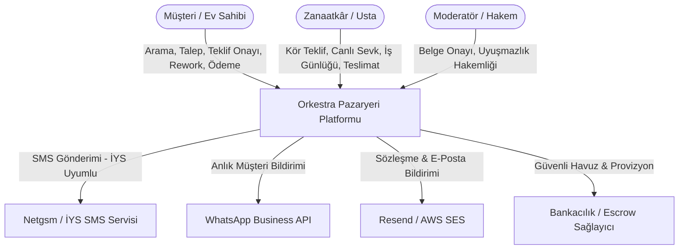
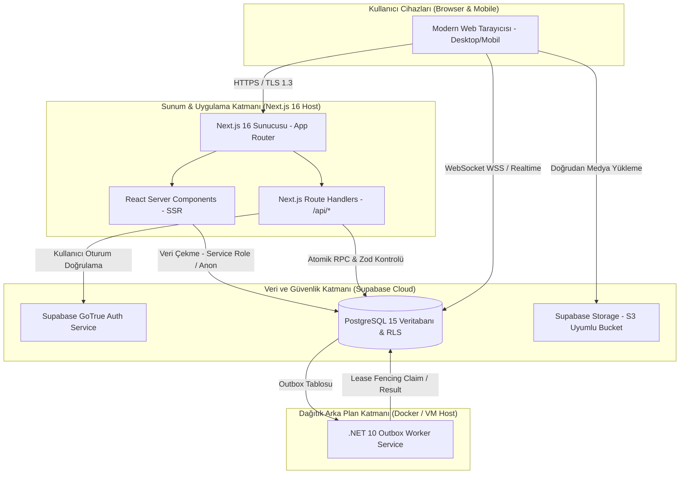
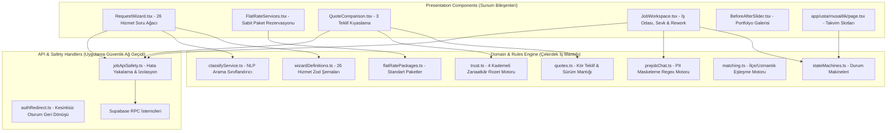
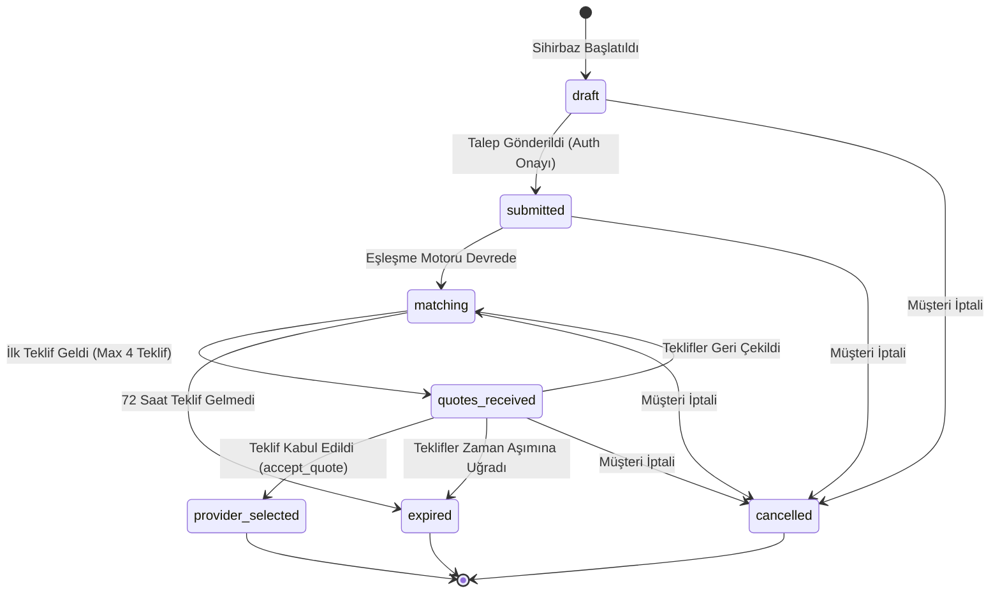
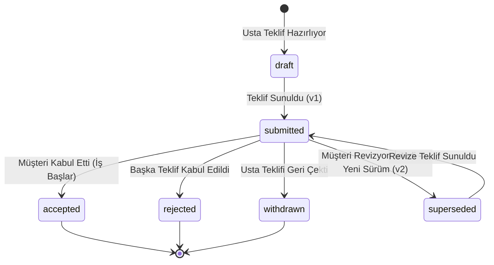
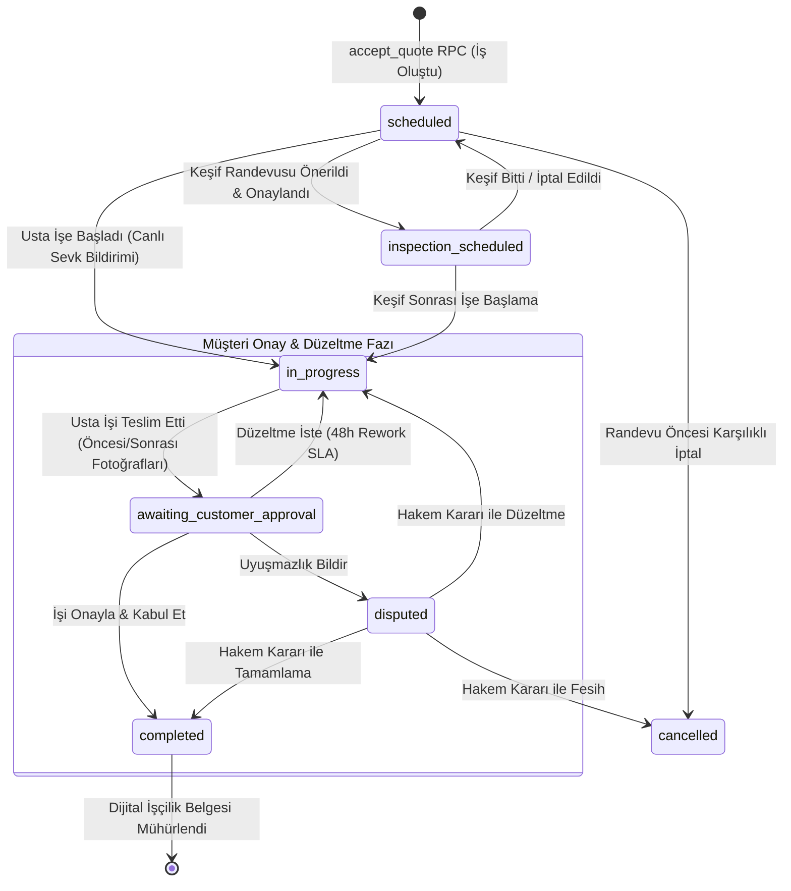
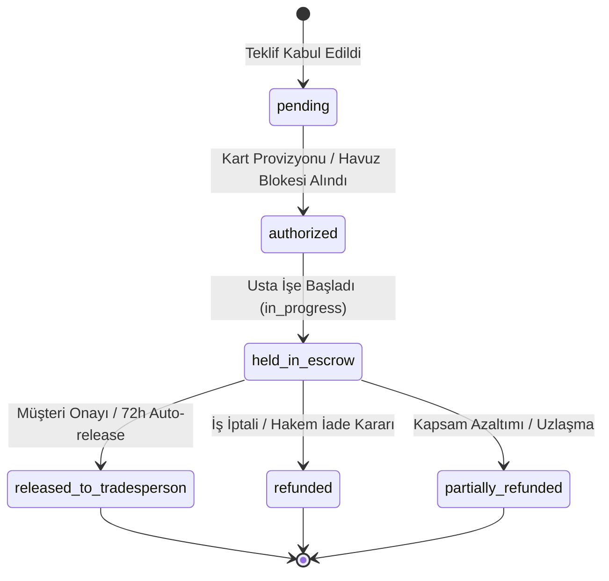
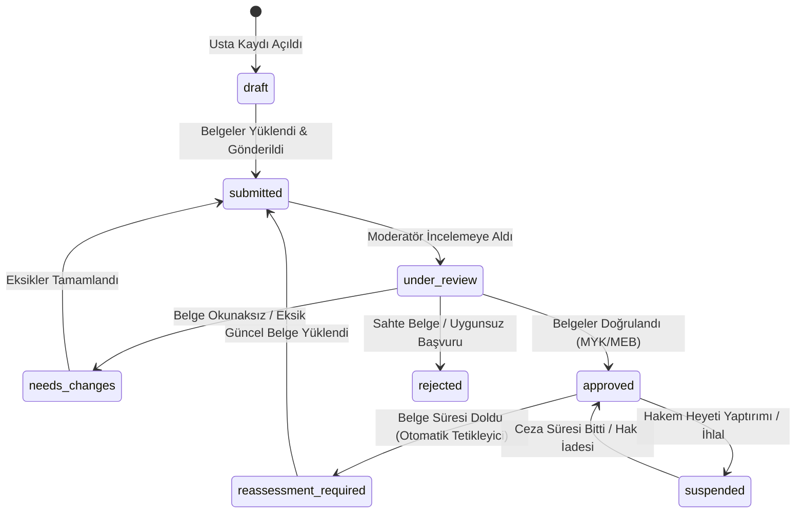
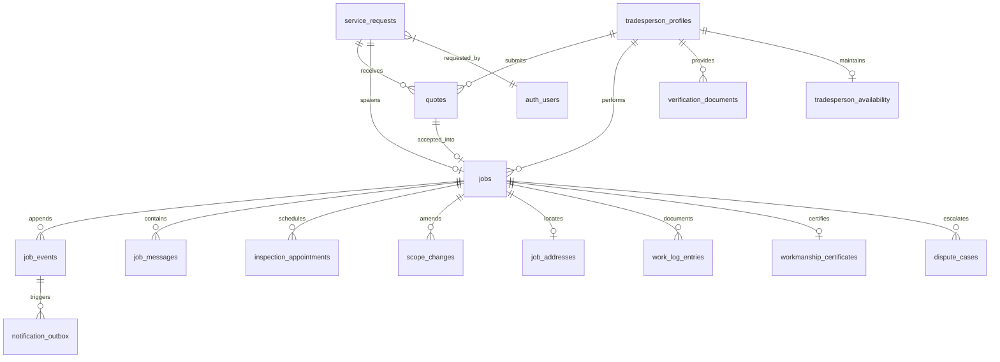

# Orkestra (Ankara Usta) — Yazılım Tasarım Dokümanı (SDD)
## Software Design Document (IEEE 1016-2009 Standardı)

**Doküman Sürümü:** 3.0  
**Tarih:** 29 Eylül 2026  
**Durum:** Onaylandı & Eksiksiz Uygulandı  
**Hedef Sistem:** Next.js 16 (App Router), React 19, Supabase (PostgreSQL 15), .NET 10 Outbox Worker  
**Doğrulama Durumu:** 95 Test Dosyası / 587 Test (%100 Başarılı) / 31 Veritabanı Migration'ı  
**Güvenlik & Kalite:** RLS Kiracı İzolasyonu, P0.1/P0.2 Dürüst Reklam İlkesi (`TRUST-01`, `TRUTH-01`), UI Borç Sınırı (`inlineStyles: 48 <= 71`)

---

## 1. Giriş ve Mimari İlkeler (Introduction & Architectural Principles)

### 1.1 Amaç ve Kapsam
Bu doküman; **Orkestra (Ankara Usta)** pazaryeri platformunun detaylı yazılım tasarımını (SDD) uluslararası **IEEE 1016-2009** standardına tam uyumlu olarak açıklar. Sistemin C4 seviyelerindeki mimari diyagramlarını, alt sistem ayrıştırmalarını, durum makinelerini, veritabanı şemasını (Data Dictionary), PostgreSQL saklı yordamlarını (RPCs), Row-Level Security (RLS) politikalarını, REST API sözleşmelerini ve dağıtık .NET 10 Outbox Worker tasarımını belgeler.

### 1.2 Temel Mimari İlkeler
1. **Temiz Mimari & Alan Odaklı Tasarım (Clean Architecture & DDD):** Domain modelleri, durum makineleri ve iş kuralları veritabanı veya ön yüz kütüphanelerinden bağımsız olarak saf TypeScript (`app/domain/`) katmanında tanımlanır.
2. **Sıfır Güven & Donanımsal Kiracı İzolasyonu (Zero-Trust Tenant Isolation):** İstemci tarafı yetkilendirme veya form girdilerine asla güvenilmez. Tüm veri erişimleri PostgreSQL Row-Level Security (RLS) politikaları ve `public.user_roles` tabloları üzerinden zorlanır.
3. **Değişmezlik ve Olay Kaydı (Immutability & Event Sourcing):** Teklifler, sözleşme şartları ve iş aşamaları asla üzerine yazılarak (destructive update) değiştirilmez. Append-only sürümlendirme (`quotes.version`) ve monotonik olay sıralaması (`job_events.sequence`) uygulanır.
4. **İki Aşamalı Güvenilirlik & Outbox Deseni (Outbox Pattern & Lease Fencing):** Kritik etki yaratan bildirimler doğrudan transaction içinde dış servislere gönderilmez; atomik olarak `public.notification_outbox` tablosuna yazılır ve bağımsız .NET 10 servisi tarafından kilit korumalı (lease fencing) işlenir.
5. **Kesin UI Borç Tavanı (Strict UI Debt Ratchet):** Projede kontrolsüz CSS ve inline stiller engellenir; `scripts/audit-ui-debt.mjs` aracıyla `inlineStyles <= 71` ve `cssLines <= 7252` sınırları her commit öncesi denetlenir.

---

## 2. C4 Mimari Modeli (C4 Architecture Model)

### 2.1 C4 Seviye 1: Sistem Bağlam Diyagramı (System Context Diagram)
Sistemin kullanıcıları ve dış dünya sistemleriyle olan ilişkisini gösterir:



### 2.2 C4 Seviye 2: Kapsayıcı Diyagramı (Container Diagram)
Sistemi oluşturan bağımsız çalıştırılabilir çalışma alanlarını gösterir:



### 2.3 C4 Seviye 3: Bileşen Diyagramı (Component Diagram)
Next.js ve Domain katmanındaki dahili bileşen modüllerinin hiyerarşisi:



---

## 3. Alt Sistem Ayrıştırması (Subsystem Decomposition)

### 3.1 Ön Yüz Alt Sistemi (Frontend Subsystem)
- **Teknoloji:** Next.js 16 (App Router), React 19, TypeScript.
- **Tasarım Mimarisi:** Vanilla CSS Modules (`*.module.css`) ve `app/application.css` global tasarım token'ları. TailwindCSS veya harici stil framework'ü bulunmaz.
- **Tasarım Token'ları:**
  - Renkler: `--brand-night: #0B132B`, `--brand-amber: #D97706`, `--brand-emerald: #059669`, `--surface-ground: #F8FAFC`.
  - Tipografi: Sistem font hiyerarşisi (Inter / Segoe UI / sans-serif).
  - UI Borç Limiti: `inlineStyles <= 71` (Mevcut Durum: **48**), `cssLines <= 7252` (Mevcut Durum: **6986**).

### 3.2 API ve Güvenlik Katmanı (Application API Layer)
- **Hata ve İstisna Yönetimi:** Tüm rota işleyicileri (`app/api/*`) standart `jsonPublicError` ve `jsonApiError` sözleşmelerine tabidir. Her hata isteğine benzersiz bir `correlationId` (`err_uuid`) üretilir.
- **Kimlik ve Rol Güvencesi:** `assertJobIdentity` fonksiyonu, oturum açmış kullanıcının talep sahibi müşteri, teklif veren usta veya sistem yöneticisi olup olmadığını doğrular. İstemciden gelen rol bildirimleri yok sayılır.

### 3.3 Çekirdek Domain Katmanı (`app/domain/`)
- `models.ts`: Sistemin temel TypeScript türleri (`Request`, `Quote`, `Job`, `ScopeChange`, `DisputeCase`, `TradespersonTier`, `WorkLogEntry`).
- `stateMachines.ts`: Talep, teklif, iş, uyuşmazlık ve başvuru durum makineleri geçiş kuralları (`canTransitionJob`, `assertActorCanTransitionJob`).
- `quotes.ts`: Monotonik sürüm artışı (`nextQuoteVersion`), maksimum 3 teklif kıyaslama seçimi (`selectQuotesForComparison`), ve maksimum 4 teklif kapasite kuralı (`MAX_QUOTES_PER_REQUEST = 4`, `canAcceptNewQuotes`).
- `trust.ts`: Zanaatkâr seviye hesaplama algoritması (`calculateTradespersonLevel`).
- `prejobChat.ts`: Teklif öncesi odada telefon, e-posta ve IBAN bilgilerini tespit edip maskeleyen deterministik regex motoru.

### 3.4 Veritabanı ve Güvenlik Katmanı (Database & Storage Subsystem)
- **PostgreSQL 15:** 31 adet production migration'ı ile yapılandırılmış şema.
- **Satır Düzeyi Güvenlik (RLS):** Kiracılar arası veri sızıntısını veritabanı çekirdeğinde engelleyen 40'tan fazla RLS kuralı.
- **Atomik Saklı Yordamlar (RPCs):** İki aşamalı veya birden fazla tablonun aynı anda kilitlenmesini gerektiren kritik işlemler `SECURITY DEFINER` yordamlar ile yürütülür.

### 3.5 Dağıtık Arka Plan Servisi (.NET 10 Outbox Worker)
- **Servis Adı:** `AnkaraUsta.NotificationWorker` (`BackgroundService`).
- **Görevi:** `public.notification_outbox` tablosundaki kayıtları artan nesil damgalı lease token (`worker_id`, `attempts`) ile atomik olarak sahiplenmek, dış servisler üzerinden dağıtmak ve sonucu bildirmek.
- **Sağlık Denetimi:** Bağımsız HTTP portu üzerinden `/health/live` ve `/health/ready` uçları.

---

## 4. Durum Makineleri Tasarımı (State Machines Design)

### 4.1 Talep Yaşam Döngüsü (Service Request Lifecycle)


### 4.2 Teklif ve Sürümlendirme Yaşam Döngüsü (Quote Lifecycle)


### 4.3 İş Yaşam Döngüsü (Job Lifecycle — Rework & Canlı Sevk Entegreli)


### 4.4 Emanet (Escrow) Ödeme Durum Makinesi


### 4.5 Zanaatkâr Başvuru ve Doğrulama Durum Makinesi


---

## 5. Veritabanı Şeması ve Veri Sözlüğü (Data Dictionary)

Sistemdeki temel PostgreSQL tabloları, birincil/yabancı anahtarlar ve kısıtlar:



### 5.1 Tablo Tanımları

#### 1. `public.service_requests`
| Sütun Adı | Veri Tipi | Kısıtlar / Varsayılan | Açıklama |
|---|---|---|---|
| `id` | `uuid` | PK, `default gen_random_uuid()` | Benzersiz talep kimliği |
| `customer_id` | `uuid` | FK -> `auth.users(id)` | Talebi açan müşteri |
| `service_id` | `text` | NOT NULL | 26 standart hizmetten biri |
| `district` | `text` | NOT NULL | Ankara ilçesi (Çankaya vb.) |
| `neighborhood` | `text` | NOT NULL | İlçe mahallesi |
| `status` | `text` | CHECK in (`draft`, `submitted`, `matching`, `quotes_received`, `provider_selected`, `cancelled`, `expired`) | Talep yaşam döngüsü durumu |
| `answers` | `jsonb` | NOT NULL, DEFAULT `{}` | Sihirbaz soru-cevap verisi |
| `routing_mode` | `text` | DEFAULT `'pool'`, CHECK in (`'pool'`, `'direct'`) | Açık havuz veya doğrudan davet |
| `created_at` | `timestamptz` | NOT NULL, DEFAULT `now()` | Oluşturulma zamanı |
| `updated_at` | `timestamptz` | NOT NULL, DEFAULT `now()` | Son güncelleme zamanı |

#### 2. `public.quotes`
| Sütun Adı | Veri Tipi | Kısıtlar / Varsayılan | Açıklama |
|---|---|---|---|
| `id` | `uuid` | PK, `default gen_random_uuid()` | Benzersiz teklif kimliği |
| `request_id` | `uuid` | FK -> `public.service_requests(id)` | İlgili talep ID |
| `tradesperson_id` | `uuid` | FK -> `public.tradesperson_profiles(user_id)` | Teklif veren usta ID |
| `version` | `integer` | NOT NULL, DEFAULT 1 | Teklif sürüm numarası (v1, v2...) |
| `labor_amount_kurus`| `bigint` | NOT NULL, CHECK >= 0 | İşçilik bedeli (Kuruş cinsinden) |
| `material_amount_kurus`| `bigint`| NOT NULL, CHECK >= 0 | Malzeme bedeli (Kuruş cinsinden) |
| `estimated_duration_minutes`| `integer`| NOT NULL, CHECK > 0 | Tahmini tamamlama süresi |
| `warranty_days` | `integer` | NOT NULL, CHECK >= 0 | İşçilik garanti taahhüt süresi (gün) |
| `included_scope`| `text[]` | NOT NULL, DEFAULT `{}` | Dahil olan iş kalemleri |
| `excluded_scope`| `text[]` | NOT NULL, DEFAULT `{}` | Hariç tutulan kalemler |
| `note` | `text` | NULLABLE, MAX 2000 karakter | Usta açıklaması |
| `status` | `text` | CHECK in (`draft`, `submitted`, `accepted`, `rejected`, `withdrawn`, `superseded`) | Teklif durumu |
| `supersedes_quote_id`| `uuid` | FK -> `public.quotes(id)` | Revize edilen önceki teklif ID |
| `created_at` | `timestamptz` | NOT NULL, DEFAULT `now()` | Teklif zaman damgası |

#### 3. `public.jobs`
| Sütun Adı | Veri Tipi | Kısıtlar / Varsayılan | Açıklama |
|---|---|---|---|
| `id` | `uuid` | PK, `default gen_random_uuid()` | Benzersiz iş kimliği |
| `request_id` | `uuid` | UNIQUE, FK -> `public.service_requests(id)` | Kaynak talep ID |
| `accepted_quote_id`| `uuid` | UNIQUE, FK -> `public.quotes(id)` | Kabul edilen dondurulmuş teklif ID |
| `customer_id` | `uuid` | FK -> `auth.users(id)` | Müşteri ID |
| `tradesperson_id`| `uuid` | FK -> `public.tradesperson_profiles(user_id)`| Seçilen usta ID |
| `status` | `text` | CHECK in (`scheduled`, `inspection_scheduled`, `in_progress`, `awaiting_customer_approval`, `completed`, `disputed`, `cancelled`) | İş durumu |
| `scheduled_for` | `timestamptz` | NULLABLE | Planlanan iş/keşif tarihi |
| `warranty_ends_at`| `timestamptz`| NULLABLE | Garantinin bittiği resmi tarih |
| `next_event_sequence`| `bigint` | NOT NULL, DEFAULT 0 | Monotonik artan olay sayacı |
| `created_at` | `timestamptz` | NOT NULL, DEFAULT `now()` | İş başlama tarihi |

#### 4. `public.job_events`
| Sütun Adı | Veri Tipi | Kısıtlar / Varsayılan | Açıklama |
|---|---|---|---|
| `id` | `uuid` | PK, `default gen_random_uuid()` | Benzersiz olay kimliği |
| `job_id` | `uuid` | FK -> `public.jobs(id)` ON DELETE CASCADE | İlgili iş ID |
| `sequence` | `bigint` | NOT NULL, CHECK > 0, UNIQUE(`job_id`, `sequence`) | Monotonik olay sıra no |
| `event_type` | `text` | NOT NULL | Olay tipi (`job_created`, `dispatch_on_way`, `rework_requested` vb.) |
| `actor_id` | `uuid` | FK -> `auth.users(id)` | Eylemi yapan kullanıcı |
| `actor_role` | `text` | CHECK in (`customer`, `tradesperson`, `admin`, `system`) | Eylem sahibi rolü |
| `payload` | `jsonb` | NOT NULL, DEFAULT `{}` | Olay detay verisi |
| `created_at` | `timestamptz` | NOT NULL, DEFAULT `now()` | Değiştirilemez zaman damgası |

#### 5. `public.notification_outbox`
| Sütun Adı | Veri Tipi | Kısıtlar / Varsayılan | Açıklama |
|---|---|---|---|
| `id` | `bigint` | GENERATED ALWAYS AS IDENTITY, PK | Monotonik kuyruk ID |
| `event_id` | `uuid` | FK -> `public.job_events(id)` ON DELETE CASCADE | Kaynak olay ID |
| `recipient_id` | `uuid` | FK -> `auth.users(id)` ON DELETE CASCADE | Bildirim alıcısı ID |
| `channel` | `text` | CHECK in (`in_app`, `email`, `sms`, `push`) | İletim kanalı |
| `payload` | `jsonb` | NOT NULL | Bildirim içerik şablonu |
| `status` | `text` | CHECK in (`pending`, `processing`, `retrying`, `sent`, `dead`) | Kuyruk iletim durumu |
| `attempts` | `integer` | NOT NULL, DEFAULT 0, CHECK (0..8) | İletim deneme sayısı (Fencing damgası) |
| `next_attempt_at`| `timestamptz`| NOT NULL, DEFAULT `now()` | Sonraki deneme zamanı |
| `worker_id` | `text` | NULLABLE | Kilidi elinde tutan worker kimliği |
| `last_error` | `text` | NULLABLE, MAX 2000 | Son hata kaydı |
| `sent_at` | `timestamptz` | NULLABLE | Başarıyla iletildiği tarih |

---

## 6. PostgreSQL Güvenlik ve Row-Level Security (RLS) Mimarisi

Sistemde kiracı izolasyonu doğrudan PostgreSQL çekirdeğinde sağlanır:

### 6.1 `service_requests` RLS Politikaları
```sql
-- Müşteri sadece kendi taleplerini okuyabilir
CREATE POLICY "requests_customer_select" ON public.service_requests
  FOR SELECT TO authenticated
  USING (customer_id = auth.uid());

-- Usta sadece kendisine eşleşen veya açık havuzda olan talepleri okuyabilir
CREATE POLICY "requests_tradesperson_select" ON public.service_requests
  FOR SELECT TO authenticated
  USING (
    EXISTS (
      SELECT 1 FROM public.request_matches rm
      WHERE rm.request_id = service_requests.id
        AND rm.tradesperson_id = auth.uid()
    )
  );
```

### 6.2 `quotes` RLS Politikaları (Kör Teklif Güvencesi)
```sql
-- Müşteri kendi talebine gelen teklifleri görebilir
CREATE POLICY "quotes_customer_select" ON public.quotes
  FOR SELECT TO authenticated
  USING (
    EXISTS (
      SELECT 1 FROM public.service_requests r
      WHERE r.id = quotes.request_id AND r.customer_id = auth.uid()
    )
  );

-- Usta sadece KENDİ verdiği teklifi görebilir (Diğer ustaların tekliflerini asla göremez)
CREATE POLICY "quotes_tradesperson_select" ON public.quotes
  FOR SELECT TO authenticated
  USING (tradesperson_id = auth.uid());
```

### 6.3 `job_addresses` RLS Politikaları (Açık Adres Koruma)
```sql
-- Açık adres sadece iş oluştuktan sonra seçilen ustaya ve müşteriye açılır
CREATE POLICY "job_addresses_access" ON public.job_addresses
  FOR SELECT TO authenticated
  USING (
    customer_id = auth.uid() OR
    EXISTS (
      SELECT 1 FROM public.jobs j
      WHERE j.id = job_addresses.job_id AND j.tradesperson_id = auth.uid()
    )
  );
```

---

## 7. Atomik PostgreSQL Saklı Yordamları (RPC Contracts)

### 7.1 `public.accept_quote(p_quote_id uuid)`
- **Erişim:** `authenticated` | **Güvenlik Modeli:** `SECURITY INVOKER` -> `private.accept_quote` (`SECURITY DEFINER`).
- **İşlem Adımları:**
  1. Teklifi `FOR UPDATE` ile kilitler. Durumun `submitted` olduğunu ve çağıran kullanıcının talep sahibi olduğunu doğrular.
  2. Teklif durumunu `accepted` yapar.
  3. İlgili talebe gelen diğer tüm bekleyen teklifleri `rejected` durumuna çeker.
  4. Talep durumunu `provider_selected` yapar.
  5. Yeni bir `jobs` satırı oluşturur (`status = 'scheduled'`).
  6. `job_events` tablosuna ilk olayı (`sequence = 1`, `event_type = 'job_created'`) yazar.
  7. `notification_outbox` tablosuna usta için kabul bildirimini yazar.
  8. Tüm bu işlemleri tek bir ACID transaction sınırında tamamlar.

### 7.2 `public.claim_notification_batch(p_worker_id text, p_limit integer default 25)`
- **Erişim:** `service_role` | **Güvenlik Modeli:** `SECURITY DEFINER`.
- **İşlem Adımları:**
  1. `pending` ve `retrying` durumunda olup `next_attempt_at <= now()` olan veya `processing` durumunda 5 dakikadan uzun süre takılı kalmış bildirimleri seçer.
  2. Satırları `FOR UPDATE SKIP LOCKED` ile kilitler.
  3. `status = 'processing'`, `attempts = attempts + 1`, `worker_id = p_worker_id`, `updated_at = now()` damgalar.
  4. Sahiplenilen satırları worker'a döndürür.

### 7.3 `public.mark_notification_result(p_id bigint, p_worker_id text, p_attempt integer, p_succeeded boolean, p_error text)`
- **Erişim:** `service_role` | **Güvenlik Modeli:** `SECURITY DEFINER` (Lease Fencing Garantisi).
- **İşlem Adımları:**
  1. `notification_outbox` satırını `id = p_id AND status = 'processing' AND worker_id = p_worker_id AND attempts = p_attempt` şartıyla günceller.
  2. Başarılıysa `status = 'sent'`, `sent_at = now()`.
  3. Başarısızsa ve `attempts >= 8` ise `status = 'dead'`; aksi halde `status = 'retrying'` ve üstel gecikme:
     $$\text{delay} = \min(3600, 30 \times 2^{\text{attempts}-1}) \text{ saniye}$$
  4. Satır bulunamazsa (fencing token el değiştirdiyse) `P0001` istisnası fırlatır; çift işlemeyi engeller.

---

## 8. REST API Uç Noktaları Sözleşmesi (Route Handlers)

| HTTP Metodu | Uç Nokta Yolu | Giriş Şeması (Zod) | Başarı Yanıtı | Hata Kodları |
|---|---|---|---|---|
| `POST` | `/api/requests/draft` | `z.object({ serviceId, district, answers })` | `200 { draftId, savedAt }` | `400 INVALID_INPUT`, `500 SERVER_ERROR` |
| `POST` | `/api/quotes/[id]/accept` | `z.object({ expectedUserId: z.uuid() })` | `200 { accepted: true, jobId }` | `400 INVALID_INPUT`, `401 AUTH_REQUIRED`, `409 QUOTE_UNAVAILABLE` |
| `POST` | `/api/jobs/[id]/transition` | `z.object({ status: z.enum(jobStatuses) })` | `200 { transitioned: true, status }` | `400 INVALID_INPUT`, `403 FORBIDDEN`, `409 INVALID_STATE` |
| `POST` | `/api/jobs/[id]/messages` | `z.object({ body, idempotencyKey })` | `200 { messageId, sequence }` | `400 INVALID_INPUT`, `409 DUPLICATE_KEY` |
| `POST` | `/api/jobs/[id]/rework` | `z.object({ punchList: z.string().min(10) })`| `200 { reworkRequested: true, slaEndsAt }`| `400 INVALID_INPUT`, `403 FORBIDDEN` |
| `POST` | `/api/jobs/[id]/dispatch` | `z.object({ dispatchStatus: z.string() })` | `200 { recorded: true }` | `400 INVALID_INPUT`, `403 FORBIDDEN` |

---

## 9. Dağıtık .NET 10 Outbox Worker Servis Mimarisi

- **Servis Tipi:** C# .NET 10 `BackgroundService` (`AnkaraUsta.NotificationWorker`).
- **Döngü Süresi:** 3 saniyelik periyodik yoklama (Polling loop) veya PostgreSQL `LISTEN` sinyali.
- **Hassas Bilgi Maskeleme (Redaction):**
  - Worker HTTP loglayıcısı; `apikey`, `authorization`, `cookie` başlıklarını otomatik olarak `[REDACTED]` ile maskeler.
- **Sağlık Denetim Uç Noktaları (K8s / Container Probes):**
  - `GET /health/live`: Worker ana döngüsünün hayatta olduğunu teyit eder (200 OK).
  - `GET /health/ready`: Supabase veritabanı ve dış sağlayıcı (SMS/E-posta) bağlantılarını doğrular (200 OK).

---

## 10. Çapraz Kesen Mimari Konular (Cross-Cutting Concerns)

### 10.1 STRIDE Güvenlik Tehdit Analizi
1. **Spoofing (Kimlik Sahteciliği):** Supabase JWT oturumları ve `assertJobIdentity` ile engellenir.
2. **Tampering (Veri Tahrifatı):** Veritabanı tetikleyicileri ile `jobs.accepted_quote_id` dondurulur; teklifler append-only sürümlenir.
3. **Repudiation (İnkâr Edilebilirlik):** Tüm işlemler `job_events` ve `admin_audit_log` tablolarında değiştirilemez zaman damgasıyla saklanır.
4. **Information Disclosure (Bilgi İfşası):** RLS politikaları, teklif öncesi PII regex maskelemesi ve kör teklif mimarisiyle tam gizlilik sağlanır.
5. **Denial of Service (Servis Engelleme):** 4 teklif kotası, Zod şema limitleri ve devre kesici (`ORKESTRA_PILOT_INTAKE_ENABLED`) ile sistem korunur.
6. **Elevation of Privilege (Yetki Yükseltme):** Roller veritabanında `public.user_roles` içinde tutulur; istemci metadata'sından rol kabul edilmez.

### 10.2 Eşzamanlılık ve Yarış Koşulları Koruması
- Bildirim kuyruğu çekilirken `FOR UPDATE SKIP LOCKED` kullanılarak aynı anda çalışan birden fazla worker örneğinin aynı bildirimi mükerrer işlemesi engellenir.
- Monotonik `job_events.sequence` ile istemci saat farklarından bağımsız olay sıralaması temin edilir.

### 10.3 UI Borç Yönetimi ve Stil Kısıtları
- Projede satır içi stil (`style={{...}}`) kullanımı sıkı kontrol altındadır.
- `scripts/audit-ui-debt.mjs` aracı her derleme ve test sürecinde çalıştırılır:
  - `inlineStyles` sayısı asla **71**'i geçemez (Mevcut: **48**).
  - `cssLines` sayısı asla **7252**'yi geçemez (Mevcut: **6986**).
