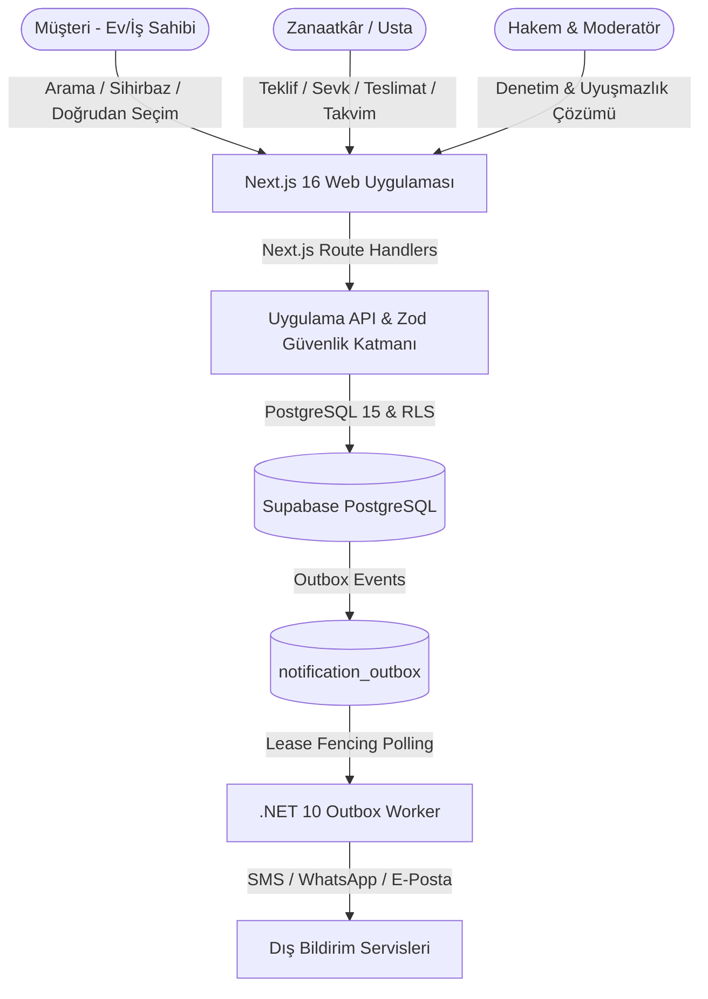

# Orkestra (Ankara Usta) — Yazılım Gereksinimleri Belirtimi (SRS)
## Software Requirements Specification (IEEE 830-1998 / ISO/IEC/IEEE 29148:2018 Standardı)

**Doküman Sürümü:** 3.0  
**Tarih:** 29 Eylül 2026  
**Durum:** Onaylandı & Eksiksiz Uygulandı  
**Hedef Pazar:** Ankara Pilot Bölgesi (Çankaya, Keçiören, Yenimahalle, Etimesgut, Mamak, Altındağ, Gölbaşı, Pursaklar, Sincan)  
**Doğrulama Durumu:** 95 Test Dosyası / 587 Test (%100 Başarılı) / 31 Veritabanı Migration'ı  
**Güvenlik & Kalite:** RLS Kiracı İzolasyonu, P0.1/P0.2 Dürüst Reklam İlkesi (`TRUST-01`, `TRUTH-01`), UI Borç Sınırı (`inlineStyles: 48 <= 71`)

---

## 1. Giriş (Introduction)

### 1.1 Amaç (Purpose)
Bu doküman; Türkiye'nin ilk kural tabanlı, şeffaf, doğrulanabilir ve hakemli yerel zanaatkâr pazaryeri platformu olan **Orkestra (Ankara Usta)** için yazılım gereksinimlerini (SRS) uluslararası **IEEE 830-1998** ve **ISO/IEC/IEEE 29148:2018** standartlarına tam uyumlu biçimde belirler. Doküman; sistemin mimari sınırlarını, fonksiyonel gereksinimlerini (FR), fonksiyonel olmayan kalite niteliklerini (NFR), iş kurallarını (BR), kullanıcı rol yetki matrisini ve izlenebilirlik ağını (RTM) yazılım mühendisliği disipliniyle tanımlar.

### 1.2 Kapsam (Scope)
Orkestra platformu; ev ve iş yerlerindeki montaj, elektrik, sıhhi tesisat, boya/tadilat, kaynak/demir doğrama ve derin temizlik dikeyindeki **26 sektörel standart hizmeti** kapsar. Sistem;
1. **Armut Modeli'nden:** Detaylı dallanan sektörel soru ağaçları (`wizardDefinitions.ts`), dinamik form mantığı, talep yayınlama ve usta spam'ini engelleyen **en fazla 4 teklif sınırı** mekanizmasını,
2. **TaskRabbit Modeli'nden:** Sabit fiyatlı ve kapsamı şeffaf paket hizmetler (`flatRatePackages.ts`), usta haftalık çalışma takvimi/slotları ve iş günü tek tıkla sevk bildirimlerini (Yoldayım, Adresteyim, Malzeme Teminindeyim),
3. **Bionluk Modeli'nden:** İş teslimatında **48 saatlik düzeltme (rework) SLA** döngüsü, interaktif öncesi/sonrası portfolyo galerisi (`BeforeAfterSlider.tsx`), 4 kademeli zanaatkâr seviye motoru (Çırak, Kalfa, Usta, Elit Baş Usta) ve uyuşmazlıklarda bağlayıcı Hakem Heyeti masasını
bütünleştirerek harmanlayan hibrit bir pazaryeri mimarisi sunar.

### 1.3 Tanımlar, Kısaltmalar ve Terimler Sözlüğü (Definitions & Acronyms)
| Terim / Kısaltma | Açıklama |
|---|---|
| **RLS (Row-Level Security)** | PostgreSQL çekirdeğinde çalışan, kullanıcıların yalnızca kendi yetki alanındaki satırları okuyup yazabilmesini sağlayan donanımsal izolasyon mekanizması. |
| **RPC (Remote Procedure Call)** | Supabase PostgreSQL üzerinde ACID transaction garantisiyle çalışan saklı yordam (Stored Procedure). |
| **Kör Teklif (Blind Quoting)** | Bir talebe teklif veren ustaların, birbirlerinin teklif tutarlarını, malzeme detaylarını veya süre taahhütlerini kesinlikle görememesi ilkesi (`quotes` RLS kuralı). |
| **Outbox Pattern** | Veritabanı hareketleri sırasında dış sistem bildirimlerinin atomik olarak `public.notification_outbox` tablosuna yazılması ve bağımsız .NET servisiyle işlenmesi. |
| **Lease Generation Fencing** | Dağıtık arka plan servislerinde yarış koşullarını ve çift bildirim gönderimini donanımsal olarak engelleyen artan nesil damgalı kilit mekanizması. |
| **Escrow (Emanet / Güvenli Havuz)** | Müşterinin ödediği işçilik tutarının banka/ödeme kuruluşu havuzunda bloke edilmesi ve müşteri kabulüyle ustaya serbest bırakılması güvencesi. |
| **Rework (Düzeltme Talebi)** | Usta işi teslim ettiğinde müşterinin eksik veya kusurlu bulduğu maddeleri yazılı gerekçeyle bildirerek 48 saatlik ek düzeltme süreci başlatması. |
| **Dijital İşçilik Belgesi** | İşi tamamlanan müşteriye üretilen, kapsamı ve garanti süresini sabitleyen benzersiz numaralı kriptografik güvence kaydı (`workmanship_certificates`). |
| **Zod Doğrulaması** | İstemci ve sunucu katmanında girdi verilerinin şema tip güvenliğini sağlayan TypeScript tabanlı doğrulama kütüphanesi. |
| **UI Debt Ratchet** | Projedeki stil borçlarını, satır içi stilleri (`inlineStyles <= 71`) ve CSS satır sayısını sınırlandıran otomatik kalite bariyeri. |

### 1.4 Referanslar ve Yasal Dayanaklar (References & Regulatory Framework)
- **IEEE Std 830-1998:** Recommended Practice for Software Requirements Specifications.
- **ISO/IEC/IEEE 29148:2018:** Systems and software engineering — Life cycle processes — Requirements engineering.
- **6698 Sayılı KVKK:** Kişisel Verilerin Korunması Kanunu (Açık rıza, veri minimizasyonu, profil fotoğrafı yayın izni).
- **6563 Sayılı ETK:** Elektronik Ticaretin Düzenlenmesi Hakkında Kanun (İYS entegrasyonu, ticari elektronik ileti onayları).
- **6502 Sayılı TKHK:** Tüketicinin Korunması Hakkında Kanun ve Mesafeli Sözleşmeler Yönetmeliği (Zanaatkâr işçilik istisnaları).
- **5544 Sayılı MYK:** Mesleki Yeterlilik Kurumu Kanunu (Tehlikeli ve çok tehlikeli işlerde ustalık belgesi zorunluluğu).

---

## 2. Genel Sistem Tanımı (Overall Description)

### 2.1 Ürün Perspektifi ve Ekosistem Bağlamı
Orkestra, geleneksel komisyoncu veya kontrolsüz lead-generation sitelerinin yol açtığı kalite belirsizliğini ve fiyat manipülasyonunu ortadan kaldırmak için kurgulanmıştır. Platform, "Dürüst Hizmet & Güvenli Teslimat" ilkesine dayanır. Sistemde hiçbir koşulda sahte veya simüle usta profili üretilemez (`hasSyntheticArtisans: false`, `TRUST-01`).

### 2.2 Kullanıcı Sınıfları ve Operasyonel Roller
1. **Hizmet Alan (Müşteri - Customer):**
   - İhtiyacını doğal dil araması veya kategori listesinden seçer.
   - 26 sektörel sihirbazdan birini doldurur veya sabit paket hizmeti rezerve eder.
   - En fazla 4 ustanın verdiği kör teklifleri inceler; 3 teklifi yan yana kıyaslar.
   - Teklif öncesinde platform içi güvenli mesajlaşma odasında detayları netleştirir.
   - Teklifi kabul ederek iş sözleşmesini başlatır; iş odasından canlı süreci izler.
   - İşi onaylar veya 48 saatlik düzeltme (rework) talep eder; nihai onayda dijital işçilik belgesini alır.
2. **Doğrulanmış Zanaatkâr (Verified Tradesperson):**
   - Kimlik, ikametgâh ve mesleki ustalık belgesi (MYK/MEB) onaylanmış profesyonel.
   - Açık havuzdaki uygun talepleri veya adına gelen özel davetleri görüntüler.
   - Malzeme ve işçilik kırılımını, garanti gününü belirterek kör teklif verir (v1..v3).
   - İş günü mobil cihazından tek tıkla sevk durumunu (Yoldayım, Adresteyim, Malzeme Temininde) bildirir.
   - İş günlüğüne Öncesi/Sonrası fotoğrafları yükler ve işi müşterinin onayına sunar.
   - Haftalık çalışma gün ve saat slotlarını, acil servis kabulünü yönetir.
3. **Başvuru Aşamasındaki Zanaatkâr (Unverified Tradesperson):**
   - Profil oluşturan, uzmanlık kategorilerini ve Ankara ilçe bölgelerini seçen, belgelerini yükleyen kullanıcı.
   - Belgeleri moderasyon onayından geçene kadar açık havuza teklif veremez ve vitrinde listelenemez.
4. **Moderatör ve Hakem (Moderator & Dispute Arbitrator):**
   - Zanaatkâr başvurularını, ustalık belgelerini ve süre sonlarını denetler.
   - Çözülemeyen uyuşmazlıklarda tarafların sunduğu fotoğraflı kanıtları inceler, bağlayıcı hakem kararı verir.
5. **Sistem Yöneticisi (System Administrator):**
   - Sektörel hizmet taksonomisini, fiyat referans aralıklarını ve ilçe bazlı pilot devre kesicileri yönetir.
6. **Arka Plan Servis İşçisi (.NET 10 Notification Worker):**
   - Outbox bildirimlerini atomik kilitlerle çekip dış sağlayıcılara (SMS/E-posta) dağıtan otonom servis.

### 2.3 İşletim Ortamı ve Sistem Kısıtları
- **Ön Yüz Mimarisi:** Next.js 16 (App Router), React 19, TypeScript (Strict Mode).
- **Stil ve Tasarım Dili:** Vanilla CSS ve CSS Modules (`*.module.css`). TailwindCSS kesinlikle yasaktır.
- **UI Borç Tavanı:** `audit-ui-debt.mjs` testinde `inlineStyles <= 71` (Mevcut: **48**), `cssLines <= 7252` (Mevcut: **6986**).
- **Veritabanı Katmanı:** Supabase PostgreSQL 15, Row-Level Security politikaları, 31 adet production migration'ı.
- **Arka Plan İşçisi:** .NET 10 Worker Service (`AnkaraUsta.NotificationWorker`), Lease Fencing, Kriptografik PII maskeleme.
- **Erişilebilirlik:** W3C WCAG 2.1 AA Seviyesi.

---

## 3. Harici Arayüz Gereksinimleri (External Interface Requirements)

### 3.1 Kullanıcı Arayüzleri (User Interfaces)
- **Duyarlı Tasarım (Responsive):** 360px mobil ekranlardan 4K masaüstü monitörlere kadar akıcı layout.
- **Tasarım Dili ve Renk Paleti:** Orkestra kurumsal renkleri (Gece Mavisi `#0B132B`, Zanaat Turuncusu `#D97706`, Güven Yeşili `#059669`, Nötr Gri `#F8FAFC`).
- **Mikro Etkileşimler:** Teklif karşılaştırma matrisinde interaktif fark vurgulama, öncesi/sonrası slider'ı (`BeforeAfterSlider.tsx`), canlı sevk durumu çipleri.

### 3.2 Yazılım ve Servis Arayüzleri (Software Interfaces)
- **Supabase Auth API:** E-posta/Şifre ve OTP tabanlı güvenli kimlik doğrulama. Rol bilgisi istemci metadata'sından değil, `public.user_roles` tablosundan okunur.
- **Supabase Storage API:** Zanaatkâr belgeleri için gizli bucket (`verification-documents`), iş fotoğrafları için imzalı URL bucket'ı (`job-work-logs`).
- **Supabase Realtime API:** Teklif odası ve iş günlüğünde PostgreSQL `LISTEN/NOTIFY` destekli WebSocket kanalları.
- **Dış Bildirim Ağ Geçitleri:** SMS (Netgsm / İYS Uyumlu), WhatsApp Business API ve E-posta (Resend / AWS SES) servisleri.

### 3.3 İletişim Protokolleri (Communication Protocols)
- Tüm istemci-sunucu trafiği **HTTPS (TLS 1.3)** üzerinden şifrelenir.
- Canlı güncellemeler güvenli WebSockets (**WSS**) üzerinden taşınır.
- API rotaları RESTful JSON mimarisinde, her yanıtta `Cache-Control: private, no-store` ve `X-Correlation-Id` içerir.

---

## 4. Fonksiyonel Gereksinimler (Functional Requirements)

### FR-01: Problem Arama, Doğal Dil Sınıflandırma ve Acil Güvenlik Koruması
- **Öncelik:** P0 (Kritik) | **Benchmark:** Armut Problem Arama & Güvenlik Kalkanı
- **Girdi:** Müşterinin serbest metin arama girdisi (örn: "klozet su kaçırıyor", "sigorta attı duman çıkıyor").
- **İşlem Mantığı:**
  1. Girdi `classifyService.ts` kural tabanlı NLP sınıflandırıcısına iletilir.
  2. Kelime kökleri, eşanlamlılar (`aliases`) ve ağırlık matrisine göre 26 hizmet taranır; birincil eşleşme ve alternatif adaylar hesaplanır.
  3. **Acil Güvenlik Kuralı:** Girdide gaz kaçağı, elektrik yangını, patlama veya ana kolon çatlağı gibi hayati risk tespit edilirse anında acil durum uyarısı gösterilir; 112 Acil Çağrı Merkezi ve Başkent Doğalgaz/TEDAŞ numaraları vurgulanır; talep oluşturma güvenlik sebebiyle kilitlenir.
- **Çıktı:** Güven skoru (%90+ Yüksek, %70+ Orta) ile sıralanmış hizmet önerisi veya acil güvenlik ekranı.

### FR-02: 26 Hizmet Sektörel Soru Ağaçları (Armut Modeli)
- **Öncelik:** P0 (Kritik) | **Benchmark:** Armut Soru Sihirbazı
- **Girdi:** Müşterinin seçtiği hizmet (`serviceId`), adım yanıtları, Ankara ilçe ve mahallesi.
- **İşlem Mantığı:**
  1. `wizardDefinitions.ts` dosyasındaki dinamik soru ağacı yüklenir. Montaj (5), Elektrik (4), Tesisat (5), Boya (4), Kaynak (4), Temizlik (4) olmak üzere 26 hizmetin tamamı için özel soru setleri işletilir.
  2. Sorular koşullu dallanmayı destekler (`showWhen` kuralı; örn: "Boya yapılacak alan > 100m² ise tavan dahil mi sorusu").
  3. Form adımları Zod şemaları ile anlık olarak doğrulanır; zorunlu sorular yanıtlanmadan "İleri" aktifleşmez.
  4. Konum seçimi `ankaraLocations.ts` veri setinden Çankaya, Keçiören, Yenimahalle vb. pilot ilçeler üzerinden yapılır.
- **Çıktı:** Doğrulanmış `answers` JSON nesnesi ve talep taslağı.

### FR-03: Sabit Paket Hizmetler (Flat-Rate Direct Booking — TaskRabbit Modeli)
- **Öncelik:** P0 (Kritik) | **Benchmark:** TaskRabbit Standart Paket Rezervasyonu
- **Girdi:** Müşterinin sabit fiyatlı paket seçimi (`flatRatePackages.ts`).
- **İşlem Mantığı:**
  1. Yüksek frekanslı 5 standart paket (Musluk Montajı 450 TL, Avize Montajı 350 TL, Klozet Tamiri 550 TL, Korniş Montajı 400 TL, TV Duvar Montajı 500 TL) ana sayfada listelenir.
  2. Paket kartında sabit işçilik bedeli, tahmini süre, 60–180 gün garanti ve "Neler Dahil / Neler Hariç" açıkça sunulur.
  3. "Hemen Rezervasyon Yap" düğmesine basıldığında talep sihirbazı paket parametreleriyle önceden doldurulmuş olarak başlatılır.
- **Çıktı:** Fiyat belirsizliği olmayan, doğrudan rezervasyona hazır standart talep sözleşmesi.

### FR-04: Taslak Saklama, Çoklu Cihaz Senkronizasyonu ve Güvenli Oturum Geri Dönüşü
- **Öncelik:** P0 (Kritik) | **Benchmark:** Kesintisiz Kullanıcı Deneyimi
- **Girdi:** Giriş yapmamış kullanıcının sihirbazda ilerlemesi.
- **İşlem Mantığı:**
  1. Kullanıcı oturum açmamışsa veriler yerel hafızaya (`localStorage`) ve `/api/requests/draft` üzerinden sunucuya kaydedilir.
  2. Kullanıcı son adıma geldiğinde kimlik doğrulama zorunlu tutulur.
  3. Giriş veya kayıt sonrasında `authRedirect.ts` mekanizması devreye girer; doldurulan hiçbir veri sıfırlanmadan kullanıcı kaldığı onay adımına geri döndürülür.
- **Çıktı:** Sıfır veri kaybı ile tamamlanan talep kaydı.

### FR-05: Hibrit Eşleştirme Motoru: Açık Havuz vs. Doğrudan Usta Daveti
- **Öncelik:** P0 (Kritik) | **Benchmark:** Armut Açık Havuz & TaskRabbit Doğrudan Usta Çağrısı
- **Girdi:** Yayınlanan talep (`service_requests`).
- **İşlem Mantığı:**
  1. Talep genel sihirbazdan geldiyse: Uzmanlık kategorisi ve ilçe bölgesi eşleşen tüm onaylı ustalara açık havuz bildirimi gider (`matching.ts`, 0-100 puanlama).
  2. Talep doğrudan bir ustanın vitrin profilinden verildiyse (`/ustalar/[id]/talep`): Talep açık havuza düşmez; `routing_mode = 'direct'` olarak yalnızca ilgili ustaya özel davet iletilir.
- **Çıktı:** Hedef zanaatkârların paneline düşen talep fırsatı.

### FR-06: Sürümlü Teklif Sunumu (v1..v3) ve Kör Teklif Gizliliği
- **Öncelik:** P0 (Kritik) | **Benchmark:** Bionluk Revizyon & Kör İhale Modeli
- **Girdi:** Zanaatkârın teklif formu (İşçilik tutarı, malzeme tutarı, süre, garanti günü, kapsam maddeleri).
- **İşlem Mantığı:**
  1. Ustalar birbirlerinin tekliflerini kesinlikle göremez (`quotes` RLS kuralı: Sadece talep sahibi müşteri ve teklifi veren usta okuyabilir).
  2. Müşteri revizyon istediğinde usta teklifini güncelleyebilir; önceki teklif ezilmez (`superseded`), append-only yeni teklif satırı (`version = parent.version + 1`) üretilir (`submit_quote_revision`).
- **Çıktı:** Değişmez, denetlenebilir sürümlü teklif geçmişi.

### FR-07: 4 Teklif Havuz Limiti ve Spam Koruması (Armut Modeli)
- **Öncelik:** P0 (Kritik) | **Benchmark:** Armut 4 Teklif Sınırı
- **Girdi:** Zanaatkârların teklif verme istekleri.
- **İşlem Mantığı:**
  1. Bir talebe en fazla 4 usta teklif verebilir (`MAX_QUOTES_PER_REQUEST = 4`, `canAcceptNewQuotes`).
  2. 4. teklif veritabanına işlendiği anda talep durumu otomatik olarak yeni teklif girişine kapatılır. Müşteri onlarca mesaj veya çağrı ile rahatsız edilmez.
- **Çıktı:** Kontrollü, dengeli ve tacizsiz teklif havuzu.

### FR-08: Yan Yana 3 Teklif Karşılaştırma Matrisi ve Zanaatkâr Rozetleri
- **Öncelik:** P0 (Kritik) | **Benchmark:** Bionluk Şeffaf Kıyaslama & Usta Seviyeleri
- **Girdi:** Müşterinin gelen teklifleri seçmesi.
- **İşlem Mantığı:**
  1. Müşteri gelen tekliflerden en fazla 3 tanesini yan yana karşılaştırma ekranına (`QuoteComparison.tsx`) alır.
  2. Sistem teklifleri toplam maliyet, işçilik/malzeme ayrımı, tahmini tamamlama süresi, işçilik garantisi ve dahil/hariç kapsam maddelerine göre kıyaslar.
  3. Ustanın kıdem seviyesi (`TradespersonTier`: Çırak 🥉, Kalfa 🥈, Usta 🥇, Elit Baş Usta 💎) rozet olarak gösterilir.
- **Çıktı:** Rasyonel, şeffaf ve manipülasyonsuz karar destek paneli.

### FR-09: Teklif Öncesi Güvenli Mesajlaşma ve Gerçek Zamanlı PII Maskeleme
- **Öncelik:** P0 (Kritik) | **Benchmark:** Platform Güvenliği ve İletişim Maskeleme
- **Girdi:** Müşteri ve ustanın `/gorusmeler` odasındaki mesajlaşmaları.
- **İşlem Mantığı:**
  1. Teklif kabul edilmeden önce taraflar iş kapsamını netleştirmek için yazışabilir.
  2. Sistem, mesaj metninde geçen Türkiye telefon numaralarını (örn: `05xx`, `+90 5xx`), e-posta adreslerini ve banka IBAN formatlarını kural tabanlı regex filtreleriyle (`prejobChat.ts`) anlık olarak tespit eder ve `[İletişim Bilgisi Gizlendi]` şeklinde maskeler.
- **Çıktı:** Kullanıcı güvenliğinin ve ticari bütünlüğün platform içinde korunması.

### FR-10: Atomik Teklif Kabulü (`accept_quote` RPC), Sözleşme Kilitlenmesi ve Açık Adres
- **Öncelik:** P0 (Kritik) | **Benchmark:** Hukuki Bağlayıcı İş Sözleşmesi
- **Girdi:** Müşterinin seçtiği teklif ID'si.
- **İşlem Mantığı:**
  1. Müşteri teklifi kabul ettiğinde `accept_quote(p_quote_id uuid)` atomik RPC'si çalışır.
  2. Teklif durumu `accepted` olur; teklif şartları değiştirilemez biçimde dondurulur.
  3. Aynı talebe gelen diğer tüm teklifler otomatik olarak `rejected` durumuna çekilir.
  4. Yeni bir `jobs` kaydı oluşturulur (`status = 'scheduled'`) ve ilk `job_events` kaydı (`job_created`) atılır.
  5. Müşterinin bina/daire no ve açık yol tarifi bilgisi **yalnızca bu aşamadan sonra** seçilen ustaya açılır (`job_addresses`).
- **Çıktı:** Tarafları koruyan, tek transaction ile güvenceye alınmış iş kaydı.

### FR-11: İş Odası, Çift Onaylı Keşif ve Kapsam Değişikliği (`JobWorkspace.tsx`)
- **Öncelik:** P0 (Kritik) | **Benchmark:** Profesyonel Proje Yönetimi
- **Girdi:** Keşif randevusu veya ek iş / malzeme ihtiyacı.
- **İşlem Mantığı:**
  1. Keşif randevusu planlandığında karşı taraf onaylamadan takvime işlenmez (`propose_inspection`, `respond_inspection`).
  2. İş sırasında öngörülemeyen arıza çıktığında usta veya müşteri çift taraflı kapsam değişikliği önerir (`propose_scope_change`). Her iki taraf dijital imza/onay vermedikçe bütçe ve süre değişmez.
- **Çıktı:** Sürpriz maliyetleri ve anlaşmazlıkları sıfırlayan mutabakat akışı.

### FR-12: Mobil Canlı Sevk Bildirimleri (TaskRabbit Modeli)
- **Öncelik:** P1 (Yüksek) | **Benchmark:** TaskRabbit Live Artisan Tracking
- **Girdi:** Ustanın akıllı telefonundan sevk çipleri seçimi.
- **İşlem Mantığı:**
  1. Usta iş günü cep telefonundan tek tıkla sevk durumunu bildirir:
     - 🚗 *Yoldayım (Varış ~20-30 dk)*
     - 📍 *Adresteyim & İşe Başladım*
     - 🔧 *Malzeme Teminindeyim*
  2. Sevk bildirimi atomik bir olay olarak `job_events` tablosuna yazılır; müşteriye anlık SMS/Push bildirimi tetiklenir.
- **Çıktı:** Müşterinin ustayı bekleme stresini yok eden anlık durum şeffaflığı.

### FR-13: İş Günlüğü, Çift Foto Kanıtı ve 48 Saatlik Düzeltme (Rework) SLA Döngüsü (Bionluk Modeli)
- **Öncelik:** P0 (Kritik) | **Benchmark:** Bionluk Teslimat & Revizyon Döngüsü
- **Girdi:** Ustanın iş bitirme bildirimi ve fotoğraflar.
- **İşlem Mantığı:**
  1. Usta iş günlüğüne Öncesi (`before`) ve Sonrası (`after`) fotoğraflarını yükler.
  2. Usta "İşi Bitirdim" dediğinde durum `awaiting_customer_approval` olur.
  3. Müşteri "İşi Onayla" derse iş `completed` olur.
  4. Müşteri işi eksik veya kusurlu bulursa "Düzeltme İste" (Rework) düğmesine basar. Zorunlu eksik listesi (punch-list) yazılır. Durum `in_progress`'e döner, ustaya anlık bildirim gider ve 48 saatlik düzeltme SLA süresi başlar.
- **Çıktı:** Müşteriyi yarım veya kusurlu iş teslimatına karşı koruyan garanti döngüsü.

### FR-14: Dijital İşçilik Belgesi, 4 Kademeli Usta Seviyesi ve Hakem Masası
- **Öncelik:** P0 (Kritik) | **Benchmark:** Bionluk Kıdem Sistemi & Tüketici Hakem Heyeti
- **Girdi:** Tamamlanan iş onayı veya çözülemeyen anlaşmazlık.
- **İşlem Mantığı:**
  1. Tamamlanan her iş için kriptografik referanslı Dijital İşçilik Belgesi (`workmanship_certificates`) üretilir; garanti bitiş tarihi sisteme mühürlenir.
  2. Ustanın tamamladığı iş sayısı ve müşteri puan ortalamasına göre seviyesi dinamik güncellenir:
     - 🥉 **Çırak:** Başlangıç seviyesi.
     - 🥈 **Kalfa:** 5+ tamamlanan iş, 4.2+ puan.
     - 🥇 **Usta:** 15+ tamamlanan iş, 4.6+ puan.
     - 💎 **Elit Baş Usta:** 30+ tamamlanan iş, 4.85+ puan ve sıfır çözülmemiş uyuşmazlık.
  3. Taraflar anlaşamazsa Hakem Masası (`/uyusmazliklar`) devreye girer; bağımsız moderatör kanıtları inceleyerek bağlayıcı karar alır.
- **Çıktı:** Liyakate dayalı kariyer basamağı ve kurumsal hakem güvencesi.

### FR-15: Çift Korumalı Emanet Ödeme (Escrow) ve 72 Saatlik Otomatik Serbest Bırakma
- **Öncelik:** P0 (Kritik) | **Benchmark:** Bionluk Güvenli Havuz Modeli
- **Girdi:** Ödeme emri ve iş onay bildirimi.
- **İşlem Mantığı:**
  1. Teklif kabul edildiğinde işçilik bedeli güvenli havuz hesabına provizyona alınır (`held_in_escrow`).
  2. Müşteri işi onayladığında tutar ustanın hesabına aktarılır (`released_to_tradesperson`).
  3. Usta işi teslim ettikten sonra müşteri 72 saat boyunca ne onay verir ne de düzeltme talep ederse, sistem zanaatkârın mağdur olmaması için tutarı otomatik olarak serbest bırakır (72h Auto-release).
- **Çıktı:** Hem müşteriyi hem ustayı finansal olarak koruyan güvenli takas.

### FR-16: Zanaatkâr Müsaitlik ve Nöbetçi Takvim Yönetimi (`/usta/musaitlik`)
- **Öncelik:** P1 (Yüksek) | **Benchmark:** TaskRabbit Takvim Slotları
- **Girdi:** Ustanın çalışma günleri ve zaman aralıkları.
- **İşlem Mantığı:**
  1. Usta haftalık takviminde günlük 3 dilimi yönetir: Sabah (09:00 - 13:00), Öğle (13:00 - 18:00), Akşam / Nöbetçi (18:00 - 22:00).
  2. "Acil / Aynı Gün Servis Kabul Ediyorum" (`acceptsUrgent`) anahtarı ile nöbetçi usta listesinde öne çıkar.
- **Çıktı:** Müsait olmayan ustaya talep gitmesini engelleyen dinamik takvim.

### FR-17: Usta Belgeleri Doğrulama ve Süre Sonu Yeniden Değerlendirme Döngüsü
- **Öncelik:** P0 (Kritik) | **Benchmark:** Regülasyon Uyumu (MYK / MEB)
- **Girdi:** Ustanın mesleki yeterlilik, kimlik ve ikamet belgeleri.
- **İşlem Mantığı:**
  1. Belgeler moderatör onayından geçmeden usta vitrinde listelenemez ve teklif veremez.
  2. Süresi dolan belgelerde (örn: yıllık oda kaydı veya geçici sertifika) sistem ustayı otomatik olarak `reassessment_required` durumuna alır ve teklif verme yetkisini dondurur.
- **Çıktı:** Platformdaki usta kalitesinin sürekli güncel ve yasal kalması.

### FR-18: Denetim Günlüğü (Audit Trail) ve Operatör Kararları
- **Öncelik:** P0 (Kritik) | **Benchmark:** Kurumsal Güvenlik & İzlenebilirlik
- **Girdi:** Moderatör veya yönetici tarafından yapılan her türlü onay, ret, askıya alma ve uyuşmazlık çözümü.
- **İşlem Mantığı:**
  1. Veritabanı tetikleyicisi aracılığıyla operatörün kimliği, işlem tipi, gerekçesi ve zaman damgası `admin_audit_log` tablosuna değiştirilemez biçimde yazılır.
- **Çıktı:** Geriye dönük denetlenebilir kurumsal operasyon günlüğü.

---

## 5. Fonksiyonel Olmayan Gereksinimler (Non-Functional Requirements)

### NFR-01: Performans ve Hız Kriterleri
- **NFR-01.1:** İlk İçerik Boyama (FCP) < 1.2 saniye, En Büyük İçerik Boyama (LCP) < 2.0 saniye olmalıdır.
- **NFR-01.2:** API rotalarında p95 yanıt süresi 250 ms'nin altında kalmalıdır.
- **NFR-01.3:** Outbox bildirimlerinin kuyruğa girişinden dış sağlayıcıya iletilmesine kadar geçen süre p95 < 5.0 saniye olmalıdır.

### NFR-02: Güvenlik, Kimlik ve Kiracı İzolasyonu
- **NFR-02.1:** Tüm veritabanı tabloları PostgreSQL Row-Level Security (RLS) ile korunmalı; hiçbir kullanıcı diğerinin talebini, kör teklifini veya özel mesajını okuyamamalıdır.
- **NFR-02.2:** Tüm mutasyonlar `jobApiSafety.ts` sarmalayıcısı ve oturum doğrulaması (`assertJobIdentity`) ile korunmalıdır.

### NFR-03: Güvenilirlik, İdempotency ve Hata Dayanıklılığı
- **NFR-03.1:** Dağıtık .NET bildirim servisinde artan nesil damgalı lease generation fencing uygulanmalı; ağ bölünmelerinde dahi çift bildirim engellenmelidir.
- **NFR-03.2:** Ağ kesintilerinde mükerrer işlem yapılmaması için teklif kabulü ve mesaj gönderimlerinde istemci taraflı UUID formatında `idempotencyKey` zorunlu tutulmalıdır.

### NFR-04: UI Borç Tavanı ve Kod Kalitesi
- **NFR-04.1:** Proje genelinde `scripts/audit-ui-debt.mjs` test bütçesi aşılamaz:
  - `inlineStyles <= 71` (Mevcut Durum: **48**).
  - `cssLines <= 7252` (Mevcut Durum: **6986**).
- **NFR-04.2:** TailwindCSS veya kontrolsüz utility sınıfları kullanılmaz; tüm bileşenler Vanilla CSS Modules (`*.module.css`) veya `application.css` değişkenleriyle yazılmalıdır.

### NFR-05: Dürüst Reklam ve Pazar Şeffaflığı İlkesi (`TRUST-01`)
- **NFR-05.1:** Sistemde hiçbir zaman yapay veya simüle usta profili üretilemez (`hasSyntheticArtisans: false`).
- **NFR-05.2:** Arzın bulunmadığı ilçelerde kullanıcıya dürüstçe "Bu bölgede henüz aktif usta bulunmuyor" bilgisi verilmeli; yanıltıcı vaatte bulunulmamalıdır.

### NFR-06: KVKK, Veri Maskeleme ve Gizlilik Uyumluluğu
- **NFR-06.1:** Müşterinin açık rızası (`customerPublicationConsent: true`) olmadan hiçbir iş günlüğü fotoğrafı profil galerisinde yayınlanamaz.
- **NFR-06.2:** Teklif öncesi odada telefon, e-posta ve IBAN regex filtreleriyle maskelenerek kişisel veri sızıntısı önlenmelidir.

### NFR-07: Devre Kesici (Circuit Breaker) ve Saha Koruma
- **NFR-07.1:** İlçe bazlı usta arzı yetersiz kaldığında ilgili bölgede talep alımı sistem tarafından durdurulmalı (`ORKESTRA_PILOT_INTAKE_ENABLED`), kullanıcı dürüstçe bilgilendirilmelidir.

### NFR-08: Ölçeklenebilirlik ve Eşzamanlılık
- **NFR-08.1:** Veritabanı bağlantıları Supabase Supavisor havuzlayıcısı üzerinden yönetilmeli; kuyruk çekme işlemlerinde `FOR UPDATE SKIP LOCKED` kullanılarak kilit kilitlenmeleri (deadlock) önlenmelidir.

### NFR-09: Sürdürülebilirlik ve Test Kapsamı
- **NFR-09.1:** Kod tabanındaki testler (mevcut 95 dosya, 587 test) %100 başarı oranını korumalıdır.
- **NFR-09.2:** TypeScript derleyicisi (`tsc --noEmit`) ve ESLint kuralları sıfır hata ile tamamlanmalıdır.

### NFR-10: Gözlemlenebilirlik ve Denetlenebilirlik
- **NFR-10.1:** Her API isteğine benzersiz bir `correlationId` (`err_uuid`) atanmalı ve yapılandırılmış JSON loglarında takip edilmelidir.
- **NFR-10.2:** Hassas başlıklar (`authorization`, `apikey`, `cookie`) loglardan `[REDACTED]` ile temizlenmelidir.

---

## 6. İş Kuralları Matrisi (Business Rules Matrix)

| Kural Kodu | Kural Tanımı | Tetikleyici & Kısıt | Hata / Davranış |
|---|---|---|---|
| **BR-01** | **Kör Teklif İlkesi** | Bir usta teklif verirken veya incelerken | Diğer ustaların tekliflerini RLS katmanında göremez. |
| **BR-02** | **4 Teklif Kotası** | Bir talebe 4. teklif verildiğinde | Talep durumu teklif alımına anında kapatılır. |
| **BR-03** | **İletişim Maskeleme** | Teklif kabulü öncesi mesajlaşmada | Telefon, e-posta, IBAN regex ile maskelenir. |
| **BR-04** | **Sözleşme Kilitlenmesi** | `accept_quote` RPC çağrıldığında | Teklif şartları dondurulur; diğer teklifler reddedilir. |
| **BR-05** | **48 Saatlik Düzeltme (Rework) SLA** | Müşteri teslimatta düzeltme istediğinde | İş `in_progress` olur, usta için 48 saatlik sayaç başlar. |
| **BR-06** | **72 Saatlik Otomatik Serbest Bırakma** | Usta işi teslim ettikten sonra müşteri tepkisiz kalırsa | 72 saat sonunda işçilik bedeli ustaya otomatik aktarılır. |
| **BR-07** | **Zanaatkâr Kademesi (Tier)** | İş tamamlandığında ve puan verildiğinde | Çırak → Kalfa (5 iş, 4.2) → Usta (15 iş, 4.6) → Elit (30 iş, 4.85). |
| **BR-08** | **Sıfır Sentetik Profil (`TRUST-01`)** | Vitrin ve usta dizin listelemesinde | Sahte/simüle profil üretilemez; doğrulanmış usta yoksa boş döner. |
| **BR-09** | **Çift Taraflı Kapsam Mutabakatı** | Kapsam veya fiyat değişikliğinde | Müşteri ve usta onay vermeden bütçe değişmez. |
| **BR-10** | **Fotoğraf Yayın İzni** | İş günlüğü fotoğrafı yüklenirken | `customerPublicationConsent = true` değilse profil galerisinde gösterilemez. |
| **BR-11** | **Pilot Bölge Devre Kesici** | İlçe arzı tükendiğinde | Talep alımı durdurulur (`ORKESTRA_PILOT_INTAKE_ENABLED`). |
| **BR-12** | **Acil Durum Güvenlik Kalkanı** | Serbest metinde gaz/yangın/yüksek gerilim kelimeleri | Talep akışı durdurulur; 112 Acil yönlendirmesi yapılır. |
| **BR-13** | **Belge Süre Sonu Dondurması** | Ustanın yüklediği belgenin süresi dolduğunda | Teklif verme yetkisi dondurulur (`reassessment_required`). |
| **BR-14** | **Hakem Heyeti Yaptırımları** | Uyuşmazlık çözüme kavuşturulduğunda | Kusurlu tarafa uyarı verilir veya profil askıya alınır (`suspended`). |
| **BR-15** | **Append-Only Denetim İzi** | İş sürecindeki her eylemde | `job_events` tablosuna artan sıra numarasıyla (`sequence`) yazılır. |

---

## 7. Kullanıcı Rol Yetki Matrisi (Role-Based Access Control - RBAC)

| Yetenek / Fonksiyon | Ziyaretçi (Anon) | Müşteri (Customer) | Onaysız Usta | Doğrulanmış Usta | Moderatör / Hakem | Sistem Yöneticisi |
|---|---|---|---|---|---|---|
| Hizmet taksonomisi & sabit paketleri gezme | ✅ | ✅ | ✅ | ✅ | ✅ | ✅ |
| Talep oluşturma & taslak saklama | ✅ (Geçici) | ✅ | ❌ | ❌ | ❌ | ❌ |
| Açık havuz fırsatlarını inceleme | ❌ | ❌ | ❌ | ✅ (Eşleşenler) | ✅ | ✅ |
| Teklif verme & revizyon sunma | ❌ | ❌ | ❌ | ✅ (Aktif & Onaylı) | ❌ | ❌ |
| Teklifleri yan yana kıyaslama & kabul | ❌ | ✅ (Kendi Talebi) | ❌ | ❌ | ❌ | ❌ |
| Müşteri açık adresini görüntüleme | ❌ | ✅ | ❌ | ✅ (İş Kabul Sonrası) | ✅ | ✅ |
| Canlı sevk durumu bildirme (Yoldayım vb.) | ❌ | ❌ | ❌ | ✅ (Kendi İşi) | ❌ | ❌ |
| İş günlüğüne Öncesi/Sonrası yükleme | ❌ | ❌ | ❌ | ✅ (Kendi İşi) | ❌ | ❌ |
| Düzeltme (Rework) talep etme | ❌ | ✅ (Kendi İşi) | ❌ | ❌ | ❌ | ❌ |
| İşi tamamlama ve onaylama | ❌ | ✅ (Kendi İşi) | ❌ | ❌ | ❌ | ✅ (Destek) |
| Uyuşmazlık dosyası açma ve kanıt sunma | ❌ | ✅ (Kendi İşi) | ❌ | ✅ (Kendi İşi) | ❌ | ❌ |
| Uyuşmazlık kararı bağlama & yaptırım | ❌ | ❌ | ❌ | ❌ | ✅ | ✅ |
| Usta belgelerini inceleme & onaylama | ❌ | ❌ | ❌ | ❌ | ✅ | ✅ |
| İlçe devre kesiciyi açıp kapatma | ❌ | ❌ | ❌ | ❌ | ❌ | ✅ |

---

## 8. Gereksinim İzlenebilirlik Matrisi (Requirements Traceability Matrix - RTM)

| Gereksinim Kodu | İlgili Kod Modülleri | Veritabanı Tablosu / RPC | Vitest Test Dosyası |
|---|---|---|---|
| **FR-01** | `app/domain/classifyService.ts`, `serviceTaxonomy.ts` | - | `classifyService.test.ts` |
| **FR-02** | `app/data/wizardDefinitions.ts`, `RequestWizard.tsx` | `service_requests` | `RequestWizard.test.tsx`, `wizardDefinitions.test.ts` |
| **FR-03** | `app/data/flatRatePackages.ts`, `FlatRateServices.tsx`| `service_requests` | `FlatRateServices.test.tsx` |
| **FR-04** | `app/lib/authRedirect.ts`, `app/api/requests/draft` | `service_requests (draft)` | `authRedirect.test.ts`, `AccountDraftBoundary.test.tsx` |
| **FR-05** | `app/domain/matching.ts`, `app/usta/talepler` | `request_matches` | `matching.test.ts`, `TradespersonRequestsPage.test.tsx` |
| **FR-06** | `app/domain/quotes.ts`, `quoteRevision.ts` | `quotes`, `submit_quote_revision` | `quotes.test.ts`, `quoteRevision.test.ts` |
| **FR-07** | `app/domain/quotes.ts` (`MAX_QUOTES = 4`) | `quotes` | `quotes.test.ts` |
| **FR-08** | `app/components/QuoteComparison.tsx`, `trust.ts` | `quotes`, `tradesperson_profiles` | `QuoteComparison.test.tsx` |
| **FR-09** | `app/domain/prejobChat.ts`, `/gorusmeler` | `request_conversations` | `prejobChat.test.ts`, `requestConversation.test.ts` |
| **FR-10** | `app/api/quotes/[id]/accept/route.ts` | `accept_quote` RPC, `jobs` | `quoteAcceptApi.test.ts`, `JobContractScope.test.tsx` |
| **FR-11** | `app/components/JobWorkspace.tsx`, `jobLifecycle.ts` | `inspection_appointments`, `scope_changes` | `JobReliability.test.tsx` |
| **FR-12** | `JobWorkspace.tsx` (Sevk çipleri) | `job_events` | `JobReworkAndDispatch.test.tsx` |
| **FR-13** | `JobWorkspace.tsx`, `app/domain/stateMachines.ts` | `jobs`, `work_log_entries` | `JobReworkAndDispatch.test.tsx` |
| **FR-14** | `app/domain/trust.ts`, `/uyusmazliklar` | `workmanship_certificates`, `dispute_cases` | `trust.test.ts`, `DisputeOperations.test.tsx` |
| **FR-15** | `app/domain/jobLifecycle.ts` | `jobs` | `jobLifecycle.test.ts` |
| **FR-16** | `app/usta/musaitlik/page.tsx` | `tradesperson_availability` | `TradespersonAvailability.test.tsx` |
| **FR-17** | `app/domain/verification.ts`, `/admin/ustalar` | `verification_documents` | `verification.test.ts`, `AdminTradespersonQueue.test.tsx` |
| **FR-18** | `app/lib/adminAudit.ts` | `admin_audit_log` | `disputes.test.ts` |
| **NFR-04** | `scripts/audit-ui-debt.mjs` | - | `npm run ui-debt:check` (`inlineStyles: 48 <= 71`) |
| **NFR-05** | `app/domain/pilotCoverage.ts` | `tradesperson_profiles` | `pilotCoverage.test.ts` (`TRUST-01`) |
