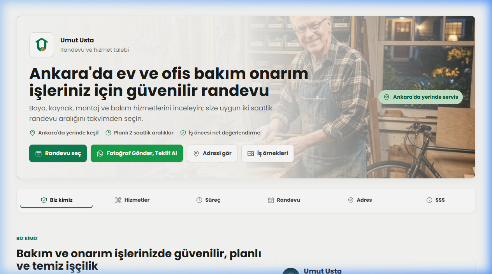
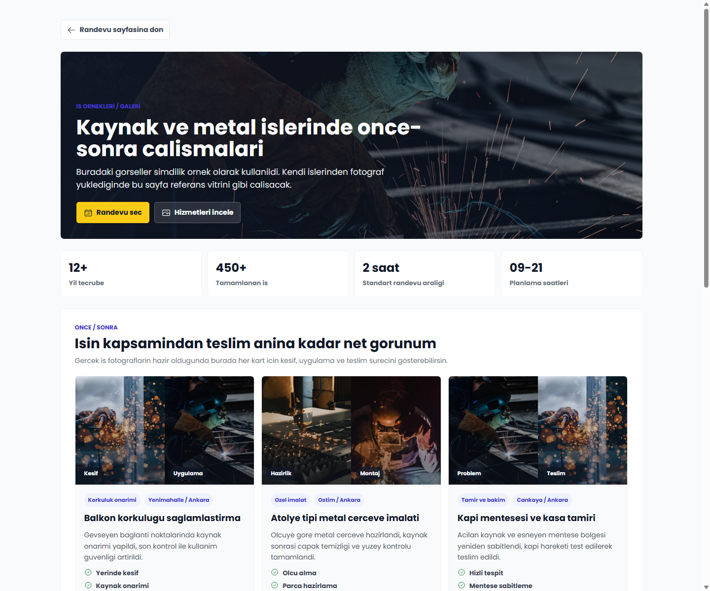
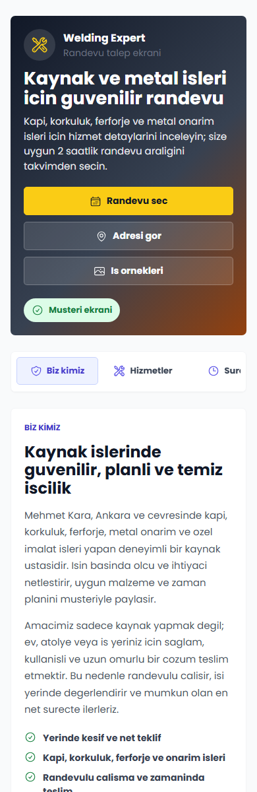

# The Welding Expert App

The Welding Expert App is a React and Supabase application for a local welding and metalwork service. It separates the customer-facing booking experience from the admin panel used to review requests and manage availability.

## Screenshots

### Customer Booking Page



### Work Gallery Page



### Mobile Booking Experience



## Features

- Customer appointment page with weekly availability
- Two-hour booking slots between 09:00 and 21:00
- Future date selection for appointment planning
- WhatsApp, email, and in-system request options
- Admin dashboard for appointment request review
- Admin availability management for days and slots
- Gallery page for work examples, before/after content, and testimonials
- Public business information, service overview, FAQ, and address section
- Supabase schema with RLS policies and admin profile approval flow

## Tech Stack

| Area | Tools |
| --- | --- |
| Frontend | React 18, Vite, React Router |
| Data fetching | TanStack React Query |
| Styling | Styled Components |
| Forms | React Hook Form, controlled form state |
| Testing | Vitest, Testing Library, jsdom |
| Notifications | React Hot Toast |
| Backend | Supabase Auth, PostgreSQL, RLS |
| Documentation | SQL schema, deployment notes, research review |

## Routes

| Route | Purpose |
| --- | --- |
| `/appointment` | Public customer booking page |
| `/gallery` | Work examples, gallery, and references |
| `/login` | Admin login |
| `/signup` | Admin signup request |
| `/admin/dashboard` | Admin overview |
| `/admin/bookings` | Appointment request management |
| `/admin/availability` | Weekly availability and slot management |

Legacy redirects are kept for `/dashboard` and `/bookings`.

## Getting Started

```bash
npm install
npm run dev
```

The default Vite development URL is usually:

```text
http://localhost:5173
```

## Environment Variables

Create a local `.env.local` file based on `.env.example`:

```env
VITE_SUPABASE_URL=your_supabase_url_here
VITE_SUPABASE_ANON_KEY=your_supabase_anon_key_here
```

Only use a publishable or anon Supabase key in the browser. Do not place a Supabase secret key or service role key in any frontend environment file.

## Supabase Setup

Run the schema in:

```text
supabase/welding_appointments_schema.sql
```

The schema creates:

- `appointment_availability_days`
- `appointment_availability_slots`
- `appointment_requests`
- `admin_profiles`
- Admin helper function and RLS policies
- Initial sample availability data

After an admin signs up, approve the admin profile in Supabase SQL Editor:

```sql
update public.admin_profiles
set role = 'admin', is_active = true
where user_id = (
  select id from auth.users
  where email = 'admin@example.com'
);
```

## Available Scripts

```bash
npm run dev
npm run build
npm run preview
npm run lint
npm run test
npm run test:run
```

`npm run test` starts Vitest in watch mode. `npm run test:run` runs the full
suite once and is used by the GitHub Actions workflow.

The application uses route-level lazy loading. Customer, gallery,
authentication, and admin pages are emitted as separate production chunks.

## Deployment

See [DEPLOYMENT.md](./DEPLOYMENT.md) for Vercel and Netlify guidance.

Recommended production setup:

- Add `VITE_SUPABASE_URL`
- Add `VITE_SUPABASE_ANON_KEY`
- Configure SPA fallback for React Router
- Never add Supabase secret keys to a frontend deployment

## Research Notes

See [PROJECT_RESEARCH_REVIEW.md](./PROJECT_RESEARCH_REVIEW.md) for product, UX, local SEO, Supabase, and deployment recommendations.

## Security Checklist

- `.env.local` is ignored
- `node_modules`, `dist`, `build`, screenshots, and logs are ignored
- RLS is enabled for public Supabase tables
- Public users can only read visible availability and create appointment requests
- Admin-only operations require an active admin profile

## Future Improvements

- Move gallery and testimonials to Supabase tables
- Add Supabase Storage for portfolio images
- Add LocalBusiness JSON-LD and page-level SEO metadata
- Add conflict protection for duplicate appointment slots
- Expand integration coverage for admin booking and availability workflows
