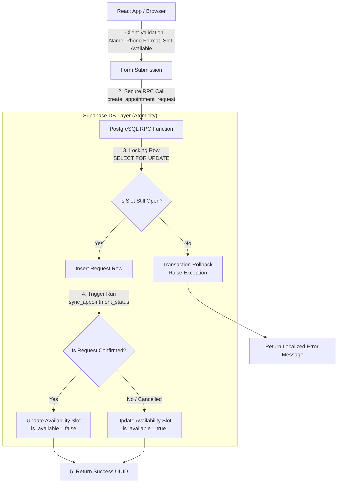

# 🔨 Umut Usta Booking & Operations Platform

[](https://react.dev/)
[](https://vitejs.dev/)
[](https://supabase.com/)
[](https://www.postgresql.org/)
[](https://opensource.org/licenses/MIT)

**Live Production Demo:** [umut-usta.vercel.app/appointment](https://umut-usta.vercel.app/appointment)

The **Umut Usta Booking & Operations Platform** is a production-ready, full-stack React application engineered to modernize booking and operational workflows for a local home services business (Ankara/Yenimahalle). It provides clients with a friction-free, mobile-optimized calendar interface, backed by a secure, real-time admin portal with custom analytics, dynamic pricing configurators, and robust PostgreSQL integrity layers.

---

## 📸 Screenshots

<p align="center">
  
</p>

<br>

<p align="center">
  
</p>

<br>

<p align="center">
  
</p>

---

## 🏗️ Architectural Overview

This system employs a **Defense-in-Depth** and **Single Source of Truth (SSOT)** design. Below is the system data-flow and validation pipeline when a customer requests a booking:



---

## 🚀 Key Engineering & Security Highlights

### ⚡ Race Condition Mitigation (`FOR UPDATE` Locking)
In local service scheduling, double-booking identical slots is a severe operational risk. This platform eliminates this at the database layer inside a single atomic PostgreSQL transaction.
When executing `create_appointment_request()`, it requests a row lock:
```sql
SELECT slot.id INTO v_slot_id
FROM public.appointment_availability_slots AS slot
WHERE slot.slot_time = p_requested_time AND slot.is_available = true
FOR UPDATE OF slot;
```
This blocks concurrent client requests from reading/writing to the same slot row until the current transaction commits or rolls back, ensuring complete scheduling integrity.

### 🔒 Privacy-First Custom Analytics
To bypass cookie consent banners and third-party trackers, a lightweight custom tracking service is embedded. It logs anonymized session-based milestones (`booking_wizard_started`, `booking_step_completed`, `booking_submitted`, `booking_whatsapp_clicked`) directly into a secure `analytics_events` table, rendering a conversion funnel directly inside the operations panel.

### 🛡️ Secure RBAC (Role-Based Access Control)
- **Granular Permissions:** 4 distinct user roles are configured: `Owner` (full system ownership), `Admin` (bookings & availability management), `Operator` (bookings & client communications), and `Technician` (field view read-only access).
- **Row-Level Security (RLS):** Policies are enforced at the database level. Anonymous clients can only execute the booking creation RPC and read configured pricing/availability. Directly modifying internal tables is restricted.

---

## ✨ Features

### 👥 Customer Booking Portal
- **2-Step Booking Wizard:** Reduced friction design prioritizing thumb zone accessibility on mobile screens.
- **Dynamic Slot Availability:** Real-time rendering of 2-hour slots with background color status mapping (Green: Available, Amber: Limited, Red: Closed).
- **Turkish Phone Formatting:** Real-time mask validation and transformation (`05xx xxx xx xx`) to guarantee clean data.
- **Multichannel Confirmations:** Dynamic pre-filled WhatsApp templates, fallback email drafts, or direct database submission.
- **LocalBusiness JSON-LD Metadata:** Implements search-engine readable schema metadata for enhanced Local SEO search results.

### 🛡️ Admin Operations Panel (`/admin`)
- **Interactive Weekly Trend Charts:** Built with `recharts`, visualizing weekly incoming, confirmed, completed, and cancelled requests over the last 8 weeks.
- **Conversion Funnel Analyser:** View step-by-step conversion stats (Wizard Open → Step 1 Done → Form Submit → WhatsApp Click) to monitor user behavior.
- **Dynamic Services Customizer:** Edit starting prices (`priceTagline`), description copy, and bullet points on the fly. Persists instantly to the public view without redeployment.
- **Advanced Request Manager:** Paginated request table (20 rows/page) with full-text search capability indexing customer details and comments.
- **Soft-Delete Archive:** Protects audit trails. Deleting requests moves them to the Archive tab, keeping history while auto-unlocking the slot via database triggers.

---

## 🛠️ Tech Stack

| Domain | Technologies Used |
| --- | --- |
| **Frontend** | React 18, Vite, React Router DOM (v7) |
| **State & Query** | TanStack React Query (v4) |
| **Data Viz** | Recharts (Responsive SVG charts) |
| **Styling** | Styled Components (CSS-in-JS, Dark mode support) |
| **Forms & Testing** | React Hook Form, Vitest, React Testing Library |
| **Backend / DB** | Supabase, PostgreSQL 15, Storage Buckets, RLS, DB Triggers |

---

## 🛣️ Application Route Configuration

| Route | Access Group | Description |
| --- | --- | --- |
| `/appointment` | Public | Main landing page and booking calendar |
| `/gallery` | Public | Before/After gallery & testimonials |
| `/login` / `/signup` | Public | Team access portal and registration |
| `/admin/dashboard` | Protected (Team) | Operations panel with KPIs, trends, and funnel charts |
| `/admin/bookings` | Protected (Team) | Paginated request lists & search console |
| `/admin/availability` | Protected (Team) | Master schedule slot config manager |
| `/admin/services` | Protected (Admin/Owner) | Dynamic service config & price editor |
| `/admin/users` | Protected (Owner-only) | Team access approval & RBAC mapping page |

---

## 🚀 Getting Started

### 1. Installation & Environment Configuration
Clone the repository, install dependencies, and create a `.env.local` file:
```bash
git clone https://github.com/abdullahberkeozder/my-portfolio.git
cd the-welding-expert-app
npm install
```

Configure your `.env.local` variables:
```env
VITE_SUPABASE_URL=https://your-project-id.supabase.co
VITE_SUPABASE_ANON_KEY=your-supabase-public-anon-key
```

Run local server:
```bash
npm run dev
```

### 2. SQL Schema Setup (Execute sequentially in Supabase SQL Editor)
Run database setup files in the `supabase/` folder in the following order:
1. `supabase/welding_appointments_schema.sql` (Creates base schemas, tables, and constraints)
2. `supabase/role_based_access_control.sql` (Initializes RBAC profiles and security policies)
3. `supabase/gallery_management_setup.sql` (Storage bucket rules & assets mapping)
4. `supabase/analytics_events_migration.sql` (Analytics tracking tables & RLS rules)
5. `supabase/service_configs_migration.sql` (Dynamic services pricing definitions & seed data)
