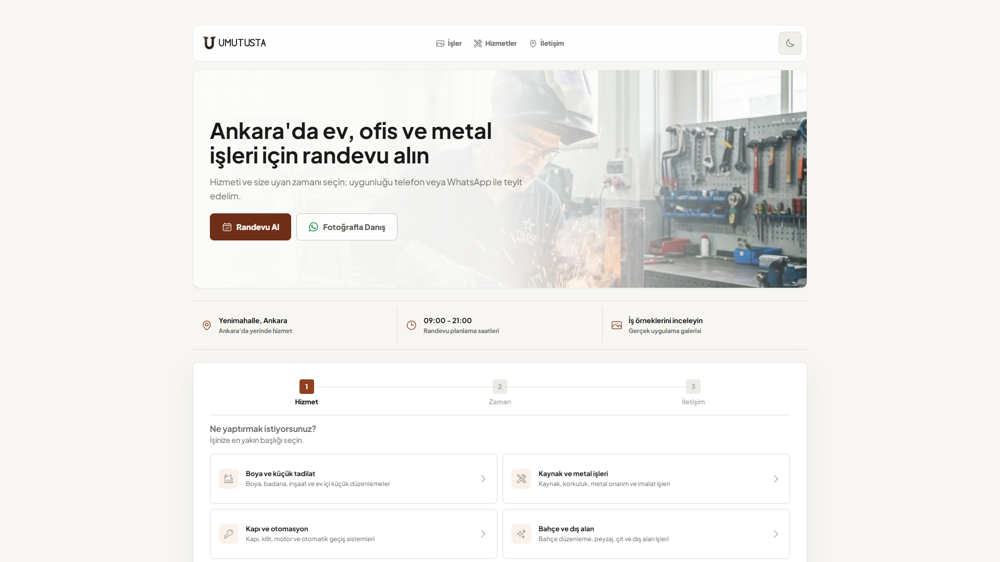
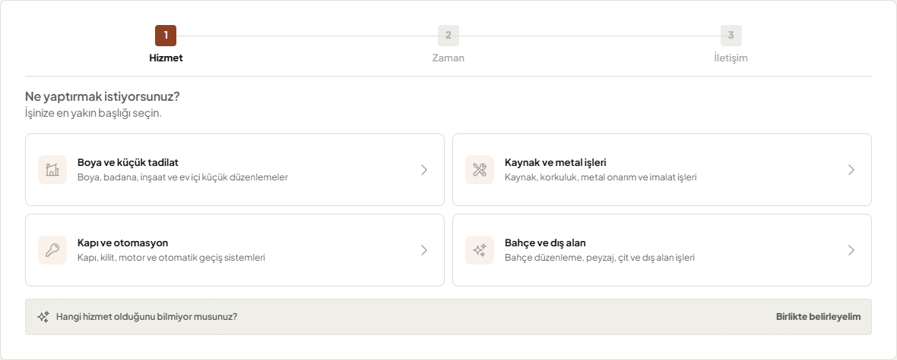
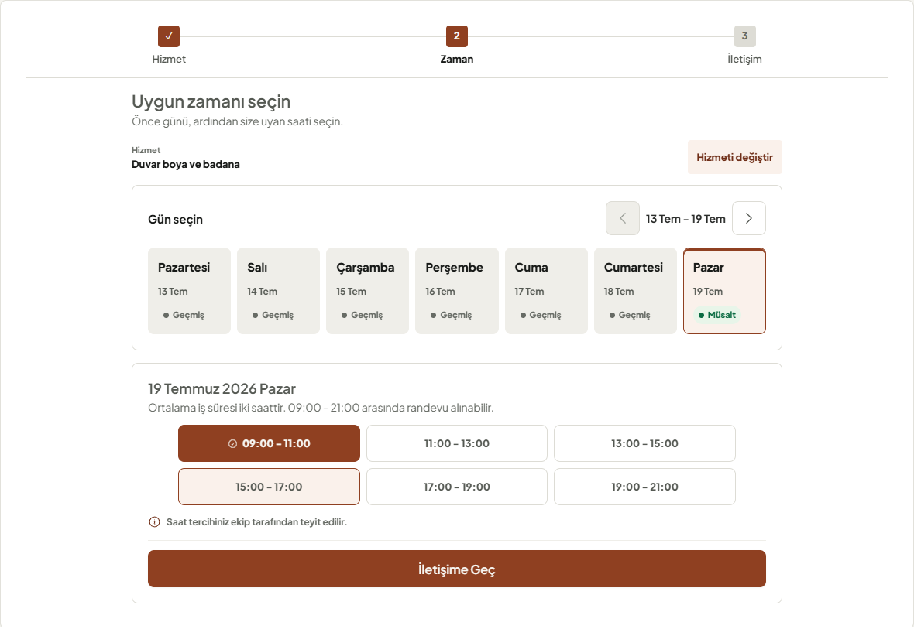
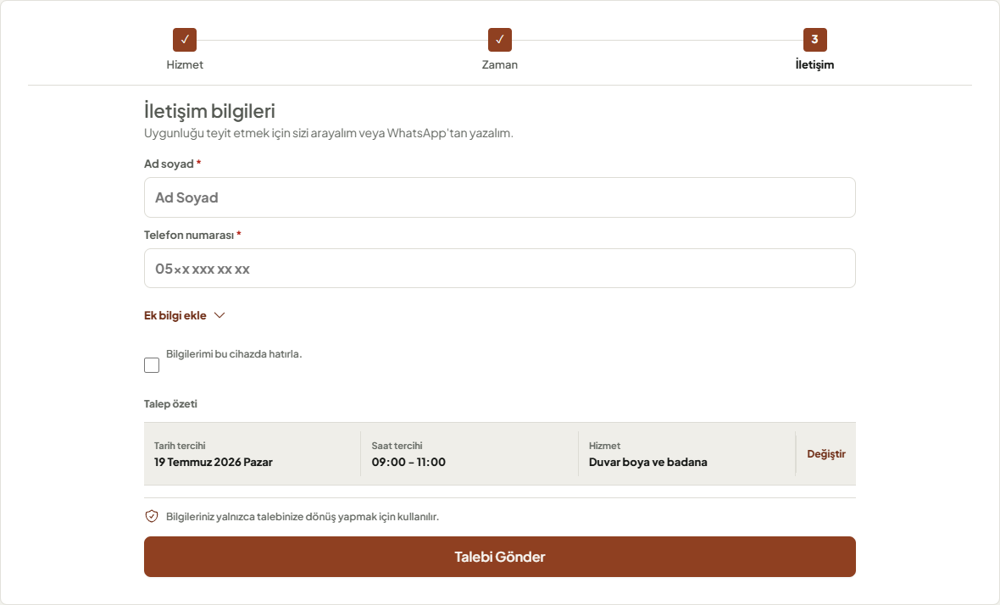
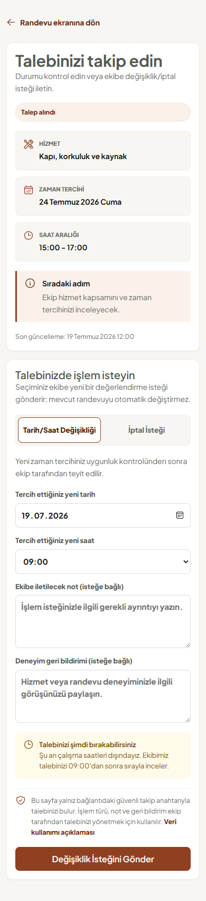
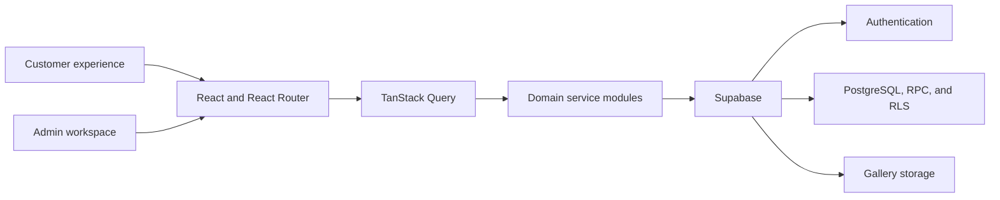

# Umut Usta - Appointment and Service Operations Platform

A production-ready appointment and operations experience for a local welding, metalwork, and home maintenance business in Ankara. The product combines a low-friction customer journey with secure scheduling, self-service request management, and an analytics-driven admin workspace.

[**Open the live application**](https://umut-usta.vercel.app/appointment) | [View the work gallery](https://umut-usta.vercel.app/gallery)



## Product Overview

Local service appointments are often coordinated through repeated calls and messages. This creates uncertainty for customers and leaves the business with fragmented request details, schedule conflicts, and little insight into demand.

Umut Usta turns that process into one connected product:

- Customers describe the job, select an available date and time, and leave contact details in a focused three-step flow.
- Returning customers can follow a private tracking link to request a cancellation or schedule change and share feedback.
- The team manages requests, availability, services, portfolio content, and access permissions from a protected admin area.
- Product and operational analytics reveal acquisition quality, booking friction, service demand, and workload patterns.

## Customer Experience

### Focused three-step booking

The booking flow progressively reveals only the information needed for the current decision:

1. **Service:** choose the closest service category or use **Birlikte belirleyelim** when the scope is unclear.
2. **Date and time:** browse weekly availability and choose a two-hour appointment window.
3. **Contact:** enter the minimum required details, review the request, and submit it for confirmation.

The progress indicator supports backward navigation, selected information remains editable, and optional fields stay collapsed until requested. This reduces competing actions without removing customer control.

<table>
  <tr>
    <td width="50%"></td>
    <td width="50%"></td>
  </tr>
  <tr>
    <td align="center"><strong>Service selection</strong></td>
    <td align="center"><strong>Weekly availability and time slots</strong></td>
  </tr>
</table>

### Customer capabilities

- Responsive appointment experience optimized for desktop, tablet, and mobile layouts
- Database-backed service definitions and weekly availability
- Clear available, unavailable, selected, loading, validation, and submission states
- Optional local contact-detail recall on the customer's device
- Before-and-after work gallery with service attribution
- Private appointment tracking through a public token
- Self-service cancellation and schedule-change requests
- Cancellation reasons, customer notes, and feedback capture
- Contextual WhatsApp contact without interrupting the primary booking flow

<table>
  <tr>
    <td width="68%"></td>
    <td width="32%"></td>
  </tr>
  <tr>
    <td align="center"><strong>Contact and submission</strong></td>
    <td align="center"><strong>Mobile self-service</strong></td>
  </tr>
</table>

## UX and Visual Direction

The customer experience was redesigned through iterative PUX sprints informed by design-thinking research, cognitive-load principles, responsive testing, and direct visual review.

- **One decision at a time:** progressive disclosure keeps the active task visually dominant.
- **Recognition over recall:** selected service, date, and time remain visible where they affect the next choice.
- **Reduced choice noise:** duplicate actions, redundant summaries, unsupported shortcuts, and unnecessary status copy were removed.
- **Clear hierarchy:** spacing, typography, borders, and contrast communicate structure before decoration.
- **Premium craft language:** the Forged U identity, warm forged-metal accent, restrained neutral surfaces, and deliberate micro-interactions connect the interface to metal craftsmanship.
- **Accessible interaction:** keyboard navigation, visible focus states, semantic labels, non-color status cues, reduced-motion support, and forced-colors behavior are included.
- **Stable responsive layouts:** controls maintain usable touch targets and predictable geometry across common mobile and desktop widths.

The design rationale and validation history are documented in the [cognitive-load UX/UI research report](./docs/Umut_Usta_Bilissel_Yuk_UX_UI_Arastirma_Raporu_2026-07-19.md) and [premium design-language benchmark](./docs/Umut_Usta_Premium_Tasarim_Dili_Benchmark_Raporu_2026-07-19.md).

## Operations and Analytics

The protected admin workspace supports the business after a customer submits a request.

### Operations

- Request search, filtering, status updates, pagination, archiving, and restoration
- Weekly availability and individual time-slot management
- Dynamic service content and gallery management
- Role-based access for `owner`, `admin`, `operator`, and `technician`
- Owner-controlled team approval, suspension, and role assignment
- Automatic slot locking and reopening as appointment status changes
- Customer action history and notification outbox support

### Data visualization

- Booking funnel and step-level drop-off analysis
- Channel-to-request, confirmation, and completion conversion
- Confirmation and completion rates by service type
- Day-and-hour demand heatmap
- Cancellation reasons and customer feedback
- Self-service request activity
- Gallery-assisted conversion attribution
- Operational totals and weekly request trends

Analytics events are first-party and sanitized before persistence. Properties that resemble names, phone numbers, email addresses, notes, or free-form messages are excluded from product analytics.

## Architecture



### Engineering highlights

- Anonymous appointment creation is routed through a validated PostgreSQL RPC instead of unrestricted table inserts.
- Row-level security limits data access by public and authenticated roles.
- Transaction-level slot locking and synchronization protect scheduling integrity.
- Customer-authored notes are preserved separately from internal operational notes.
- Public tracking responses expose only the minimum data required for self-service.
- Customer routes and admin features are lazy-loaded to reduce the initial bundle.
- Responsive image formats, performance budgets, and Lighthouse checks protect loading quality.
- Unit, integration, responsive, accessibility, and end-to-end scenarios cover critical journeys.

## Technology

| Area | Stack |
| --- | --- |
| Frontend | React 18, Vite, React Router |
| Server state | TanStack Query |
| Forms and feedback | Controlled React forms, React Hot Toast |
| Styling | Styled Components, Plus Jakarta Sans |
| Visualization | Recharts |
| Backend | Supabase Auth, PostgreSQL, RPC, Storage, RLS |
| Testing | Vitest, React Testing Library, Playwright |
| Quality | ESLint, Lighthouse CI, custom performance and image audits |
| Deployment | Vercel |

## Application Routes

| Route | Access | Purpose |
| --- | --- | --- |
| `/appointment` | Public | Customer booking experience |
| `/appointment/track/:publicToken` | Public token | Appointment tracking and self-service requests |
| `/gallery` | Public | Before-and-after work portfolio |
| `/privacy` | Public | Privacy information |
| `/login` | Public | Team sign-in |
| `/signup` | Public | Team account request |
| `/admin/dashboard` | Protected | Operational KPIs and analytics |
| `/admin/bookings` | Protected | Request management |
| `/admin/availability` | Protected | Weekly schedule management |
| `/admin/services` | Owner/Admin | Service configuration |
| `/admin/gallery` | Owner/Admin | Portfolio management |
| `/admin/users` | Owner | Team and permission management |

Legacy `/dashboard` and `/bookings` URLs redirect to their protected admin equivalents.

## Project Structure

```text
src/
|- analytics/         Event taxonomy and analytics helpers
|- features/          Booking, analytics, and domain components
|- hooks/             Query and UI behavior hooks
|- pages/             Public and protected route views
|- services/          Supabase and domain API modules
|- styles/            Global design tokens and shared styles
|- ui/                Reusable interface components
|- utils/             Permissions, formatting, and validation
supabase/              Schema, security, and feature migrations
e2e/                   Playwright journeys and visual baselines
docs/                  UX research, sprint plans, and release evidence
scripts/               Image and performance quality checks
```

## Local Development

### Prerequisites

- Node.js 18 or newer
- npm
- A Supabase project

### Setup

```bash
git clone https://github.com/abdullahberkeozder/my-portfolio.git
cd my-portfolio/the-welding-expert-app
npm install
```

Create `.env.local` in the application directory:

```env
VITE_SUPABASE_URL=https://your-project-id.supabase.co
VITE_SUPABASE_ANON_KEY=your-supabase-anon-key
```

Start the local application:

```bash
npm run dev
```

Vite prints the local URL in the terminal, typically `http://localhost:5173`.

## Database Setup

SQL migrations live in [`supabase/`](./supabase). For a new environment, apply them by capability group:

1. Base appointment schema
2. Authentication, role-based access, services, gallery, and analytics
3. Appointment integrity, secure request RPC, note separation, and status synchronization
4. Customer self-service, follow-up history, and measurement hardening
5. Seed data only after the required schema and storage configuration exist

Existing environments should apply only migrations that have not already been deployed. Review each script header and validate a backup and rollback path before execution.

## Quality Commands

| Command | Purpose |
| --- | --- |
| `npm run lint` | Run static analysis |
| `npm run test:run` | Run the Vitest suite once |
| `npm run test:e2e` | Run Playwright customer journeys |
| `npm run build` | Create the production build |
| `npm run images:audit` | Check responsive image coverage |
| `npm run perf:budget` | Enforce asset and bundle budgets |
| `npm run pux8:rc` | Run the local release-candidate pipeline |

## Deployment

The production application is deployed on Vercel. SPA rewrites are defined in [`vercel.json`](./vercel.json), allowing public tracking and protected admin routes to resolve correctly after direct navigation or refresh.

**Production:** [https://umut-usta.vercel.app/appointment](https://umut-usta.vercel.app/appointment)

## License

This project is available under the [MIT License](../LICENSE).

## Author

Designed and developed by [Abdullah Berke Ozder](https://github.com/abdullahberkeozder).
