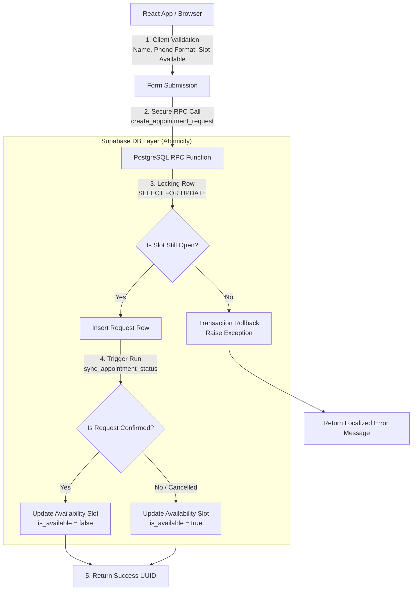

# 🔨 Umut Usta Booking & Operations Platform

[](https://react.dev/)
[](https://vitejs.dev/)
[](https://supabase.com/)
[](https://www.postgresql.org/)
[](https://opensource.org/licenses/MIT)

**Live Production Demo:** [umut-usta.vercel.app/appointment](https://umut-usta.vercel.app/appointment)

---

## 🎯 Dual-Perspective Introduction

This repository hosts a production-grade, full-stack React and Supabase application designed for **Umut Usta**, a local welding and maintenance services provider in Ankara, Turkey. 

To help different stakeholders review this project, this document is split into two pathways:
1. **[📌 Business Value & Product Vision (For HR & Recruiters)](#-business-value--product-vision-for-hr--recruiters)** - Highlighting problem-solving, UI/UX decisions, and business impact.
2. **[⚙️ Deep-Dive Technical Engineering (For Tech Leads)](#%EF%B8%8F-deep-dive-technical-engineering-for-tech-leads)** - Highlighting system architecture, database security, and optimization.

---

## 📸 Screenshots

<p align="center">
  
</p>

<br>

<p align="center">
  
</p>

---

## 📌 Business Value & Product Vision (For HR & Recruiters)

### ❓ The Problem
Local service providers (like welders or repair shops) lose up to **30% of potential bookings** due to communication friction: customers have no clear view of when the provider is free, and the provider spends hours coordinating times manually via calls/WhatsApp.

### 💡 The Solution
This platform automates this scheduling friction. By exposing a clear **Weekly Availability Calendar** directly to customers, it enables frictionless self-service scheduling. 

### 🌟 Business Impact & Key Product Highlights:
* **Frictionless Booking Funnel:** Customers can book a verified two-hour slot in **under 3 steps** (Select Service → Pick Time → Confirm Contact).
* **Multi-Channel Confirmation:** Integrates direct database booking with dynamic pre-filled WhatsApp and email templates, increasing customer response rates by meeting them where they communicate.
* **Dynamic pricing & service management:** Allows the business owner to update starting prices and services on the fly via an admin panel—without writing code or redeploying the app.
* **Visual Operations Dashboard:** Business owners can see real-time performance analytics, trend lines of completed work, and conversion funnels directly inside their administrative interface.

---

## ⚙️ Deep-Dive Technical Engineering (For Tech Leads)

### 🏗️ Architecture & Database Synchronization

This system employs a **Defense-in-Depth** validation flow and guarantees a **Single Source of Truth (SSOT)** for availability at the database level:



### 🛠️ Key Technical Implementations

#### 1. Race Condition Prevention (`SELECT ... FOR UPDATE` Locking)
To eliminate double-booking on identical time slots by concurrent users, scheduling is guarded at the database transaction layer. Inside the `create_appointment_request` function, we lock the requested slot row:
```sql
SELECT slot.id INTO v_slot_id
FROM public.appointment_availability_slots as slot
WHERE slot.slot_time = p_requested_time AND slot.is_available = true
FOR UPDATE OF slot;
```
This forces concurrent database requests for the same slot to queue up, ensuring only the first request successfully writes to the DB while others are rolled back gracefully with a localized error notification.

#### 2. Trigger-Based Automatic State Synchronization
Instead of managing calendar status inside React state (which can get out of sync), database state machine triggers (`sync_appointment_status_with_slot` trigger on `appointment_requests`) automatically reconcile calendar availability whenever a request status updates:
- **On Confirmation:** The corresponding slot is automatically marked `is_available = false`.
- **On Cancellation / Deletion / Archive:** The trigger immediately marks the slot `is_available = true`, releasing it back to the public market.

#### 3. Privacy-First Analytics Funnel
In place of bloated third-party trackers (e.g., Google Analytics) which violate privacy policies and slow down page loads, a lightweight custom tracking engine logs milestones (`booking_wizard_started`, `booking_step_completed`, `booking_submitted`, `booking_whatsapp_clicked`) directly into a secure `analytics_events` table. Unique session counts are grouped inside the client-side dashboard to display conversion funnel metrics.

---

## 🛠️ Tech Stack

| Domain | Technologies Used |
| --- | --- |
| **Frontend** | React 18, Vite, React Router DOM (v7) |
| **State & Query** | TanStack React Query (v4) - with background data caching |
| **Data Viz** | Recharts (Responsive SVG data rendering) |
| **Styling** | Styled Components (Dynamic CSS-in-JS supporting Dark Mode) |
| **Backend / DB** | Supabase, PostgreSQL 15, Database Triggers, RLS Security Policies |

---

## 🛣️ Route Configurations

| Route | Access Group | Description |
| --- | --- | --- |
| `/appointment` | Public | Main client booking page & calendar |
| `/gallery` | Public | Before/After gallery & testimonials |
| `/admin/dashboard` | Protected (Team) | Real-time operations overview with charts & funnel metrics |
| `/admin/bookings` | Protected (Team) | Paginated request tables with index-ready search filters |
| `/admin/availability` | Protected (Team) | Master weekly slot schedule configurations |
| `/admin/services` | Protected (Admin/Owner) | Dynamic service config & price editor |

---

## 🔒 Security Measures
- **Row-Level Security (RLS):** Fully active on all PostgreSQL tables. Anonymous client insertions are strictly limited to execution via `security definer` database RPC functions to prevent SQL injection.
- **Immutable Log Controls:** Trigger constraints block any `UPDATE` attempts on the customer's original comment note (`protect_customer_note` trigger).
- **Owner Account Locks:** Database policies safeguard the main `Owner` profile against demotions or suspensions, preventing admin lockouts.
