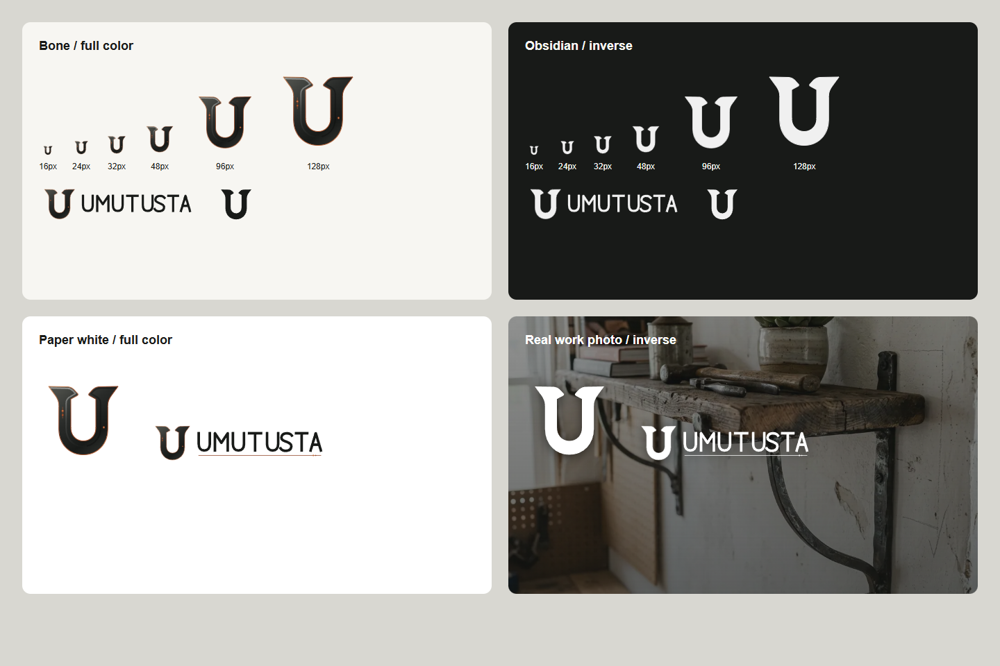

# PUX-1 Yerel Kapanış Raporu

**Proje:** Umut Usta Randevu Uygulaması  
**Sprint:** PUX-1 - Marka asset sistemi ve Quiet Craft temeli  
**Tarih:** 19 Temmuz 2026  
**Durum:** Tamamlandı, yalnız yerelde doğrulandı  
**Dağıtım:** Git commit/push ve canlı yayın yapılmadı

## 1. Sonuç

PUX-1, sonraki müşteri deneyimi sprintlerinin kullanacağı ortak marka ve arayüz temelini kurdu. Master görseldeki dövme metal karakteri vektör sisteme taşındı; eski mavi/slate ağırlıklı tema Quiet Craft paletine bağlandı; açık ve koyu tema aynı marka karakterini koruyacak şekilde eşitlendi.

Bu sprint randevu iş kurallarını, API sözleşmelerini, Supabase şemasını veya admin dashboard akışını değiştirmedi.

## 2. Tamamlanan İşler

### 2.1 Forged U asset sistemi

| Varyant | Dosya | Kullanım |
|---|---|---|
| Ana işaret | `public/umut-usta-logo.svg` | Navigasyon, hero ve standart marka alanları |
| Yatay kilit | `public/umut-usta-logo-horizontal.svg` | Geniş marka alanları ve kurumsal kullanım |
| Kompakt kilit | `public/umut-usta-logo-compact.svg` | Dar yatay alanlar |
| Tek renk | `public/umut-usta-logo-monochrome.svg` | Koyu/fotoğraflı zemin ve tek renk baskı |
| Dokulu master | `public/umut-usta-logo.png` | Büyük, kontrollü ve yüksek çözünürlüklü görsel kullanım |
| Favicon | `public/umut-usta-favicon.svg`, `.png` | 16-48 px tarayıcı bağlamı |
| Touch icon | `public/apple-touch-icon.png` | Mobil ana ekran simgesi |

- Ana U formu optik olarak dengelendi ve üç mikro kaynak iziyle sınırlandı.
- Küçük favicon varyantında kaynak izi kaldırılarak silüet önceliklendirildi.
- Tüm SVG logotype ve harf biçimleri path tabanlıdır; `<text>` ve sistem fontu yoktur.
- `BrandLogo` bileşeni `mark`, `compact`, `horizontal`, `monochrome` ve `textured` varyantlarını tek API altında sunar.
- Müşteri booking sayfası, auth alanı ve mevcut navigasyon doğrudan dosya yolu yerine ortak bileşene bağlandı.

### 2.2 Boyut ve zemin doğrulaması

İşaret 16, 24, 32, 48, 96 ve 128 px boyutlarda; bone, paper white, obsidian ve gerçek iş fotoğrafı zeminlerinde kontrol edildi.

### 2.3 Quiet Craft token temeli

| Rol | Token | Değer |
|---|---|---|
| Ana yazı / obsidian | `--ink-950` | `#181A18` |
| İkincil koyu yüzey | `--ink-850` | `#292B29` |
| Muted metin | `--steel-700` | `#555953` |
| İkincil steel | `--steel-600` | `#676B65` |
| Ana açık yüzey | `--bone-100` | `#F7F6F2` |
| Temiz yüzey | `--paper-0` | `#FFFFFF` |
| Ayrım çizgisi | `--line-200` | `#DDDCD5` |
| Ana bakır eylem | `--copper-700` | `#8F4021` |
| Vurgu bakırı | `--copper-500` | `#C56A37` |

- Legacy renk adları semantik alias'lara bağlandı; böylece sonraki sprintlerde bileşen bazlı geçiş yapılabilecek.
- Surface, text ve control semantik tokenları eklendi.
- Radius sistemi `4 / 8 / 12 px` olarak tanımlandı.
- Shadow kullanımı sakinleştirildi; premium his renk kalabalığı yerine yüzey, çizgi ve ölçü disipliniyle kuruldu.
- Plus Jakarta Sans korunurken letter spacing genel olarak `0` tutuldu.

### 2.4 Tema eşitliği

- Koyu tema slate/mavi karakterden obsidian/graphite karakterine taşındı.
- Forged U koyu temada kemik rengi tek renk varyanta dönüşerek okunabilir kaldı.
- Theme toggle içindeki doğrudan hex renkler kaldırıldı ve semantik tokenlar kullanıldı.
- Tema geçişi 320 ms olarak sınırlandı; reduced-motion davranışı global kural üzerinden `0 ms` kalır.
- Theme toggle sabit ölçülü, ikon tabanlı ve `aria-pressed` durumlu bir segmented control haline getirildi.

## 3. Kabul Kriterleri

| Kriter | Sonuç | Kanıt |
|---|---|---|
| Açık/koyu temada logo ayrışıyor | Geçti | Playwright light/dark ve yüzey matrisi |
| SVG, Forged U master silüetini taşıyor | Geçti | Beş vektör assetin görsel kontrolü |
| SVG içinde font veya `<text>` yok | Geçti | Otomatik asset guardrail testi |
| Ana kontrast çiftleri WCAG AA | Geçti | 11 kontrast birim testi |
| Theme toggle hardcoded marka dışı renk üretmiyor | Geçti | Token tabanlı stil ve component testi |
| Favicon küçük ölçekte okunuyor | Geçti | 16-48 px görsel matris |
| Mevcut müşteri akışları bozulmadı | Geçti | 20/20 Playwright E2E |

## 4. Kalite Kapıları

| Kontrol | Sonuç |
|---|---|
| `npm run lint` | Başarılı, 0 uyarı |
| `npm run test:run` | 22 dosya, 83/83 test başarılı |
| `npm run test:e2e -- e2e/pux-baseline.spec.js` | 12/12 başarılı |
| `npm run test:e2e` | 20/20 başarılı |
| `npm run build` | Başarılı, 803 modül işlendi |
| `npm run perf:budget` | Başarılı, 10.47 MB toplam; 194.8 KB kritik görsel |
| `git diff --check` | Hata yok; yalnız mevcut satır sonu uyarıları |

## 5. Tasarım Kullanım Kuralları

1. 48 px ve altında yalnız `mark` veya sade favicon kullanılır.
2. Fotoğraf ve obsidian üzerinde `monochrome` tercih edilir; yeterli kontrast yoksa kontrollü koyu overlay kullanılır.
3. Dokulu 4K master, küçük navigasyon alanlarında kullanılmaz.
4. Yeni bileşenlerde doğrudan hex yerine semantik surface/text/control tokenları kullanılır.
5. Bakır rengi birincil eylem, focus ve seçili durum için saklanır; geniş dekoratif yüzey rengi yapılmaz.
6. Kart benzeri bileşenlerde gölge yerine border ve yüzey ayrımı önceliklidir.

## 6. PUX-2 Geçiş Kararı

PUX-2 için marka, tema ve regresyon temeli hazırdır. Sonraki sprintin odağı ilk viewport'taki tekrarları azaltmak, hero karar mimarisini tek ana göreve yöneltmek ve sticky CTA görünürlüğünü hero CTA ile çakışmayacak hale getirmektir.

PUX-2 başlangıcında veritabanı veya Supabase migration gerekmemektedir.
