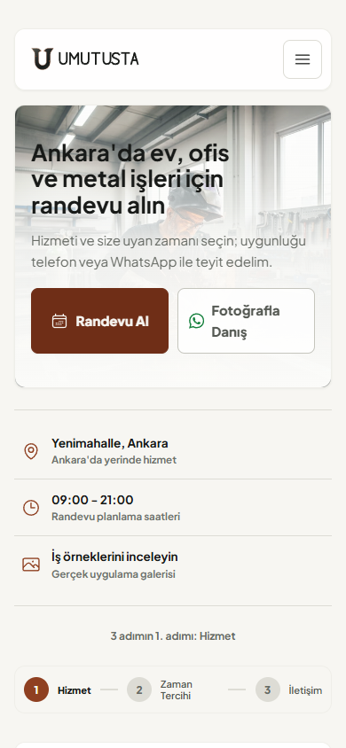
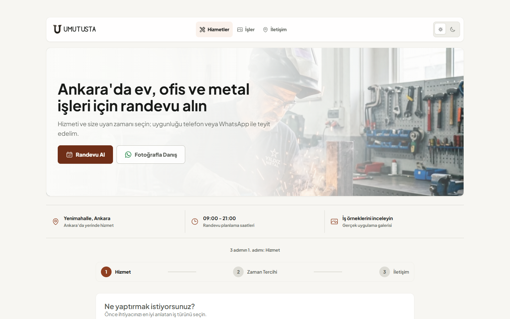

# PUX-2 Yerel Kapanış Raporu

**Proje:** Umut Usta Randevu Uygulaması  
**Sprint:** PUX-2 - Navigasyon, hero ve dikkat mimarisi  
**Tarih:** 19 Temmuz 2026  
**Durum:** Teknik uygulama tamamlandı, yalnız yerelde doğrulandı  
**Dağıtım:** Git commit/push ve canlı yayın yapılmadı

## 1. Amaç ve Sonuç

PUX-2, müşterinin ilk ekranda karşılaştığı karar sayısını azaltarak dikkati randevu görevine yönlendirdi. Aynı marka, CTA ve güven bilgilerinin farklı yüzeylerde tekrar edilmesi kaldırıldı. İlk viewport artık tek marka, tek dolu ana eylem, bir ikincil danışma kanalı ve üç doğrulanabilir bilgi taşır.

Randevu iş kuralları, API sözleşmeleri, analytics olay adları, Supabase şeması ve admin dashboard değiştirilmedi.

## 2. Önce ve Sonra

| Karar yüzeyi | PUX-1 durumu | PUX-2 durumu |
|---|---:|---:|
| İlk viewport görünür marka işareti | 2 | 1 |
| Masaüstü ana navigasyon bağlantısı | 4 | 3 |
| Hero eylemi | 2 ana + 2 utility | 1 primary + 1 secondary |
| Hero trust mesajı | 3 liste + 1 badge | 0; proof strip ile birleştirildi |
| Proof strip hücresi | 4 | 3 |
| Hero görünürken mobil sticky | Görünür | Gizli |
| Hero görünürken dolu marka CTA | Tekrar eden yüzeyler | 1 |

## 3. Tamamlanan İşler

### 3.1 Navigasyon

- Marka alanı compact horizontal Forged U lockup'a taşındı.
- Mobildeki uzun “Ankara bakım ve metal işleri” açıklaması kaldırıldı.
- Ana bağlantılar `Hizmetler`, `İşler`, `İletişim` olarak üçe indirildi.
- Tema kontrolü mobil navigasyon satırından menü içindeki `Görünüm` utility alanına taşındı.
- Hero görünürken masaüstü nav CTA erişim ve odak sırasından çıkarıldı; hero çıktıktan sonra aynı ölçüde görünür hale gelir.
- Mobil navigasyon yüksekliği ve marka ölçüsü 195 px eşdeğer dar viewport'ta taşma üretmeyecek şekilde sabitlendi.

### 3.2 Hero karar mimarisi

- Hero içindeki ikinci logo ve “Randevu ve hizmet talebi” bloğu kaldırıldı.
- H1, `Ankara'da ev, ofis ve metal işleri için randevu alın` olarak göreve bağlandı.
- Açıklama tek teyit cümlesine indirildi.
- Telefon ve galeri utility bağlantıları hero eylem kümesinden çıkarıldı; ilgili bilgi alt bölümlerde korunuyor.
- Ayrı trust listesi ve konum badge'i kaldırıldı.
- H1 için 320-390 px aralığında dengeli satır kırılımı ve stabil tipografi uygulandı.

### 3.3 CTA sistemi

- Primary eylem `Randevu Al` olarak standartlaştırıldı.
- `Fotoğrafla Danış` dolu WhatsApp butonu yerine nötr outline ikincil eylem oldu.
- WhatsApp yeşili yalnız kanal ikonunda kullanıldı.
- Mobil hero butonları iki eşit kolon ve sabit minimum yükseklik kullanır.
- Mevcut `hero_cta_clicked`, `navigation_cta_clicked`, `public_channel_clicked` ve `booking_whatsapp_clicked` olayları korundu.

### 3.4 Proof strip

Proof strip dört hücreden üçe indirildi:

1. `Yenimahalle, Ankara` ve yerinde hizmet bilgisi.
2. `09:00 - 21:00` planlama saatleri.
3. Dinamik yayınlanmış iş sayısı; veri yoksa `İş örneklerini inceleyin`.

Telefon numarası proof kartı olmaktan çıkarıldı; konum ve footer iletişim alanlarında erişilebilir kalır.

### 3.5 Mobil sticky CTA

- Hero görünürken render edilmez.
- Hero ve randevu wizard'ı görünür değilken devreye girer.
- Wizard görünür olduğunda tekrar kaldırılır.
- Bir geniş `Randevu Al` butonu ve 48 px WhatsApp ikon butonu kullanır.
- WhatsApp ikon butonunda erişilebilir ad, tooltip ve sabit dokunma alanı bulunur.
- Safe-area padding ve reduced-motion davranışı korunur.

## 4. Görsel Kanıt

### Mobil 390x844

### Masaüstü 1440x900

PUX-1 öncesi karşılaştırma görüntüleri `docs/readme-assets/pux-1-baseline/` altında arşivlendi.

## 5. Kabul Kriterleri

| Kriter | Sonuç | Kanıt |
|---|---|---|
| İlk viewport'ta logo bir kez görünür | Geçti | Playwright görünür logo sayımı |
| Aynı CTA seti tekrar etmez | Geçti | Hero/nav/sticky visibility guardrail |
| Tek dolu marka CTA vardır | Geçti | Açık/koyu görsel snapshot ve DOM kontrolü |
| Mobil sticky hero ve wizard ile çakışmaz | Geçti | Üç durumlu E2E görünürlük testi |
| H1 320-390 px aralığında bozuk tek kelime satırı üretmez | Geçti | 390 px snapshot ve 195 px taşma testi |
| Açık/koyu premium yön tutarlı | Geçti | Light/dark mobil snapshot |
| 5 saniye testinde yüzde 85 randevu tanıma | Kullanıcı testi bekliyor | PUX-8 katılımcı doğrulaması |

Otomatik test, dikkat hiyerarşisinin teknik ön koşullarını doğrular; gerçek kullanıcıların yüzde 85 başarı oranı katılımcı olmadan varsayılmamıştır.

## 6. Kalite Kapıları

| Kontrol | Sonuç |
|---|---|
| `npm run lint` | Başarılı, 0 uyarı |
| `npm run test:run` | 22 dosya, 83/83 başarılı |
| PUX görsel ve dikkat paketi | 12/12 başarılı |
| `npm run test:e2e` | 20/20 başarılı |
| Erişilebilirlik E2E | 2/2 başarılı |
| `npm run build` | Başarılı, 803 modül işlendi |
| `npm run perf:budget` | Başarılı, 10.47 MB toplam; 194.8 KB kritik görsel |
| 195 px eşdeğer viewport | Yatay taşma yok |

## 7. PUX-3 Geçiş Kararı

İlk viewport artık PUX-3 randevu sistemi dönüşümü için yeterince sakin ve hiyerarşik. PUX-3; hizmet seçimi, ilerleme göstergesi, takvim, iletişim formu ve başarı ekranını Quiet Craft diliyle tek görev akışına dönüştürecek.

PUX-3 başlangıcında veritabanı veya Supabase migration gerekmemektedir.
