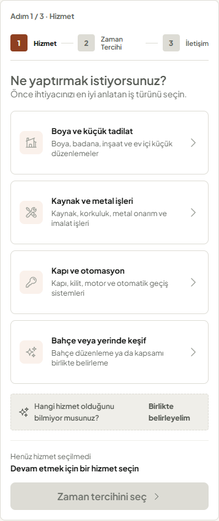
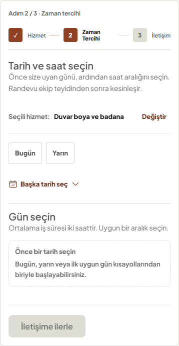
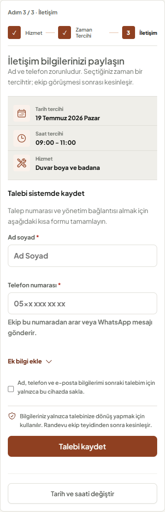
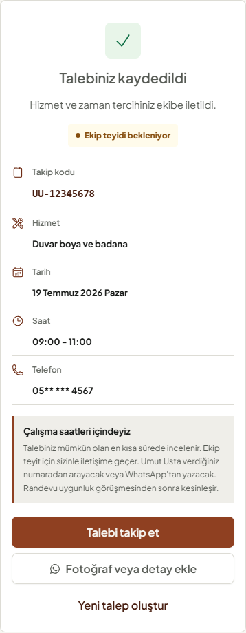

# PUX-3 Yerel Kapanış Raporu

**Proje:** Umut Usta Randevu Uygulaması  
**Sprint:** PUX-3 - Randevu sistemi görsel ve etkileşim dönüşümü  
**Tarih:** 19 Temmuz 2026  
**Durum:** Teknik uygulama tamamlandı, yalnız yerelde doğrulandı  
**Dağıtım:** Git commit/push, canlı yayın ve uzak Supabase değişikliği yapılmadı

## 1. Amaç ve Sonuç

PUX-3, mevcut üç adımlı randevu iş mantığını değiştirmeden karar yüzeyini Quiet Craft tasarım diline taşıdı. Akış artık tek çerçeveli görev alanı, açık seçim sırası, varsayılan seçim içermeyen tarih-saat adımı ve sonucu tek yerde açıklayan başarı ekranı kullanır.

API kontratı, Supabase şeması, analytics olayları ve admin dashboard kapsam dışında tutuldu. Bu sprint için migration veya SQL çalıştırılması gerekmez.

## 2. Bilişsel Yük Değişimi

| Yüzey | Önce | PUX-3 |
|---|---|---|
| Wizard yapısı | İç içe kartlar ve çoklu yüzey | Tek görev yüzeyi |
| Hizmet başlangıcı | Beş eşit ağırlıklı seçenek | Dört ana grup + ayrı belirsizlik yolu |
| Hizmet seçimi | Detay ve fiyat birlikte | Başlık + tek kapsam cümlesi |
| Tarih başlangıcı | Bugün otomatik seçili | Seçim yok; kullanıcı niyeti gerekir |
| Takvim | Tam hafta baskın | Hızlı tarihler + isteğe bağlı tam takvim |
| İletişim | Birden fazla gönderim kanalı | Tek sistem submit; opsiyonel alanlar kapalı |
| Teyit mesajı | Birden fazla yerde tekrar | Tek gizlilik/teyit açıklaması |
| Başarı | Çok katmanlı bilgi ve timeline | Sonuç, durum, özet ve tek ana sonraki adım |

## 3. Tamamlanan İşler

### 3.1 Wizard ve ilerleme

- İç içe panel görünümü kaldırıldı; progress ve içerik tek çerçevede birleşti.
- Durum metni `Adım 1 / 3 · Hizmet` biçiminde kısaltıldı.
- Tamamlanan adımlar check, aktif adım numara ve kısa label ile gösterilir.
- Geçiş hareketi 200 ms ve 6 px ile sakinleştirildi; reduced-motion davranışı korunur.

### 3.2 Hizmet seçimi

- Dört ana ihtiyaç grubu masaüstünde 2x2, mobilde tek kolon sunulur.
- `Birlikte belirleyelim` ana grid dışında ayrı ve daha düşük ağırlıklı kaçış yoludur.
- Alt hizmetler `radiogroup` ve `radio` semantiğini korur.
- Seçili durum copper kenar, soft yüzey ve check ikonu ile yalnız renge bağlı olmadan anlaşılır.
- Fiyat metni karar anından kaldırıldı; ileri eylem seçim yapılana kadar pasiftir.

### 3.3 Tarih ve saat

- Varsayılan tarih ve saat seçimi kaldırıldı.
- `Bugün` ve `Yarın` kısayolları ilk görünür seçimlerdir; tam hafta `Başka tarih seç` altında açılır.
- Tarih seçilmeden slot gösterilmez ve tek cümlelik yönlendirme sunulur.
- Boş hafta, yükleme, hata, geçmiş gün, kapalı gün, seçili slot ve slot çakışması durumları korunur.
- Saat hedefleri minimum 44 px, seçili durum check ikonu ve sabit ölçü kullanır.

### 3.4 İletişim formu

- Ad ve telefon ana yüzeyde; e-posta ve not `Ek bilgi ekle` disclosure'ında tutuldu.
- Formda tek birincil `Talebi kaydet` yolu bırakıldı; yinelenen WhatsApp submit kaldırıldı.
- Hata alanları önceden ayrılarak doğrulama sırasında layout shift azaltıldı.
- Gizlilik ve randevunun ekip teyidiyle kesinleşeceği bilgisi tek açıklamada birleştirildi.
- Kontrollü alanlar, kayıtlı iletişim bilgisi ve slot çakışmasında forma dönüş davranışı korundu.

### 3.5 Başarı ve self-servis geçişi

- Ana sonuç `Talebiniz kaydedildi`, durum `Ekip teyidi bekleniyor` olarak netleştirildi.
- Takip kodu, hizmet, tarih, saat ve maskeli telefon tek semantik özet içinde sunulur.
- `Talebi takip et` birincil sonraki adımdır.
- WhatsApp `Fotoğraf veya detay ekle` ikincil kanalıdır; `Yeni talep oluştur` düşük ağırlıklı eylemdir.
- Tekrarlanan teyit blokları ve ağır timeline kaldırıldı.

## 4. Durum Kapsamı

| Durum | Sonuç |
|---|---|
| Başlangıçta hizmet seçilmemiş | Geçti |
| Başlangıçta tarih/saat seçilmemiş | Geçti |
| Hizmet grubu ve radio semantics | Geçti |
| Hızlı tarih ve tam takvim disclosure | Geçti |
| Loading, empty ve availability error | Geçti |
| Slot seçimi ve conflict dönüşü | Geçti |
| Inline ad/telefon/e-posta validation | Geçti |
| Opsiyonel alanların kapalı başlaması | Geçti |
| Başarı, takip ve WhatsApp geçişi | Geçti |
| Klavye, reduced motion ve dar viewport | Geçti |

## 5. Görsel Kanıt

### Hizmet

### Tarih ve saat

### İletişim

### Başarı

PUX-2 referansları `docs/readme-assets/pux-2-baseline/` altında değişmeden arşivlendi.

## 6. Kalite Kapıları

| Kontrol | Sonuç |
|---|---|
| `npm run lint` | Başarılı, 0 uyarı |
| `npm run test:run` | 22 dosya, 85/85 başarılı |
| PUX görsel ve guardrail paketi | 13/13 başarılı |
| `npm run test:e2e` | 21/21 başarılı |
| Erişilebilirlik E2E | 2/2 başarılı |
| `npm run build` | Başarılı, 803 modül işlendi |
| `npm run perf:budget` | Başarılı; 10.47 MB toplam, 194.8 KB kritik görsel |
| Görsel denetim | Hizmet, zaman, iletişim ve başarı ekranları incelendi |

## 7. PUX-4 Geçiş Kararı

PUX-3 kabul kriterleri teknik olarak sağlandı. Sıradaki PUX-4, wizard sonrasındaki hizmet kataloğu, iş kanıtları, süreç, konum, SSS ve footer yoğunluğunu azaltarak müşteri sayfasının alt bölümünü aynı premium ve görev odaklı dille tamamlayabilir.

PUX-4 başlangıcında da mevcut kapsam için veritabanı migration gereksinimi öngörülmemektedir.
