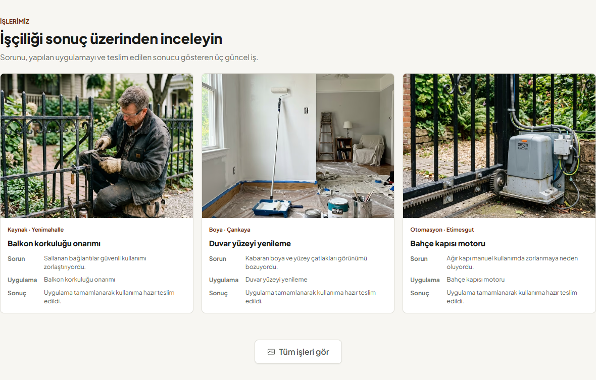
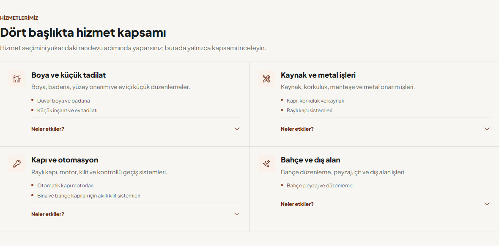
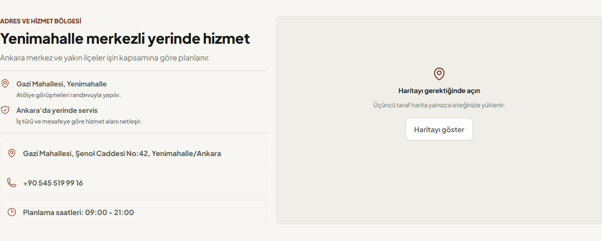
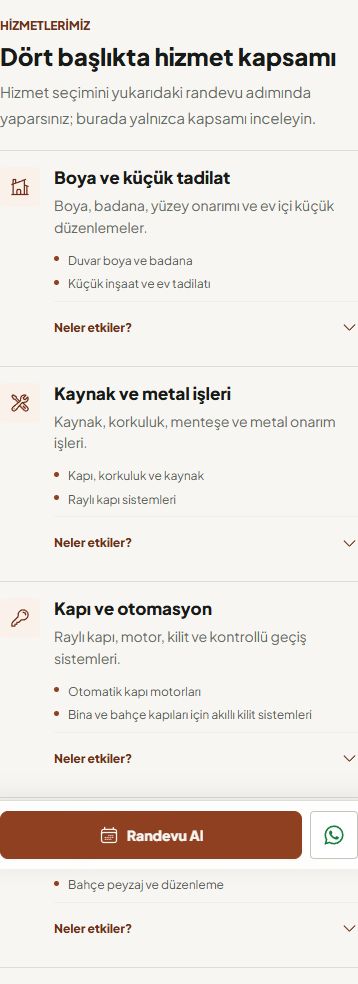
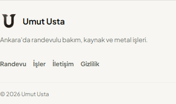

# PUX-4 Yerel Kapanış Raporu

**Proje:** Umut Usta Randevu Uygulaması  
**Sprint:** PUX-4 - İçerik yoğunluğu, iş kanıtı ve alt sayfa mimarisi  
**Tarih:** 19 Temmuz 2026  
**Durum:** Teknik uygulama tamamlandı, yalnız yerelde doğrulandı  
**Dağıtım:** Git commit/push, canlı yayın ve uzak Supabase değişikliği yapılmadı

## 1. Amaç ve Sonuç

PUX-4, randevu wizard'ından sonraki müşteri içeriğini ikinci bir karar akışı olmaktan çıkarıp kanıt, kapsam ve gerektiğinde ayrıntı sunan sakin bir bilgi mimarisine dönüştürdü. Alt bölüm sırası korunurken görünür seçenek, kart ve tekrar sayısı azaltıldı.

Randevu iş mantığı, API kontratı, admin dashboard ve veritabanı şeması değiştirilmedi. Bu sprint için SQL veya migration gerekmez.

## 2. Önce ve Sonra

| Yüzey | Önce | PUX-4 |
|---|---|---|
| İş örnekleri | Görsel + genel açıklama | Sorun + uygulama + sonuç |
| İş kanıtı CTA | Uzun ok metni | İkon + `Tüm işleri gör` |
| Hizmet kataloğu | 4 kart + 4 kartı göster eylemi | 4 statik ihtiyaç kategorisi |
| Hizmet mobil düzeni | Yatay kaydırmalı kart rayı | Tek kolon bilgi matrisi |
| Hizmet ayrıntısı | Fiyat ve planlama yoğunluğu | `Neler etkiler?` disclosure |
| Süreç | 4 bağımsız kart ve uzun metin | 4 kısa bağlı adım |
| Konum | Adres, telefon, e-posta placeholder, saat ve gömülü harita | Adres, telefon, saat ve izinli harita |
| SSS | 4 soru aynı ağırlıkta | İlk 3 soru + isteğe bağlı 1 soru |
| Footer | Marka + 8 bağlantı/bilgi + teyit tekrarı | Kısa marka + 4 utility bağlantı |

## 3. Tamamlanan İşler

### 3.1 İş kanıtları

- En fazla üç güncel iş tek satır/tek kolon kırılımıyla gösterilir.
- Kartlar `Sorun`, `Uygulama` ve `Sonuç` sırasını kullanır.
- Veri modelinde özel alanlar varsa kullanılır; yoksa mevcut açıklama ve başlıktan güvenli fallback üretilir.
- Metinler iki satırla sınırlandırılır; tam vaka galeri sayfasında kalır.
- Dekoratif hover yükselmesi ve ağır gölge kaldırıldı.

### 3.2 Hizmet kataloğu

- Sekiz hizmet dört ihtiyaç kategorisinde gruplandı: boya/tadilat, kaynak/metal, kapı/otomasyon, bahçe/keşif.
- Kategoriler bilgi amaçlıdır; button veya wizard'a otomatik scroll davranışı taşımaz.
- Kapsam listesi doğrudan görünür, maliyet ve planlama etkenleri disclosure arkasındadır.
- Başlangıç fiyatları alt sayfa karar yüzeyinden çıkarıldı; eski/güncelliği belirsiz fiyat karşılaştırması önlendi.
- Mobil yatay carousel kaldırıldı.

### 3.3 Süreç

- Dört adım `Talep -> Teyit -> Uygulama -> Teslim` zincirine dönüştürüldü.
- Her adım tek cümleye indirildi.
- İç içe kart, hover hareketi ve mobil yatay kaydırma kaldırıldı.
- Ekip teyidi açıklaması süreç bölümünde yeniden tekrarlanmadı.

### 3.4 Konum ve iletişim

- Konum ve hizmet alanı iki kısa kanıtta birleştirildi.
- İşlevsiz `E-posta hizmeti yakında` satırı kaldırıldı.
- Telefon, adres ve planlama saati tek kompakt iletişim listesinde tutuldu.
- Google Maps iframe başlangıçta yüklenmez; `Haritayı göster` eyleminden sonra oluşturulur.
- Harita açma davranışı mevcut public-channel analytics sistemine bağlandı.

### 3.5 SSS ve footer

- İlk üç kritik soru görünür, dördüncü soru `1 soru daha göster` altında tutulur.
- Accordion klavye ve `aria-expanded` davranışı korunur.
- Footer tek sayfa menüsünü tekrar üretmez.
- Footer bağlantıları `Randevu`, `İşler`, `İletişim` ve `Gizlilik` olarak sadeleştirildi.
- Telefon, adres, saat ve ekip teyidi metinlerinin footer tekrarları kaldırıldı.

## 4. Kabul Kriterleri

| Kriter | Sonuç |
|---|---|
| Görünür karar sayısı azalır | Geçti |
| Hizmet kategorileri tıklama/otomatik scroll taşımaz | Geçti |
| İş kartları problem/uygulama/sonuç gösterir | Geçti |
| İşlevsiz e-posta satırı görünmez | Geçti |
| Harita kullanıcı isteğinden önce yüklenmez | Geçti |
| Alt bölümlerde iç içe kart kullanılmaz | Geçti |
| Mobil alt bölümlerde yatay taşma yok | Geçti |
| SSS ayrıntısı progressive disclosure kullanır | Geçti |
| Footer aynı bilgileri tekrarlamaz | Geçti |

## 5. Görsel Kanıt

### İş kanıtları

### Hizmet kapsamı

### Konum ve izinli harita

### Mobil hizmet ve footer

PUX-3 referansları `docs/readme-assets/pux-3-baseline/` altında arşivlendi.

## 6. Kalite Kapıları

| Kontrol | Sonuç |
|---|---|
| `npm run lint` | Başarılı, 0 uyarı |
| `npm run test:run` | 22 dosya, 86/86 başarılı |
| PUX görsel ve guardrail paketi | 15/15 başarılı |
| `npm run test:e2e` | 23/23 başarılı |
| Erişilebilirlik E2E | 2/2 başarılı |
| `npm run build` | Başarılı, 803 modül işlendi |
| `npm run perf:budget` | Başarılı; 10.47 MB toplam, 194.8 KB kritik görsel |

## 7. PUX-5 Geçiş Kararı

PUX-4 kabul kriterleri teknik olarak sağlandı. PUX-5, mevcut gerçek iş fotoğraflarını çözünürlük, kadraj, before/after tutarlılığı ve responsive medya üretimi açısından ele alabilir. PUX-4 kart yapısı bu medya standardını karşılayacak stabil oranlara sahiptir.

PUX-5 başlangıcında görsel dosya ve pipeline değişiklikleri beklenir; mevcut kapsam için veritabanı migration gereksinimi öngörülmemektedir.
