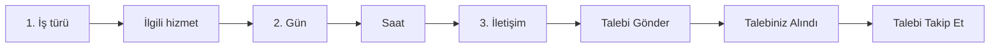
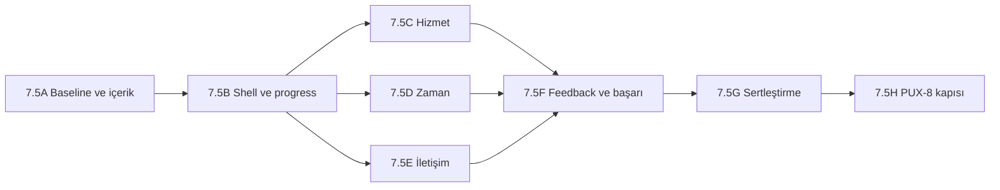

# PUX-7.5 Randevu Wizard Premium Dönüşüm Sprint Planı

**Proje:** `the-welding-expert-app`  
**Program:** PUX - Premium Customer UX  
**Sprint:** PUX-7.5 - Wizard Refinement / Kontrollü Yeniden Kurulum  
**Tarih:** 19 Temmuz 2026  
**Durum:** Tamamlandı - yerel doğrulama kapıları geçti  
**Ortam:** Yalnızca yerel geliştirme  
**Kapsam:** Müşteri randevu wizard'ının hizmet seçiminden başarı durumuna kadar tüm sunum ve etkileşim katmanı  
**Kapsam dışı:** Admin dashboard, yeni rezervasyon özelliği, veritabanı şema değişikliği, production deploy, commit ve push

## 1. Sprint amacı

PUX-7.5'in amacı mevcut wizard'ı yalnızca daha güzel göstermek değildir. Hedef; görev başarısını ve erişilebilirliği korurken kullanıcıda oluşan “temiz ama jenerik”, “fazla açıklayan”, “sistem formu gibi” ve “premium hissettirmiyor” algısının kök nedenlerini ortadan kaldırmaktır.

Sprint sonunda wizard:

1. Her adımda yalnız o anki karara odaklanmalıdır.
2. Aynı bilgi veya durum farklı bileşenlerde tekrar edilmemelidir.
3. Sistem mekanizması yerine müşteri sonucunu anlatmalıdır.
4. Quiet Craft tasarım dilini spacing, tipografi, yüzey ve içerik özgüveniyle taşımalıdır.
5. `320 px` dahil desteklenen tüm ekranlarda taşmadan çalışmalıdır.
6. Klavye, ekran okuyucu, forced-colors, reduced-motion ve sanal klavye desteğini korumalıdır.
7. PUX-8 kullanıcı doğrulamasında ölçülebilecek kararlı bir prototip/release adayı üretmelidir.

## 2. Kaynak ve problem tanımı

Bu plan aşağıdaki denetim raporundan türetilmiştir:

- [PUX-8 Öncesi Randevu Wizard Premium UX Denetim Raporu](./PUX_8_Oncesi_Randevu_Wizard_Premium_UX_Denetim_Raporu_2026-07-19.md)

Ana araştırma dayanakları:

- [Bilişsel Yük Odaklı UX/UI Araştırma Raporu](./Umut_Usta_Bilissel_Yuk_UX_UI_Arastirma_Raporu_2026-07-19.md)
- [Premium Tasarım Dili Benchmark Raporu](./Umut_Usta_Premium_Tasarim_Dili_Benchmark_Raporu_2026-07-19.md)

### 2.1 Kök nedenler

| Kod | Kök neden | Kullanıcı etkisi | Sprint karşılığı |
| --- | --- | --- | --- |
| RC-01 | İlerleme bilgisinin iki kez gösterilmesi | Görsel tekrar, gereksiz okuma | PUX-7.5B |
| RC-02 | Seçim ve devam durumunun 2-3 bileşende tekrarı | Arayüzün kendini fazla açıklaması | PUX-7.5A/C |
| RC-03 | `Talebi sistemde kaydet` gibi sistem dili | Hizmet yerine yazılım formu hissi | PUX-7.5A/E |
| RC-04 | Çok sayıda eş ağırlıklı border, ikon kutusu ve bilgi bandı | Jenerik template algısı | PUX-7.5B/C/D/E |
| RC-05 | Geniş dış shell ile görev kolonunun aynı davranması | Masaüstünde boş ve dağınık ritim | PUX-7.5B/D/E |
| RC-06 | `320 px` iletişim durumunda yaklaşık `35 px` iç taşma | Kırpılan progress, özet ve form | PUX-7.5B/E |
| RC-07 | Başarı ekranında tekrar eden teyit ve üç eylem | Tamamlama sonrası yeniden karar yükü | PUX-7.5F |
| RC-08 | Testin yalnız root taşmasını kontrol etmesi | İç layout regresyonunun kaçması | PUX-7.5G |
| RC-09 | Light ve dark yüzeylerin aynı yoğunlukta tasarlanması | Form okunabilirliğinin tema atmosferine yenilmesi | PUX-7.5B/F |

## 3. Ürün kararı: kontrollü yeniden kurulum

### 3.1 Korunacak çekirdek

Aşağıdaki davranışlar yeniden yazılmayacaktır:

- Üç adımlı model: Hizmet, Zaman Tercihi, İletişim.
- Hizmet kategorisi ve alt hizmet veri modeli.
- Varsayılan hizmet, tarih veya saat seçilmemesi.
- Doğrudan görünür haftalık takvim ve hafta gezinme mantığı.
- Slot ve uygunluk API sözleşmeleri.
- React Query ve Supabase servis sınırları.
- Ad ve telefon dışındaki alanların optional olması.
- Analytics event adları ve temel funnel sözleşmesi.
- Self-servis takip token'ı ve başarı verisi.
- Mevcut klavye, hata özeti ve odak yönetimi davranışı.

### 3.2 Yeniden kurulabilecek katman

Aşağıdaki sunum katmanı gerektiğinde baştan kurulabilir:

- Wizard dış shell ve iç görev kolonları.
- Progress/stepper bileşeni.
- Adım başlığı ve destek metni yapısı.
- Seçim kartları/radio satırları.
- Seçili hizmet özeti.
- Tarih ve saat yerleşimi.
- İletişim özeti ve form hiyerarşisi.
- Loading, empty, error ve conflict yüzeyleri.
- Başarı ekranı bilgi ve eylem hiyerarşisi.
- Adımlar arası motion ve responsive davranış.

### 3.3 Baştan yaratma karar kapısı

Sunum katmanında mevcut bileşenlerin yamalanması yerine yeni bir presentational component seti oluşturulur; aşağıdakilerden en az ikisi gerçekleşirse eski styled wrapper'lar kademeli olarak kaldırılır:

1. `320 px` taşmasını gidermek için üçten fazla bileşende negatif margin veya özel overflow düzeltmesi gerekmesi.
2. Aynı layout kuralının light/dark veya üç adım için ayrı override istemesi.
3. Progress bileşeninin mevcut flex yapısında label kırpılması ya da dokunma hedefi sorununun sürmesi.
4. İletişim özetini sadeleştirirken mevcut `HorizontalSummary` yapısının gereksiz DOM veya CSS üretmesi.
5. Visual regression güncellemesinde adımlar arasında tutarlı spacing elde edilememesi.

Önerilen yeni sunum sınırları:

```text
BookingWizardShell
├── BookingProgress
├── BookingStepHeader
├── BookingStepBody
│   ├── ServiceStep
│   ├── TimeStep
│   └── ContactStep
├── BookingInlineSummary
├── BookingPrimaryAction
└── BookingFeedback
```

Yeni abstraction yalnız gerçek tekrarları azaltır; business state `CustomerBooking.jsx` içinde korunur.

## 4. Tasarım ilkeleri

### 4.1 Tek soru, tek sonuç, tek ana eylem

Her adım şu üç parçayı taşımalıdır:

1. Kullanıcının tek sorusu.
2. Karar vermek için gerekli seçenekler.
3. Karar tamamlandığında tek primary CTA.

Ara yüzü tarif eden ikinci bir başlık, durum paragrafı veya talimat eklenmez.

### 4.2 İçerik özgüveni

- Başlık kısa ve sonuç odaklıdır.
- Destek metni yalnız hata veya yanlış beklenti önlüyorsa gösterilir.
- Aynı teyit mesajı akışta en fazla iki stratejik noktada görünür: zaman adımı ve başarı.
- Seçili durum, bileşenin görsel/semantik state'iyle anlatılır; `seçildi` paragrafı eklenmez.
- Müşteriye veri tabanı, sistem kaydı veya form mekanizması anlatılmaz.

### 4.3 Quiet Craft görsel dili

- Dış shell ana içerik ızgarasıyla hizalı kalır.
- İç task surface adıma göre kontrollü genişlik kullanır.
- Paper/Bone/Graphite ana yüzeyleri oluşturur.
- Copper yalnız aktif adım, seçili durum ve primary CTA'dadır.
- Bir adımda en fazla bir baskın dolu buton bulunur.
- Border yalnız yapı gerektiğinde kullanılır; her satır kart olmaz.
- İkonlar aynı stroke ailesinde ve yardımcı roldedir.
- Logo, metal doku, glow, gradient veya dekoratif kaynak animasyonu wizard'a eklenmez.

### 4.4 Motion

| Davranış | Hedef |
| --- | ---: |
| Hover/press | `140 ms` |
| Seçim durumu | `180-200 ms` |
| Adım geçişi | `200-240 ms` |
| Büyük layout değişimi | En fazla `320 ms` |
| Reduced motion | Transform yok; anlık veya kısa opacity |

Motion yalnız durum değişimini açıklar. CTA pulse, parallax, glow, spring bounce ve bekleten stagger kullanılmaz.

## 5. Hedef deneyim mimarisi



### 5.1 Adım başlıkları

| Adım | Hedef başlık | Destek metni |
| --- | --- | --- |
| Hizmet grup | `Ne yaptırmak istiyorsunuz?` | `İşinize en yakın başlığı seçin.` |
| Alt hizmet | `Hangi işe daha yakın?` | Yalnız kategori adı gerekiyorsa kısa bağlam |
| Zaman | `Tarih ve saat seçin` | `Size uyan günü ve saati seçin.` |
| İletişim | `İletişim bilgileri` | `Uygunluğu teyit etmek için sizi arayalım veya WhatsApp'tan yazalım.` |
| Başarı | `Talebiniz alındı` | `Çalışma saatleri içinde sizi arayacağız veya WhatsApp'tan yazacağız.` |

### 5.2 CTA sözlüğü

| Durum | CTA |
| --- | --- |
| Hizmet tamam | `Zaman Tercihini Seç` |
| Zaman tamam | `İletişime Geç` |
| Form hazır | `Talebi Gönder` |
| Başarı | `Talebi Takip Et` |
| Secondary geri dönüş | `Tarih ve Saati Değiştir` |
| Tertiary reset | `Yeni Talep Oluştur` |

Türkçe cümle düzeninde butonlarda title case zorunlu değildir; uygulamadaki genel casing kararı tutarlı uygulanır.

## 6. Sprint kırılımı

PUX-7.5 tek ara sprinttir; uygulama güvenliği için sekiz tamamlanabilir alt pakete bölünür.



## 7. PUX-7.5A: Baseline, içerik ve tasarım sözleşmesi

**Amaç:** Kod değişmeden önce hedef metin, state ve görsel sözleşmesini dondurmak.  
**Öncelik:** P0  
**Efor:** Küçük

### İşler

1. Hizmet grup, alt hizmet, boş, seçili, loading, tarih seçili, saat seçili, form, validation, conflict, submit loading ve başarı state envanteri çıkarılır.
2. Güncel screenshot'lar `320`, `390`, `768`, `1024`, `1440` genişliklerinde alınır.
3. Görünür metin envanteri çıkarılır; tekrar eden her metin bir role bağlanır: instruction, policy, error prevention veya next step.
4. Yukarıdaki hedef copy matrisi ürün sözleşmesi olarak testlere eklenir.
5. Analytics event adları ve payload'ların değişmeyeceği kaydedilir.

### Dosyalar

- `src/pages/CustomerBooking.jsx`
- `src/features/booking/components/*.jsx`
- `e2e/pux-baseline.spec.js`
- Yeni `e2e/pux75-wizard.spec.js`

### Kabul kriterleri

- Her wizard state için bir screenshot veya DOM kanıtı vardır.
- Eski ve hedef copy yan yana belgelenmiştir.
- Business davranışlarında değişiklik yapılmadığı doğrulanmıştır.
- Gerçek Supabase kaydı oluşturulmadan mock akış tamamlanır.

## 8. PUX-7.5B: Shell, progress ve responsive temel

**Amaç:** Premium hissin temelini oluşturan dış shell, iç task grid ve stepper'ı yeniden kurmak.  
**Öncelik:** P0  
**Efor:** Orta-Büyük

### İşler

1. Görsel `Adım x / 3` satırı kaldırılır; erişilebilir canlı durum visually-hidden olarak korunur.
2. Progress tek bilgi kaynağı olur.
3. Progress item'ları tamamlandı, aktif, erişilebilir ve kilitli state'lere ayrılır.
4. `320 px` için label/number/divider ölçüleri yeniden tasarlanır.
5. Gerekirse `320-359 px` aralığında label'lar kısaltılmaz; stepper iki satır veya kompakt grid davranışına geçer.
6. Wizard dış shell `118rem` ana grid hizasını korur.
7. İçerik için `--wizard-task-max` benzeri kontrollü genişlik tanımlanır.
8. Shell padding'i `12/16/24 px` responsive ölçeğinde sabitlenir.
9. Kart-içinde-kart etkisi kaldırılır; bölüm ayırımı spacing ve hairline ile yapılır.
10. Light theme ana referans, dark theme aynı semantik hiyerarşinin alternatifi olur.

### Teknik kararlar

- `WizardStatus` görsel DOM'dan kaldırılabilir veya visually-hidden yapılabilir.
- `WizardProgress` flex yerine `grid-template-columns: auto minmax(0, 1fr) ...` veya üç eşit step grid'i kullanabilir.
- Hiçbir step item sabit minimum genişlikle kapsayıcıyı taşırmamalıdır.
- Tüm flex/grid çocuklarında gerekli `min-width: 0` uygulanır.
- Wizard overflow'u gizlemek çözüm kabul edilmez; içerik gerçekten sığmalıdır.

### Kabul kriterleri

- İlerleme bilgisi görsel olarak bir kez sunulur.
- Önceki tamamlanmış adımlar tıklanabilir; gelecekteki geçersiz adımlar disabled kalır.
- Dokunma hedefleri tercihen `>=44x44 px`, hiçbir görünür kontrol `<24x24 px` değildir.
- `320`, `360`, `390`, `768`, `1024`, `1440`, `1920` genişliklerinde wizard iç taşması `<=1 px`.
- Step label'ları kırpılmaz, üst üste binmez ve anlam kaybetmez.

## 9. PUX-7.5C: Hizmet adımının yeniden düzenlenmesi

**Amaç:** İlk seçimi hızlı, sakin ve premium hale getirmek.  
**Öncelik:** P1  
**Efor:** Orta

### İşler

1. Dört kategori korunur; kartların border/ikon/ok yoğunluğu azaltılır.
2. Kategori seçenekleri desktop'ta dengeli `2x2`, mobilde tek kolon olur.
3. Seçili kategori sonrası diğer kategoriler gizlenir; alt hizmet yüzeyi tek görev olarak görünür.
4. `İş türlerine dön` düşük ağırlıklı icon+text geri eylemi olur.
5. `Birlikte belirleyelim` yardım yolu ana kategorilerden görsel olarak ayrılır fakat kaybolmaz.
6. Tek discovery seçeneği bulunduğunda optik merkezleme korunur.
7. `Henüz hizmet seçilmedi`, `Devam etmek için...` ve `Hizmet seçildi` tekrarları kaldırılır.
8. Alt hizmetler radio semantiğini ve arrow-key davranışını korur.
9. Seçili state copper edge/check + neutral wash ile anlatılır.
10. Açıklamalar mobilde hedef iki satır olacak biçimde edit edilir.

### Kabul kriterleri

- İlk ekranda yalnız dört ana kategori ve bir yardım yolu vardır.
- Kullanıcı seçili seçeneği renk olmadan da check/border/state üzerinden ayırt eder.
- Tek seçenek merkezi ve optik olarak dengelidir.
- Bir hizmet adı görünür içerikte gereksiz yere iki kez tekrarlanmaz.
- Arrow keys, Space ve Enter davranışları korunur.

## 10. PUX-7.5D: Zaman adımının yeniden düzenlenmesi

**Amaç:** Gün ve saat kararını daha hızlı taranan, daha dolu ve daha sakin bir yüzeye dönüştürmek.  
**Öncelik:** P1  
**Efor:** Orta-Büyük

### İşler

1. Başlık altı tek cümleye indirilir.
2. Seçili hizmet bilgisi kompakt inline summary/breadcrumb olur.
3. Bugün/Yarın kısayolları ve takvim disclosure'ı kullanılmaz; haftalık takvim doğrudan ana tarih seçim yüzeyi olur.
4. Tarih seçilmeden önce yalnız tek empty-state mesajı gösterilir.
5. Ortalama iş süresi, saat seçenekleri göründüğünde bağlama taşınır.
6. Slot grid'i seçili, müsait, dolu ve geçmiş state'leri için tutarlı semantik kullanır.
7. Takvim tüm genişliği kullanır; seçilen günün saatleri takvimin altında açılır.
8. Yatay gün carousel davranışı korunuyorsa scrollbar, snap ve klavye davranışı doğrulanır.
9. Loading skeleton gerçek layout ölçülerini korur; layout shift üretmez.
10. Slot conflict sonrası yeni seçim yolu açık kalır.

### Kabul kriterleri

- Tarih seçilmeden saat gösterilmez.
- Tarih seçmeden önce en fazla bir ana empty-state mesajı vardır.
- Seçili tarih ve saat yalnız renkle anlatılmaz.
- Slot loading, empty week ve conflict state'lerinde layout genişliği değişmez.
- Kullanıcı hizmete `Değiştir` üzerinden dönebilir.

## 11. PUX-7.5E: İletişim adımının kontrollü yeniden kurulumu

**Amaç:** En yüksek metin ve yüzey yoğunluğuna sahip adımı premium, kısa ve güvenli hale getirmek.  
**Öncelik:** P0  
**Efor:** Büyük

### İşler

1. `İletişim bilgilerinizi paylaşın` ve `Talebi sistemde kaydet` çift başlığı tek `İletişim bilgileri` başlığında birleştirilir.
2. `aşağıdaki kısa form` ve sistem mekanizmasını anlatan metin kaldırılır.
3. Tarih, saat ve hizmet özeti kompakt `BookingInlineSummary` olur.
4. Özette tek `Değiştir` yolu kullanılır; ayrı tekrar eden geri butonları azaltılır.
5. Ad ve telefon alanları ana form yüzeyidir.
6. Telefon helper text tek operasyon cümlesine dönüştürülür.
7. `Ek bilgi ekle` disclosure'ı korunur; email ve not alanları açılmadan DOM/visual yoğunluk yaratmaz.
8. `Bilgilerimi bu cihazda hatırla` kısa etiketi kullanılır; ayrıntılı kapsam privacy açıklamasına taşınır.
9. Gizlilik ve teyit açıklamaları tek kısa notta birleştirilir; aynı teyit mesajı tekrar edilmez.
10. CTA `Talebi Gönder` olur.
11. Form iç genişliği desktop'ta yaklaşık `72-84rem` ile sınırlandırılır; dış shell hizası korunur.
12. `320 px` için input, checkbox, helper text, özet ve CTA özel olarak doğrulanır.

### Kabul kriterleri

- Görünür zorunlu alan sayısı ikidir.
- Form başlangıcında tek başlık ve tek destek cümlesi vardır.
- `sistem`, `aşağıdaki form` ve `kaydet` ifadeleri müşteri copy'sinde bulunmaz.
- `Talebi Gönder` tek primary CTA'dır.
- `320 px` genişlikte özet ve form kırpılmaz, yatay scroll oluşmaz.
- Browser autofill, IME, paste ve telefon formatlama korunur.

## 12. PUX-7.5F: Feedback, loading, hata, conflict ve başarı

**Amaç:** Premium algıyı yalnız mutlu yolda değil tüm durumlarda tutarlı kılmak.  
**Öncelik:** P1  
**Efor:** Orta

### İşler

1. Loading state'leri içerik ölçülerini koruyan skeleton/inline feedback olarak düzenlenir.
2. Error summary ve field error aynı mesajı gereksiz tekrar etmeyecek biçimde ayrıştırılır.
3. Hata, uyarı, bilgi ve başarı renk rolleri copper'dan ayrılır.
4. Submit sırasında CTA genişliği değişmez; spinner + `Talep gönderiliyor` kullanılır.
5. Success başlığı `Talebiniz alındı` olur.
6. Durum `Uygunluk teyidi bekleniyor` olur.
7. Sonraki adım tek kısa cümleyle anlatılır.
8. Birincil eylem `Talebi Takip Et` olur.
9. Fotoğraf/detay ekleme secondary, yeni talep tertiary olur.
10. Başarı detayları takip kodu, hizmet ve tarih-saat etrafında sıkıştırılır.
11. Motion yalnız step/state geçişinde ve token süreleriyle uygulanır.
12. Reduced-motion ve forced-colors karşılıkları korunur.

### Kabul kriterleri

- Loading sırasında CTA veya form layout shift üretmez.
- Hata sonrası odak özete taşınır; ilk hatalı alana erişim açıktır.
- Conflict mesajı ne olduğunu ve kullanıcının ne yapacağını tek mesajda anlatır.
- Başarı ekranında tek primary CTA vardır.
- Kullanıcı beş saniyede talebin durumunu ve sıradaki adımı söyleyebilir.

## 13. PUX-7.5G: Teknik sertleştirme ve regresyon

**Amaç:** Dönüşümün işlev, responsive, erişilebilirlik ve performans regresyonu üretmediğini kanıtlamak.  
**Öncelik:** P0  
**Efor:** Orta

### Unit/component test kapsamı

- Progress state ve step navigation.
- Hizmet kategori/alt hizmet seçimi.
- Discovery tek seçenek merkezleme.
- Tarih ve slot seçimi.
- Empty/loading/conflict state.
- Form zorunlu/optional alanlar.
- Copy sözleşmesi ve kaldırılan tekrarların yokluğu.
- Submit loading ve success hierarchy.
- Reset ve self-servis link üretimi.

### E2E kapsamı

1. Mobile happy path.
2. Desktop happy path.
3. Klavye ile baştan sona tamamlama.
4. Yanlış hizmetten geri dönüş.
5. `Birlikte belirleyelim` akışı.
6. Tarih seçmeden slot görünmemesi.
7. Slot conflict ve yeniden seçim.
8. Validation + virtual keyboard.
9. Success + takip linki.
10. Reduced motion.
11. Forced colors.
12. Light/dark theme.

### Responsive state matrisi

| Viewport | Hizmet | Alt hizmet | Zaman empty | Zaman slots | İletişim | Hata | Başarı |
| --- | --- | --- | --- | --- | --- | --- | --- |
| `320x568` | ✓ | ✓ | ✓ | ✓ | ✓ | ✓ | ✓ |
| `360x800` | ✓ | ✓ | ✓ | ✓ | ✓ | ✓ | ✓ |
| `390x844` | ✓ | ✓ | ✓ | ✓ | ✓ | ✓ | ✓ |
| `768x1024` | ✓ | - | ✓ | ✓ | ✓ | - | ✓ |
| `1024x768` | ✓ | - | ✓ | ✓ | ✓ | - | ✓ |
| `1440x900` | ✓ | ✓ | ✓ | ✓ | ✓ | ✓ | ✓ |
| `1920x1080` | ✓ | - | - | ✓ | ✓ | - | ✓ |

### Taşma testi

Yalnız document root değil, wizard ve kritik alt yüzeyler de ölçülür:

```js
const surfaces = [
  page.locator("#appointment-calendar"),
  page.locator('[data-wizard-progress="true"]'),
  page.locator('[data-wizard-step-body="true"]'),
];

for (const surface of surfaces) {
  const overflow = await surface.evaluate(
    (element) => element.scrollWidth - element.clientWidth,
  );
  expect(overflow).toBeLessThanOrEqual(1);
}
```

### Kalite komutları

```powershell
npm run lint
npm run test:run
npm run test:e2e
npm run build
npm run perf:budget
npm run perf:lighthouse
git diff --check
```

### Kabul kriterleri

- Tüm mevcut ve yeni testler geçer.
- Wizard tüm state'lerde iç/kök taşma üretmez.
- Lighthouse accessibility `1.00` korunur.
- Lighthouse performance mevcut `0.92` baseline'ından `0.02`den fazla düşmez.
- CLS `<0.1`, TBT `<=250 ms`, LCP bütçesi `<=3500 ms` korunur.
- Console error ve unhandled rejection yoktur.

## 14. PUX-7.5H: PUX-8 hazırlık ve kapanış kapısı

**Amaç:** Tasarımı uzman görüşüyle kapatmak yerine kullanıcı doğrulamasına hazır hale getirmek.  
**Öncelik:** P1  
**Efor:** Küçük

### İşler

1. Before/after state panosu oluşturulur.
2. PUX-8 görev protokolü yeni copy ve akışla güncellenir.
3. Analytics funnel eşlemesi doğrulanır:
   - `booking_wizard_started`
   - service selected
   - slot selected
   - form error
   - submitted
   - tracking opened
4. Premium semantic differential soruları hazırlanır.
5. Açık kalan varsayımlar ve kullanıcı testi kararları kapanış raporuna yazılır.

### PUX-8'e geçiş kriterleri

- P0 ve P1 backlog kapalıdır.
- P2 maddeler ertelendiyse kullanıcı etkisi ve gerekçesi belgelenmiştir.
- `320 px` taşma tamamen kapanmıştır.
- Copy sözleşmesi ürün sahibi açısından onaylanabilir durumdadır.
- En az bir mobile ve bir desktop happy-path video/screenshot kanıtı vardır.
- Test ve performans kapıları geçmiştir.
- Gerçek kullanıcı testi için görevler arayüzü tarif etmeden yazılmıştır.

## 15. Dosya bazlı uygulama haritası

| Dosya | Planlanan sorumluluk |
| --- | --- |
| `src/pages/CustomerBooking.jsx` | Wizard orchestration, step state, focus/scroll; business davranışı korunur |
| `src/features/booking/components/booking.styles.js` | Shell, progress, shared step, summary ve responsive temel; önemli yeniden kurulum |
| `src/features/booking/components/ServiceSelection.jsx` | Kategori/alt hizmet görsel ve copy rafinasyonu |
| `src/features/booking/components/BookingCalendar.jsx` | Tarih, slot, empty/loading/conflict hiyerarşisi |
| `src/features/booking/components/BookingForm.jsx` | Tek başlık, kompakt özet, form ve CTA yeniden kurulumu |
| `src/features/booking/components/BookingSuccess.jsx` | Başarı copy, detay ve eylem hiyerarşisi |
| `src/styles/GlobalStyles.js` | Yalnız gerekli token/focus/forced-color desteği; genel tema refactor'u yok |
| `src/pages/CustomerBooking.styles.js` | Sayfa-wizard grid ilişkisi ve section spacing |
| `src/**/*.test.jsx` | Copy, state ve erişilebilirlik regresyonları |
| `e2e/pux75-wizard.spec.js` | Yeni state ve viewport matrisi |
| `e2e/*snapshots*` | Güncel visual baseline kanıtları |

Yeni bileşen gerekirse `src/features/booking/components/BookingWizardShell.jsx`, `BookingProgress.jsx` ve `BookingInlineSummary.jsx` oluşturulabilir. Yalnız birden fazla adımda gerçek tekrar varsa abstraction yapılır.

## 16. Definition of Done

PUX-7.5 aşağıdaki koşulların tamamı sağlanmadan kapanmaz:

### Ürün

- Üç adımlı görev mimarisi korunmuştur.
- Her adımda tek ana soru ve tek primary CTA vardır.
- Sistem-merkezli copy kaldırılmıştır.
- Teyit beklentisi açık fakat tekrarsızdır.
- Başarı ekranında sıradaki adım nettir.

### UX/UI

- Premium algı dekorasyonla değil tutarlılık, spacing ve içerik özgüveniyle kurulmuştur.
- Aynı bilgi görsel olarak bir kez gösterilir.
- Seçili, disabled, loading, error ve success state'leri ayrışır.
- Light ve dark theme aynı bilgi hiyerarşisini korur.
- Wizard dış shell ana sayfa grid'iyle hizalıdır.

### Responsive

- `320 px` dahil hiçbir state'te iç veya root yatay taşma yoktur.
- Metin, ikon, button ve input birbirini kırpmaz.
- Sanal klavye görünümünde error ve submit erişilebilirdir.
- Touch target ve safe-area kriterleri korunur.

### Erişilebilirlik

- Semantik radio, button, form ve alert rolleri korunur.
- Adım değişiminde anlaşılır odak/scroll davranışı vardır.
- Klavye ile tamamlama mümkündür.
- Focus görünürlüğü, forced-colors ve reduced-motion geçer.
- Normal metin AA, UI/focus en az `3:1` kontrast sağlar.

### Teknik kalite

- Unit, integration ve E2E testleri geçer.
- Yeni visual baseline'lar gözle incelenmiştir.
- Build, lint, performance budget ve Lighthouse kapıları geçer.
- Yeni DB migration veya uzak Supabase değişikliği yoktur.
- Commit, push veya deploy yapılmamıştır.

## 17. Riskler ve önlemler

| Risk | Etki | Önlem |
| --- | --- | --- |
| Fazla copy azaltımı güven bilgisini gizler | Yanlış randevu beklentisi | Teyidi zaman ve başarıda birer kez koru |
| Presentational rebuild state davranışını bozar | Booking regresyonu | State/API katmanına dokunma; component/E2E önce |
| 320 px için aşırı sıkıştırma touch target'ı küçültür | Erişilebilirlik kaybı | Gerekirse stepper iki satır; hedefleri küçültme |
| Premium adına kontrast düşürülür | Okunabilirlik kaybı | Token kontrast testlerini kapı yap |
| Form özeti fazla sıkışır | Yanlış seçim fark edilmez | Değiştir eylemi ve üç ana bilgiyi koru |
| Yeni motion dikkat dağıtır | Bilişsel yük artar | Yalnız state transition, reduced-motion zorunlu |
| Visual baseline güncellemesi regresyonu örter | Hata kabul edilir | Önce ölçüm/assertion, sonra insan gözlü baseline onayı |

## 18. Tahmini iş yükü

Bu tahmin tek geliştiricili yerel akış içindir ve takvim taahhüdü değildir.

| Paket | Göreli efor | Risk |
| --- | ---: | --- |
| 7.5A Baseline/copy | 0.5 birim | Düşük |
| 7.5B Shell/progress | 1.5 birim | Yüksek |
| 7.5C Hizmet | 1.0 birim | Orta |
| 7.5D Zaman | 1.5 birim | Orta-Yüksek |
| 7.5E İletişim | 1.5 birim | Yüksek |
| 7.5F Feedback/başarı | 1.0 birim | Orta |
| 7.5G Sertleştirme | 1.5 birim | Yüksek |
| 7.5H PUX-8 kapısı | 0.5 birim | Düşük |
| **Toplam** | **9.0 göreli birim** | **Orta-Yüksek** |

## 19. Uygulama sırası ve durma kuralları

1. 7.5A tamamlanmadan copy veya görsel baseline değiştirilmez.
2. 7.5B tamamlanmadan adım içi polish yapılmaz; taşma ve shell temel risktir.
3. 7.5C, D ve E aynı shell sözleşmesine göre ilerler.
4. Her alt paket sonunda ilgili unit test ve dar viewport screenshot çalıştırılır.
5. P0 regresyon görülürse sonraki pakete geçilmez.
6. Business state veya Supabase sözleşmesi değişme ihtiyacı doğarsa sprint durdurulur ve ayrı ürün kararı açılır.
7. Tüm alt paketler bitmeden global screenshot baseline'ları topluca güncellenmez.

## 20. Nihai başarı tanımı

PUX-7.5 başarıyla tamamlandığında wizard yalnız “daha premium görünen” bir form olmayacaktır. Kullanıcı:

- ilk seçimi daha az okuyarak yapacak,
- nerede olduğunu tek bir progress yüzeyinden anlayacak,
- tarih ve saat kararını boşluk veya tekrarlarla uğraşmadan verecek,
- iletişim adımında sistem mekanizmasını değil kendisinden istenen iki bilgiyi görecek,
- talebi gönderdiğinde ne olduğunu ve sonra ne olacağını hemen anlayacak,
- tüm bunları 320 px mobil, klavye veya yardımcı teknolojiyle aynı güven seviyesinde tamamlayacaktır.

Bu sprintin çıkışı PUX-8 kullanıcı doğrulamasının başlangıç noktasıdır; production release kararı değildir.
