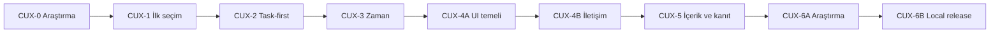

# Umut Usta Bilişsel UX Uygulanabilir Detaylı Sprint Planı

**Proje:** `the-welding-expert-app`  
**Program:** `CUX`  
**Kaynak rapor:** `Umut_Usta_Bilissel_Yuk_UX_UI_Arastirma_Raporu_2026-07-19.md` v2.0  
**Kapsam:** Müşteri giriş sayfası, randevu talebi, müşteri takip/self-servis ve müşteri güven katmanı  
**Kapsam dışı:** Admin dashboard yeniden tasarımı  
**Çalışma politikası:** Yalnız local; commit, push, deploy ve canlı veri değişikliği yok

## 1. Program amacı

Müşterinin doğru hizmeti daha az dışsal bilişsel yükle seçmesini, uygun zaman tercihi bırakmasını ve ekip teyidi sürecini yanlış anlamadan talebini tamamlamasını sağlamak.

Program tam sayfa estetik yenileme değildir. Her sprint tek bir kullanıcı problemini çözen, test edilebilir dikey dilim üretir. İçerik veya özellik silmek yerine karar anında gerekli bilgi öne alınır, ayrıntı progressive disclosure ile korunur.

## 2. Başarı modeli

Program üç kanıt katmanıyla değerlendirilir:

| Katman | Ana ölçüm | Hedef |
| --- | --- | --- |
| Yapısal yük | Görünür karar/aksiyon sayısı | Bir görünümde 1 primary; 2-4 karşılaştırmalı seçim |
| Davranışsal yük | Süre, hata, geri dönüş, terk | İlk seçim P75 <20 sn; talep medyan <2 dk |
| Algılanan yük | SEQ ve kısa NASA-TLX | SEQ medyan >=5.5/7; Mental Demand medyan <=35/100 hipotezi |

Yüzde ve workload hedefleri evrensel eşik veya dönüşüm vaadi değildir. Baseline ile yeni deneyimin kontrollü karşılaştırması için karar kapısıdır.

## 3. Program yapısı

| Sprint | Durum | Tahmini süre | Ana çıktı |
| --- | --- | ---: | --- |
| CUX-0 | Tamamlandı | 1-2 gün | Araştırma, baseline ve karar kaydı |
| CUX-1 | Tamamlandı | 3-5 gün | Grup bazlı hizmet seçimi ve CTA sadeleştirme |
| CUX-2 | Yerelde tamamlandı | 3-4 gün | Task-first sayfa sırası |
| CUX-3 | Yerelde tamamlandı | 5-7 gün | Progressive zaman seçimi |
| CUX-4A | Yerelde tamamlandı | 3-4 gün | Renk, kontrast ve erişilebilir UI temeli |
| CUX-4B | Yerelde tamamlandı | 4-6 gün | Kısa iletişim, trust ve başarı adımı |
| CUX-5 | Yerelde tamamlandı | 5-7 gün | Hizmet içeriği ve gerçek kanıt katmanı |
| CUX-6A | Yerelde tamamlandı | 3-5 gün | Ölçüm, workload baseline ve dashboard okuması |
| CUX-6B | Yerel QA tamamlandı; LCP riski açık | 3-4 gün | Çoklu cihaz QA ve koşullu local release adayı |

Önerilen toplam kalan geliştirme süresi 26-37 iş günüdür. Gerçek fotoğraf/vaka içeriğinin temini bu tahmine dahil değildir.

## 4. Ortak çalışma kuralları

### 4.1 Sprint giriş kriteri

- Önceki sprintin P0 kabul kriterleri geçmiştir.
- Kapsam ve kapsam dışı maddeler anlaşılmıştır.
- Gerekli gerçek içerik veya test verisi hazırdır.
- İlgili component ve E2E baseline okunmuştur.
- Yeni SQL gerekiyorsa sprint başlamadan migration ihtiyacı açıkça kaydedilmiştir.

### 4.2 Ortak Definition of Done

- Bir görünümde yalnız bir baskın primary eylem vardır.
- Kullanıcının girdiği veri geri dönüş ve geçici hatada korunur.
- Loading, empty, error, conflict ve success durumları ele alınır.
- Normal metin kontrastı >=4.5:1; UI/focus >=3:1 hedefini karşılar.
- Kritik dokunma hedefleri pratikte >=44x44 CSS px'dir.
- Klavye, görünür focus, %200 eşdeğeri reflow ve reduced motion korunur.
- Kişisel veri analytics property'lerine yazılmaz.
- Unit, ilgili integration/E2E, görsel regresyon, lint ve build geçer.
- Admin davranışı değişmez.
- Commit, push ve deploy yapılmaz.

### 4.3 Test cihaz matrisi

Her müşteri sprinti en az şu görünümlerde denetlenir:

- 360x800 küçük Android.
- 390x844 ana mobil baseline.
- 768x1024 tablet portrait.
- 1280x720 kısa desktop.
- 1440x900 ana desktop.
- 195x422 CSS eşdeğeri, %200 zoom/reflow.

## 5. CUX-0 - Araştırma ve baseline

**Durum:** Tamamlandı  
**Amaç:** Tasarım değişikliklerini ölçülebilir kullanıcı problemine bağlamak.

### Tamamlanan çıktılar

- Plerdy, WCAG, cognitive workload ve service UX araştırması.
- Altı kullanıcı segmenti ve on uçtan uca senaryo.
- Bilişsel yük bütçesi.
- Alternatif palet ve kontrast değerlendirmesi.
- COG/VIS/CNT/IMG/MET/OPS gereksinim kimlikleri.
- Yerel çalışma ve admin kapsam dışı kaydı.

### Kapanış kanıtı

- Araştırma raporu v2.0 repoda bulunuyor.
- Plerdy prediction ile gerçek davranış verisi ayrımı yazılı.
- Dönüşüm artışı kanıtsız iddia edilmiyor.

## 6. CUX-1 - İlk seçim ve aksiyon hiyerarşisi

**Durum:** Yerelde tamamlandı  
**Amaç:** Hero ve hizmet seçimindeki ilk karar maliyetini düşürmek.

### Tamamlanan gereksinimler

| ID | Çıktı | Kanıt |
| --- | --- | --- |
| COG-01 | Varsayılan hizmet kaldırıldı | Unit/E2E |
| COG-02 | Dört ihtiyaç grubu eklendi | Component ve screenshot |
| COG-03 | Hero bir primary + bir alternatif oldu | CustomerBooking testi |
| COG-04 | Sticky iki eyleme indi ve wizard'da gizleniyor | Mobil görsel regresyon |
| MET-01 | Grup seçimi ve geri dönüş event'leri eklendi | Analytics taxonomy |

### Kapanış sonucu

- 60/60 Vitest, 8/8 Playwright, lint ve build geçti.
- Mobil ilk hizmet görünümü 1367 px'den 797 px'ye indi.
- Sonuç dönüşüm artışı değil, yapısal yoğunluk azalmasıdır.

## 7. CUX-2 - Task-first bilgi mimarisi

**Süre:** 3-4 gün  
**Amaç:** Müşteriyi uzun tanıtım içeriğinden geçirmeden güven kanıtı sonrası randevu görevine ulaştırmak.

### Hipotez

Hero ve kısa trust şeridinden hemen sonra wizard gösterilirse kullanıcı görevini daha erken başlatır; galeri ve hizmet içeriğinin keşfedilebilirliği korunur.

### Kullanıcı hikâyeleri

| ID | Hikâye | SP |
| --- | --- | ---: |
| CUX-201 | Mobil müşteri olarak hizmet kataloğunu geçmeden talep başlatmak istiyorum | 3 |
| CUX-202 | Güven odaklı müşteri olarak talep öncesi konum ve çalışma saatini görmek istiyorum | 2 |
| CUX-203 | Ekran okuyucu kullanıcısı olarak görsel ve DOM sırasının aynı olmasını istiyorum | 3 |
| CUX-204 | İçerik araştıran müşteri olarak gerçek işleri ve hizmetleri kaybetmeden incelemek istiyorum | 3 |

### Kapsam

1. Müşteri sayfası sırasını `nav -> hero -> trust -> wizard -> portfolio -> services -> process -> location -> FAQ -> footer` yap.
2. `AboutSection` içeriğini trust ve proof katmanlarına dağıt; uzun bağımsız blok olarak görev önünde tutma.
3. Hero CTA ve nav anchor'larının yeni sırada doğru focus hedeflerine gitmesini sağla.
4. Wizard scroll/focus davranışını task-first sıraya göre sadeleştir.
5. Mobil CSS `order` hilelerini kaldır veya DOM sırasıyla uyumlu hale getir.
6. `booking_wizard_started` event placement değerlerini koru ve gerekirse `page_order_version: "task_first_v1"` ekle.

### Kapsam dışı

- Takvim kontrolünün yeniden tasarımı.
- Form alanlarının disclosure'a alınması.
- Hizmet kartı içerik modelinin değiştirilmesi.
- Admin navigasyonu.

### Etkilenecek dosyalar

- `src/pages/CustomerBooking.jsx`
- `src/pages/CustomerBooking.styles.js`
- `src/pages/CustomerBooking.test.jsx`
- `e2e/accessibility.spec.js`
- `e2e/visual-regression.spec.js`
- Görsel regression snapshot'ları

### Teknik görevler

| ID | İş | Tahmin |
| --- | --- | ---: |
| CUX-2-T1 | Bölüm DOM sırasını değiştir | 0.5 gün |
| CUX-2-T2 | About bilgisini trust/proof metnine dağıt | 0.5 gün |
| CUX-2-T3 | Anchor, `scrollIntoView` ve focus yönetimini düzelt | 0.5 gün |
| CUX-2-T4 | Responsive order CSS'ini temizle | 0.5 gün |
| CUX-2-T5 | DOM sırası ve nav testlerini güncelle | 0.5 gün |
| CUX-2-T6 | Mobil/desktop görsel baseline ve overflow QA | 1 gün |

### Kabul kriterleri

- COG-05: Wizard trust şeridinden sonraki ilk ana görev bandıdır.
- DOM, screen reader ve görsel sıra aynıdır.
- Hero `Talep Oluştur` focus'u wizard başlığına taşır.
- Randevu alanı 390x844 görünümde en geç ikinci içerik bölgesinde başlar.
- Galeri, hizmet kataloğu, süreç, lokasyon ve SSS erişilebilir kalır.
- Browser back, anchor ve mobil menü davranışı bozulmaz.
- Sticky wizard görünürken kapalı kalır.

### Manuel test

1. `/appointment` sayfasını 390x844 aç.
2. Hero'dan `Talep Oluştur` seç; focus'un wizard'da olduğunu doğrula.
3. Klavyeyle hero -> trust -> wizard -> portfolio sırasını izle.
4. Nav içindeki Hizmetler/Galeri/İletişim yollarını kontrol et.
5. 195 px genişlikte yatay taşma olmadığını doğrula.

### Sprint GO/NO-GO

GO: Wizard erken görünür, trust kaybolmaz, DOM sırası doğrudur ve tüm E2E geçer.  
NO-GO: CSS order ile ekran okuyucu sırası ayrışır veya CTA focus'u görünmeyen bir alana gider.

## 8. CUX-3 - Progressive zaman seçimi

**Süre:** 5-7 gün  
**Amaç:** Tarih ve saat kararını iki küçük karara bölmek.

### Hipotez

İlk görünümde üç hızlı tarih ve yalnız seçilen günün saatleri sunulursa kullanıcı daha az kontrol tarar; ayrıntılı tarih seçme yeteneği kaybolmaz.

### Kullanıcı hikâyeleri

| ID | Hikâye | SP |
| --- | --- | ---: |
| CUX-301 | Müşteri olarak bugün, yarın veya ilk uygun günü hızlı seçmek istiyorum | 5 |
| CUX-302 | Farklı tarih isteyen müşteri olarak tam tarih görünümünü açmak istiyorum | 5 |
| CUX-303 | Slot dolduğunda bilgilerimi kaybetmeden alternatif seçmek istiyorum | 3 |
| CUX-304 | Klavye kullanıcısı olarak tarih disclosure ve saatleri sırayla kullanmak istiyorum | 3 |

### Hedef akış

1. Kompakt seçili hizmet özeti.
2. En fazla üç hızlı tarih: Bugün, Yarın, İlk uygun gün.
3. Seçilen günün saat aralıkları.
4. `Başka tarih seç` disclosure.
5. Disclosure içinde hafta/tarih kontrolleri.
6. Tek ilerleme: `İletişim bilgilerine geç`.

### Teknik görevler

| ID | İş | Tahmin |
| --- | --- | ---: |
| CUX-3-T1 | Availability verisinden ilk uygun günü güvenli hesapla | 1 gün |
| CUX-3-T2 | `QuickDateOptions` bileşenini ayır | 0.5 gün |
| CUX-3-T3 | Tam tarih alanını erişilebilir disclosure yap | 1 gün |
| CUX-3-T4 | Seçilen gün/saat focus ve aria-live yönetimi | 0.5 gün |
| CUX-3-T5 | Loading, boş hafta, network ve conflict durumlarını sadeleştir | 1 gün |
| CUX-3-T6 | Unit + conflict + keyboard E2E | 1 gün |
| CUX-3-T7 | Çoklu viewport görsel QA | 0.5-1 gün |

### Etkilenecek dosyalar

- `src/features/booking/components/BookingCalendar.jsx`
- `src/features/booking/components/BookingCalendar.test.jsx`
- `src/features/booking/components/booking.styles.js`
- `src/pages/CustomerBooking.jsx`
- `src/pages/CustomerBooking.test.jsx`
- `e2e/booking-flow.spec.js`
- `e2e/accessibility.spec.js`
- `e2e/visual-regression.spec.js`

### Analytics

- Mevcut `booking_slot_selected` korunur.
- Yeni: `booking_date_shortcut_selected` (`shortcut`, `date`).
- Yeni: `booking_full_calendar_opened` (`selected_date`, `source`).
- Kişisel bilgi veya serbest not event'e yazılmaz.

### Kabul kriterleri

- COG-06: İlk görünümde en fazla üç hızlı tarih vardır.
- COG-07: Tam tarih yalnız kullanıcı açtığında görünür.
- Gün seçilmeden saat seçilemez.
- Geçmiş ve doğrulanmamış saatler kapalıdır.
- Slot conflict iletişim bilgilerini silmez.
- Empty/error durumunda tek açık alternatif sunulur.
- Disclosure button `aria-expanded` ve `aria-controls` taşır.
- Focus sticky altında kalmaz; 195 px'de taşma olmaz.

### Manuel test senaryoları

- Bugün müsait, bugün dolu ve yarın müsait veri setleri.
- Hiç müsait gün olmayan hafta.
- Availability servisi hatası.
- Form gönderiminde slot conflict.
- Klavye ile disclosure açma/kapatma.
- Reduced motion altında adım geçişi.

## 9. CUX-4A - Renk, kontrast ve erişilebilir UI temeli

**Süre:** 3-4 gün  
**Amaç:** Form ve güven katmanından önce müşteri UI semantic tokenlarını güvenli hale getirmek.

### Neden ayrı sprint?

Renk tokenı değişikliği wizard, form, self-servis ve durum bileşenlerinin tamamını etkiler. Form tasarımıyla aynı değişiklik setine alınırsa görsel regresyonun kaynağı belirsizleşir.

### Teknik görevler

| ID | İş | Tahmin |
| --- | --- | ---: |
| CUX-4A-T1 | Başarı metni rolünü `#0B6C43` veya eşdeğer koyu tokena taşı | 0.25 gün |
| CUX-4A-T2 | `grey-400` metin kullanımlarını dekoratif/disabled ile sınırla | 0.5 gün |
| CUX-4A-T3 | Ana CTA'da `brand-600`, dekoratif vurguda `brand-500` rolünü netleştir | 0.5 gün |
| CUX-4A-T4 | Direct hex envanteri ve semantic role temizliği | 0.5 gün |
| CUX-4A-T5 | Light/dark kontrast yardımcı testi ekle | 0.75 gün |
| CUX-4A-T6 | Status bileşenlerinde ikon+metin denetimi | 0.5 gün |
| CUX-4A-T7 | Focus ring ve 44 px hedef QA | 0.5 gün |

### Etkilenecek dosyalar

- `src/styles/GlobalStyles.js`
- `src/ui/Button.jsx`
- `src/features/booking/components/booking.styles.js`
- `src/pages/CustomerBooking.styles.js`
- `src/pages/CustomerAppointmentManage.jsx`
- Yeni token/contrast test dosyası
- Görsel snapshot'lar

### Kabul kriterleri

- VIS-01: Normal metin token çiftleri >=4.5:1.
- UI sınırı/focus göstergesi gerekli yerde >=3:1.
- `#A3A398` normal gövde veya yardım metni değildir.
- `#0D8050` açık yeşil üzerinde normal metin olarak kullanılmaz.
- VIS-02: Müsait, dolu, başarı, uyarı ve hata yalnız renge dayanmaz.
- Light ve dark müşteri görünümünde focus görülebilir.
- CSS token değişimi admin görünümünü bozmaz; admin smoke test geçer.

### GO/NO-GO

NO-GO: Bir token düzeltmesi müşteri metnini geçirirken admin veya dark mode kontrastını düşürür. Bu durumda rol ayrıştırılır, global renk zorlanmaz.

## 10. CUX-4B - Kısa iletişim, trust ve başarı

**Süre:** 4-6 gün  
**Amaç:** Yalnız gerekli iletişim bilgisini öne almak, ayrıntıyı korumak ve talep sonrası belirsizliği azaltmak.

### Kullanıcı hikâyeleri

| ID | Hikâye | SP |
| --- | --- | ---: |
| CUX-4B-01 | Müşteri olarak yalnız ad ve telefonla talep başlatmak istiyorum | 5 |
| CUX-4B-02 | İstersem e-posta ve iş notu eklemek istiyorum | 3 |
| CUX-4B-03 | Hata olduğunda neyi nasıl düzelteceğimi görmek istiyorum | 3 |
| CUX-4B-04 | Gönderimden sonra ne olacağını ve talebi nasıl takip edeceğimi bilmek istiyorum | 3 |

### Teknik görevler

1. Ad ve telefonu ana görünür alan olarak koru.
2. E-posta ve notu `Ek bilgi ekle` disclosure altında topla.
3. Disclosure açılıp kapanırken değer ve focus'u koru.
4. Kısa privacy açıklamasını submit yakınına yerleştir.
5. Validation metnini "ne oldu + nasıl düzeltilir" yapısına getir.
6. `aria-invalid`, `aria-describedby` ve hata özetini doğrula.
7. Trust kanıtını submit yakınında üç kısa doğrulanabilir maddeyle sınırla.
8. Başarı ekranını durum, dönüş beklentisi ve `Talebi Takip Et` yoluna indir.
9. Mesai dışı gönderimde beklenen dönüş zamanını göster.

### Etkilenecek dosyalar

- `src/features/booking/components/BookingForm.jsx`
- `src/features/booking/components/BookingForm.test.jsx`
- `src/features/booking/components/BookingSuccess.jsx`
- `src/features/booking/components/BookingSuccess.test.jsx`
- `src/features/booking/components/booking.styles.js`
- `src/pages/CustomerBooking.jsx`
- `src/utils/businessHours.js`
- `e2e/booking-flow.spec.js`

### Kabul kriterleri

- COG-08: İlk görünümde yalnız ad ve telefon zorunludur.
- COG-09: Ek alan açma/kapatma değeri ve focus'u korur.
- Placeholder label yerine kullanılmaz.
- Telefon alanı mobilde uygun klavye açar.
- Hata mesajı renk dışında metin ve programatik bağlantı taşır.
- Submit sırasında buton genişliği değişmez.
- Başarı ekranında tek primary sonraki adım vardır.
- Takip bağlantısı geçerli public token ile üretilir.
- Slot conflict form verisini korur.

### Analytics

- Yeni: `booking_optional_details_toggled` (`expanded`, `step`).
- Mevcut validation/submission event'leri korunur.
- E-posta, telefon, ad ve not analytics'e yazılmaz.

## 11. CUX-5 - Hizmet içeriği ve gerçek kanıt

**Süre:** 5-7 gün geliştirme + içerik temini  
**Amaç:** Kataloğu görevle yarışmadan doğru beklenti ve güven üretir hale getirmek.

### İçerik şeması

Her hizmette:

- Müşteri problemi.
- Kısa kapsam, en fazla üç madde.
- Başlangıç fiyatı veya fiyat belirleme mantığı.
- Fiyatı etkileyen 2-4 faktör.
- Hizmet alanı veya keşif gereksinimi.
- Uygun gerçek vaka bağlantısı.

Her vakada:

- Başlık ve hizmet türü.
- İlçe; tam müşteri adresi değil.
- Sorun, uygulama ve sonuç.
- Yaklaşık süre; doğrulanmışsa.
- Önce/sonra veya süreç fotoğrafı.
- Anlamlı alt metin ve ortak aspect ratio.

### Teknik görevler

| ID | İş | Tahmin |
| --- | --- | ---: |
| CUX-5-T1 | Hizmet içerik şemasını normalize et | 1 gün |
| CUX-5-T2 | Katalog ayrıntısını erişilebilir disclosure yap | 1 gün |
| CUX-5-T3 | Kartların buton algısını kaldır; article semantiğini koru | 0.5 gün |
| CUX-5-T4 | `Emin değilim` yolunu yerinde keşfe bağla | 0.5 gün |
| CUX-5-T5 | Vaka metadata görünümünü ekle | 1 gün |
| CUX-5-T6 | Responsive image/alt/aspect ratio QA | 1 gün |
| CUX-5-T7 | Content schema, role ve no-anchor-jump testleri | 1 gün |

### Etkilenecek alanlar

- `src/config/business.js`
- `src/pages/CustomerBooking.jsx`
- `src/pages/CustomerBooking.styles.js`
- `src/pages/Gallery.jsx`
- `src/features/gallery/`
- `src/services/apiGallery.js`
- `src/services/apiServiceConfigs.js`
- İlgili testler ve görsel baseline

### Veritabanı kararı

Gerçek vaka için mevcut `gallery_items` alanları yeterliyse migration yoktur. İlçe, süre ve sonuç ayrı sorgulanabilir alanlar olacaksa yeni migration gerekir. Migration sprint başlamadan önce ayrı dosyada hazırlanır ve Supabase'e kullanıcı çalıştırmadan uygulanmaz.

### Kabul kriterleri

- CNT-01: Katalog kartı görev butonu değildir ve anchor jump üretmez.
- CNT-02: Her hizmet problem, kapsam ve fiyat mantığı taşır.
- IMG-01: Gerçek vakalar ortak oran ve anlamlı alt metin taşır.
- `Emin değilim` yolu keşfe çıkar; kullanıcı teknik seçim yapmaya zorlanmaz.
- Karanlık/blur/atmosferik görsel ana kanıt olarak kullanılmaz.
- Lazy image yüklemesi layout shift yaratmaz.
- Fiyat metni kesin teklif izlenimi vermez.

## 12. CUX-6A - Ölçüm ve kullanılabilirlik araştırması

**Süre:** 3-5 gün hazırlık/analiz; katılımcı organizasyonu hariç  
**Amaç:** Yeni deneyimi gerçek görev performansı ve algılanan yükle değerlendirmek.

### Araştırma örneklemi

6-8 katılımcı:

- 2 hızlı mobil kullanıcı.
- 2 güven/telefon odaklı, mümkünse 50+ kullanıcı.
- 1 apartman veya iş yeri karar vericisi.
- 1 düşük dijital yetkinlik kullanıcısı.
- Mümkünse klavye/büyütme kullanan 1 katılımcı.

### Görevler

1. Boya işi için yarın öğleden sonra talep bırakma.
2. Türü bilinmeyen kapı sorununu fotoğrafla danışma.
3. Telefon ve hizmet bölgesini bulma.
4. Birden fazla iş için keşif talebi bırakma.
5. Yanlış gruptan geri dönüp doğru hizmeti seçme.
6. Talebi değiştirme yolunu bulma.

### Toplanacak metrikler

- Tamamlandı / yardımla / başarısız.
- İlk anlamlı seçim süresi.
- Toplam görev süresi.
- Yanlış seçim, geri dönüş, validation ve yardım sayısı.
- SEQ 1-7.
- NASA-TLX Mental Demand, Effort, Frustration 0-100.
- Nitel tereddüt ve beklenti notları.

### Teknik görevler

- Event taxonomy ve property denetimi.
- Funnel: page -> group -> service -> slot -> contact -> submitted.
- Grup geri dönüş ve hizmet geçiş tablosu.
- Süre hesaplamak için session/event zaman farkı; PII yok.
- Medyan ve P75 görselleştirmesi.
- Örneklem sayısı düşük heatmap için `yetersiz veri` durumu.
- Araştırma sonuç şablonu ve severity matrisi.

### Kabul kriterleri

- MET-02: SEQ ve workload baseline raporlanır.
- Kritik görev başarısı hedefi >=%90 veya açık NO-GO bulgusu vardır.
- Ortalama tek başına kullanılmaz; medyan/P75 ve örneklem görünür.
- Dönüşüm iddiası gerçek trafik olmadan yapılmaz.
- Analytics kişisel veri içermez.
- Bulgular severity, kanıt, öneri ve sprint hedefiyle kaydedilir.

## 13. CUX-6B - Local release adayı ve çoklu cihaz QA

**Süre:** 3-4 gün  
**Amaç:** Müşteri deneyiminin teknik ve görsel olarak yerel release adayı olup olmadığını belirlemek.

### Otomatik kalite paketi

- `npm run lint`
- `npm run test:run`
- `npm run test:e2e`
- `npm run build`
- Performance budget
- Lighthouse mobile/desktop
- `git diff --check`

### E2E kritik yollar

1. Mobil talep tamamlama.
2. Klavye ile grup -> hizmet -> zaman -> iletişim.
3. Availability hatası.
4. Slot conflict ve veri koruma.
5. Invalid form ve focus.
6. Başarı ve takip bağlantısı.
7. İlk değişiklik/iptal talebi.
8. Tekrarlanan self-servis talebi.

### Görsel QA

- 360x800, 390x844, 412x915.
- 768x1024 ve 1024x768.
- 1280x720 ve 1440x900.
- 195x422 reflow.
- Light/dark ve reduced motion.
- Loading, error, empty, conflict, success.

### Operasyon doğrulaması

- Local/mock test lead'i doğru payload ile oluşturulur.
- Test lead'i admin tarafında görülür; admin yeniden tasarlanmaz.
- Takip tokenı doğru kaydı açar.
- İptal/değişiklik ekibe yeni istek olarak ulaşır.
- Canlı Supabase'e test verisi yazılmaz; gerçek entegrasyon gerekiyorsa kullanıcı açıkça onaylar.

### GO kriterleri

- Tüm P0 acceptance kriterleri geçer.
- Kritik E2E geçer; P0 accessibility sorunu yoktur.
- Mobil performance >=90 veya açık kabul edilmiş sapma kaydı vardır.
- Submit alanı hiçbir hedef görünümde kapanmaz.
- Event dedupe ve attribution testleri geçer.
- Kullanıcı araştırmasındaki kritik sorunlar kapanmış veya NO-GO'dur.

### NO-GO kriterleri

- Yanlış hizmetle sessiz ilerleme.
- Dolu slotun seçilebilir görünmesi.
- Başarısız submitte başarı mesajı.
- Form verisinin conflict/geri dönüşte kaybolması.
- Telefon veya formun küçük görünümde ulaşılamaması.
- Kritik kontrast/focus/reflow sorunu.
- Test lead'inin operasyona ulaşmaması.

### Sprint çıktısı

`CUX_Local_Release_Adayi_Raporu.md`:

- Test sonuçları.
- Görsel baseline listesi.
- Lighthouse/performance bulguları.
- Açık risk ve teknik borç.
- GO/NO-GO kararı.
- Production önerisi; production işlemi değil.

## 14. Bağımlılıklar ve kritik yol

Kritik yol CUX-2 -> CUX-3 -> CUX-4A -> CUX-4B -> CUX-6A -> CUX-6B'dir. CUX-5 içerik hazırlığı, gerçek fotoğraf ve vaka metinleri hazırsa CUX-3/CUX-4A ile paralel hazırlanabilir; kod entegrasyonu CUX-4B sonrasında yapılmalıdır.

## 15. Risk kaydı

| Risk | Olasılık | Etki | Erken sinyal | Önlem |
| --- | --- | --- | --- | --- |
| Task-first güveni düşürür | Orta | Yüksek | Telefon/adres arama artar | Trust şeridini wizard önünde koru |
| Grup dili kullanıcıyla eşleşmez | Orta | Yüksek | Yüksek group-back | İsim testi ve keşif kaçış yolu |
| Takvim disclosure keşfedilmez | Orta | Orta | Full-calendar event çok düşük | Açık `Başka tarih seç` etiketi |
| Token değişimi admini bozar | Orta | Orta | Admin visual diff | Semantic rol ayır, smoke test |
| Ek bilgi görünmez kalır | Düşük | Orta | Not oranı aniden düşer | Açık disclosure etiketi ve event |
| Gerçek içerik gecikir | Yüksek | Orta | Placeholder vaka | CUX-5 giriş kriteri ve content checklist |
| Analytics çift sayar | Düşük | Yüksek | Funnel > page view | Event ID/dedupe testi |
| Aşırı sadeleştirme kapsamı gizler | Orta | Yüksek | Yardım/WhatsApp artar | Bilgiyi silme, katmanla |
| Performans görsellerle düşer | Orta | Yüksek | LCP ve bundle bütçesi aşılır | Responsive image ve lazy loading |

## 16. Sprint yönetim ritmi

### Sprint başlangıcı

- Bu dokümandaki kapsam ve kabul kriterlerini yeniden oku.
- Mevcut dirty worktree'yi kaydet; kullanıcı değişikliklerini geri alma.
- İlgili testleri baseline olarak çalıştır.
- SQL, gerçek içerik ve dış bağımlılıkları işaretle.

### Günlük kontrol

- Tek in-progress kullanıcı hikâyesi.
- Yeni bulgu acceptance kriterini değiştiriyorsa karar kaydı.
- Her component tamamlandığında ilgili unit testi.
- Her müşteri akışı değişikliğinde mobil screenshot.

### Sprint kapanışı

- Acceptance kriterlerini tek tek PASS/FAIL işaretle.
- Otomatik test ve görsel QA sonucunu yaz.
- Veritabanı/yerel dosya gereksinimini kullanıcıya açıkça bildir.
- Sonraki sprint giriş kriterlerini kontrol et.
- Commit/push/deploy yapma.

## 17. Sıradaki eylem

Sıradaki uygulanacak sprint **CUX-2 - Task-first bilgi mimarisi**dir. Bu sprint SQL veya Supabase değişikliği gerektirmez; müşteri sayfası DOM sırası, stiller, anchor/focus davranışı ve test baseline'ları yerelde güncellenir.
