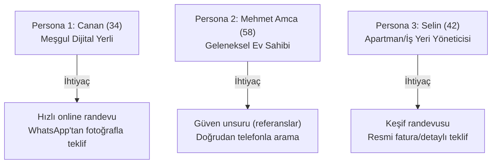
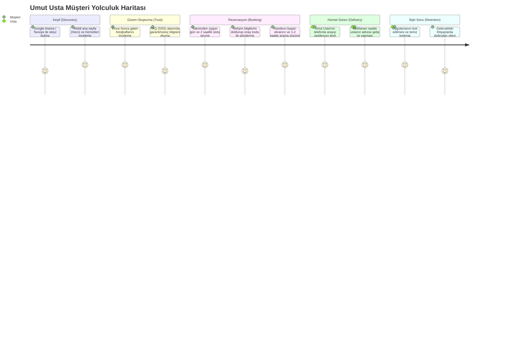
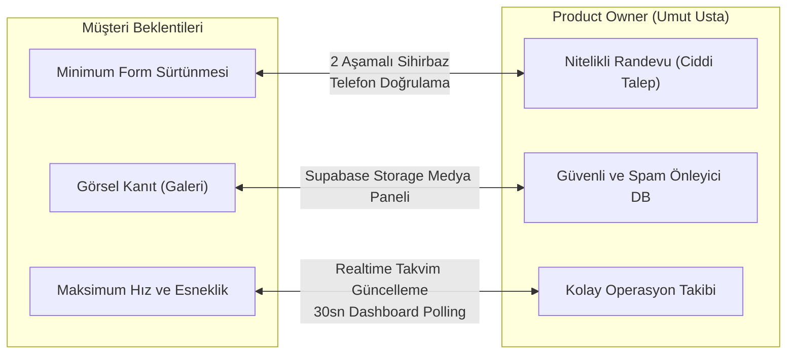
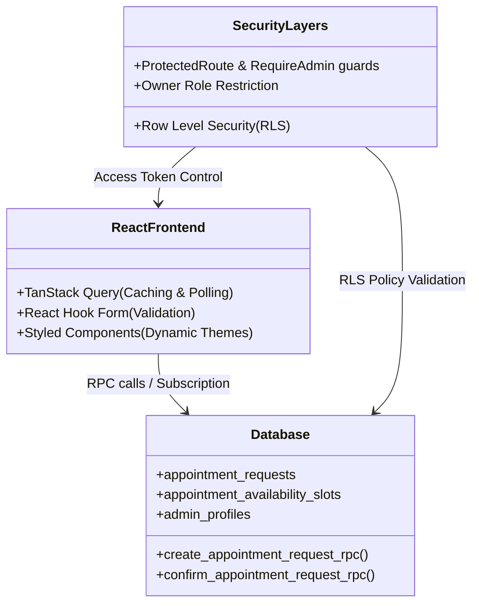

# Umut Usta Randevu Uygulaması Kapsamlı Değerlendirme Raporu

**Tarih:** 3 Temmuz 2026  
**Hazırlayan:** Antigravity (Advanced Agentic Coding AI)  
**Kapsam:** Müşteri Gözü & Product Owner Değerlendirmesi  
**Metodoloji:** Design Thinking, Veri Görselleştirme (Data Visualization) & Yazılım Mühendisliği (Software Engineering) Temelleri  

---

## 📋 Yönetici Özeti

Bu rapor, Ankara genelinde (özellikle Yenimahalle ve çevresi) lokal metal kaynak, duvar boyama, peyzaj, otomatik kapı motorları ve akıllı kilit sistemleri alanında hizmet veren **Umut Usta** işletmesi için geliştirilen **The Welding Expert App (Umut Usta Randevu Sistemi)** uygulamasının stratejik ve teknik değerlendirmesidir. 

Yapılan analiz; uygulamanın müşteri arayüzünü (Public Portal) ve yönetim panelini (Admin Operations Panel) hem nihai kullanıcı (müşteri) hem de ürün sahibi (Product Owner / Umut Usta) gözünden ele almaktadır. Değerlendirme, **Design Thinking** metodolojisiyle kullanıcı deneyimini iyileştirmeyi, **Yazılım Mühendisliği** prensipleriyle veri bütünlüğünü ve güvenliği sağlamayı, **Veri Görselleştirme** yaklaşımlarıyla da operasyonel kararları kolaylaştırmayı hedeflemektedir.

---

## 👥 1. Hedef Kitle & Demografik Analiz

Ankara metropolünde usta hizmetlerine ihtiyaç duyan kitle, sosyo-ekonomik ve teknolojik okuryazarlık düzeylerine göre çeşitlilik göstermektedir. Bu bağlamda hedef kitle **üç ana segmente** ayrılmaktadır:

### 1.1. Demografik Segmentasyon
* **Yaş Grubu:** 25 - 65 yaş arası ev/iş yeri sahipleri veya yöneticileri.
* **Coğrafi Odak:** Ankara (Yenimahalle merkez olmak üzere Çankaya, Etimesgut, Keçiören, Batıkent, Çayyolu gibi yakın bölgeler).
* **Teknoloji Kullanımı:** 
  * *Genç/Orta Yaş (25-45):* Mobil öncelikli (Mobile-First) yaşayan, telefon görüşmesi yerine çevrimiçi (online) rezervasyon ve WhatsApp görsel paylaşımını tercih eden dijital yerliler.
  * *İleri Yaş (45-65+):* Geleneksel yöntemlere alışkın, kişisel güven ilişkisi arayan, büyük yazı boyutları ve doğrudan arama butonlarına ihtiyaç duyan kullanıcılar.

### 1.2. Kullanıcı Personaları (Design Thinking)

Aşağıdaki personalar, uygulamanın hitap ettiği temel kullanıcı profillerini ve onun spesifik ihtiyaçlarını somutlaştırmaktadır:

#### 👩 Persona 1: Dijital Yerli ve Meşgul Çalışan (Canan, 34)
* **Profil:** Çayyolu'nda bir teknoloji firmasında proje yöneticisi. Evi için raylı bahçe kapısı motoru montajı ve kaynak tamiratı yaptırmak istiyor.
* **Kullanıcı Amacı (Goal):** Mesai saatlerinde telefonla konuşmadan, internet sitesi üzerinden hızlıca müsait günleri görüp cumartesi sabahına 2 saatlik randevu almak.
* **Engeller (Pain Points):** Güvenilmez ustalarla zaman kaybetmek, telefonda fiyat pazarlığı yapmak istememesi, şeffaf olmayan hizmet süreçleri.
* **Uygulamadaki Karşılığı:** 2 aşamalı rezervasyon sihirbazı (Booking Calendar & Form) ve WhatsApp görsel paylaşım hattı ("Fotoğraf Gönder, Teklif Al").

#### 👨 Persona 2: Geleneksel Ev Sahibi (Mehmet Amca, 58)
* **Profil:** Yenimahalle'de emekli devlet memuru. Balkon demirlerinin kaynağını ve duvar boyasını yeniletmek istiyor.
* **Kullanıcı Amacı (Goal):** Mahallesine yakın, güvenilir bir usta bulup telefonda konuşarak detayları netleştirmek.
* **Engeller (Pain Points):** Karmaşık web formları, küçük yazılar, sitenin "sahte" veya dolandırıcı olmasından korkması.
* **Uygulamadaki Karşılığı:** Görünür telefon numarası, fiziksel adres (Gazi Mahallesi), harita konumu, temiz Türkçe karakterler ve gerçek referans çalışmaları içeren Galeri.

#### 🏢 Persona 3: Apartman / İş Yeri Yöneticisi (Selin, 42)
* **Profil:** 40 daireli bir sitenin yöneticisi. Bina girişine akıllı kilit sistemi ve hidrolik kapatıcı yaptırmak istiyor.
* **Kullanıcı Amacı (Goal):** Ustanın yerinde keşif yapıp yönetim kuruluna sunulmak üzere resmi bir fiyat teklifi hazırlaması.
* **Engeller (Pain Points):** Keşif ücreti belirsizlikleri, yapılacak işin teknik detaylarının raporda yazılmaması.
* **Uygulamadaki Karşılığı:** "Yerinde keşif ve teklif" (ücretsiz keşif) randevu seçeneği ve admin panelinden girilebilen "Müşteri Notu/Admin Notu" ayrımı.

---

## 🎯 2. Müşteri Gözünden Beklenti Analizi

Müşterilerin usta kiralama süreçlerinde yaşadığı temel sorunlar ve bu uygulamanın getirdiği çözümler Design Thinking felsefesiyle analiz edilmiştir.

### 2.1. Temel Müşteri Kaygıları ve Çözüm Yaklaşımları
1. **Zaman Belirsizliği ("Usta ne zaman gelecek?"):** Geleneksel süreçte usta "öğleden sonra gelirim" der ve tüm gün beklenir. Uygulama, **2 saatlik hassas zaman dilimleri** (örn: 09:00-11:00) sunarak müşterinin gününü planlamasına olanak tanır.
2. **Fiyat ve Kapsam Belirsizliği:** Müşteri sürpriz maliyetlerden çekinir. Hizmet kartlarındaki başlangıç fiyatları ve "Yerinde Keşif" seçeneği bu kaygıyı azaltır.
3. **Güven ve Referans Eksikliği:** Galeri sayfasındaki gerçek **Önce-Sonra (Before-After)** çalışmaları, tamamlanan işlerin kalitesini doğrudan kanıtlar.

### 2.2. Müşteri Yolculuk Haritası (Customer Journey Map)

Aşağıdaki yolculuk haritası, bir müşterinin Umut Usta Randevu Sistemi ile etkileşime girdiğinde geçtiği aşamaları göstermektedir:

---

## 🛠️ 3. Ürün Tanımı ve Temel Değer Önerisi

### 3.1. Ürün Tanımı
**Umut Usta Randevu Sistemi (The Welding Expert App)**; yerel bir teknik bakım ve kaynak işletmesinin tüm müşteri ilişkilerini, müsaitlik takvimini, randevu taleplerini, galeri portföyünü ve ekip yetkilerini tek bir merkezden yönetmesini sağlayan, bulut tabanlı (React + Supabase) bir iş operasyon platformudur.

### 3.2. Değer Önerisi Kanvası (Value Proposition Canvas)

Değer Önerisi Kanvası, müşterinin yapmaya çalıştığı işler ile uygulamanın sunduğu özelliklerin nasıl eşleştiğini doğrulamaktadır.

| Müşteri Profili (Customer Profile) | Değer Haritası (Value Map) |
| :--- | :--- |
| **Müşteri İşleri (Customer Jobs):** - Ev/Ofis hasarlarını tamir ettirmek. - Kapı, korkuluk ve kilit montajı yaptırmak. - Güvenilir yerel uzman bulmak. | **Ürün ve Hizmetler:** - 7/24 Online Randevu Portalı. - Önce/Sonra İnteraktif Galerisi. - WhatsApp Hızlı Teklif Hattı. |
| **Ağrılar (Pains):** - Çift randevu / Ustanın gelmemesi. - Telefonda uzun pazarlıklar. - İş kalitesinden emin olamama. | **Ağrı Gidericiler (Pain Relievers):** - DB seviyesinde atomik çakışma engeli. - Telefonla 1-2 saatte hızlı teyit dönüşü. - Ücretsiz keşif seçeneği. |
| **Kazançlar (Gains):** - Pürüzsüz boya/sağlam kaynak. - Zamandan tasarruf etmek. - Kolayca planlanabilir servis. | **Kazanç Yaratıcılar (Gain Creators):** - Net 2 saatlik servis aralıkları. - Responsive mobil tasarım ve sticky CTA. - Detaylı hizmet açıklama kartları. |

---

## 📊 4. Müşteri Gözü & Product Owner Değerlendirmesi

Uygulamanın başarısı, bu iki zıt fakat tamamlayıcı rolün beklentilerinin aynı paydada buluşmasına bağlıdır.

### 4.1. Perspektif Karşılaştırma Matrisi

| Kriter | Müşteri Gözünden Beklenti | Product Owner (Umut Usta) Gözünden Beklenti | Hizalanma ve Çözüm Stratejisi |
| :--- | :--- | :--- | :--- |
| **Randevu Akışı** | Formu doldururken vakit kaybetmemek, hemen onay almak. | Yanlış veya "şaka" amaçlı randevuların takvimi kilitlemesini engellemek. | **2 Aşamalı Sihirbaz:** İlk aşamada gün/saat seçilir, ikinci aşamada isim ve doğrulanabilir telefon alınır. Kayıtlar veritabanına `new` (yeni) olarak düşer, usta onaylayınca takvim kilitlenir. |
| **İletişim Kanalı** | Doğrudan WhatsApp'tan fotoğraf atıp fiyat almak veya siteden gün seçmek. | Gelen taleplerin tek bir panelde birikmesi, WhatsApp'tan gelen işlerin de takvime girilebilmesi. | **Çift Yönlü Sistem:** Sitede hem veritabanına talep bırakan "Randevu Seç" butonu hem de önceden doldurulmuş şablon mesajlı "Fotoğraf Gönder, Teklif Al" WhatsApp butonu bulunur. |
| **Müsaitlik Planlama** | İstediği gün ve saati esnekçe seçebilmek. | Hava durumuna, malzeme tedariğine veya önceki işlerin uzamasına göre günü kolayca kapatabilmek. | **Dinamik Takvim Yöneticisi:** Admin panelinden tek tıkla günler "Müsait", "Kısıtlı" veya "Kapalı" yapılabilir. Bireysel 2 saatlik slotlar pasifleştirilebilir. |
| **Medya ve Güven** | İşlerin kalitesini yakından ve büyük boyutlu görebilmek. | Sunucu maliyetlerini artırmadan, mobil cihazlardan hızlıca fotoğraf yükleyebilmek. | **Supabase Storage Entegrasyonu:** Fotoğraflar WebP formatında optimize edilerek yüklenir. İstemci tarafında tembel yükleme (lazy loading) ile hızlı sayfa açılışı sağlanır. |

---

## 📈 5. Feature Completeness (Özellik Tamlığı) Değerlendirmesi

Sprint 1 ve 2 geliştirme süreçlerinin ardından uygulamanın özellik tamlığı analiz edilmiştir.

### 5.1. Özellik Karşılaştırma ve Durum Tablosu

| Özellik Grubu | Modül / Detay | Durum | Müşteri Etkisi | Product Owner Etkisi | Öncelik / Sonraki Adım |
| :--- | :--- | :--- | :--- | :--- | :--- |
| **Public Booking** | Gün ve 2 Saatlik Slot Seçimi | ✅ Tamamlandı | Çok Yüksek (Kolay planlama) | Yüksek (İş gücü planlama) | - |
| **Public Booking** | 2 Aşamalı Randevu Sihirbazı | ✅ Tamamlandı | Yüksek (Azalan form karmaşası) | Orta (Nitelikli lead artışı) | - |
| **Public Booking** | Sticky Mobile CTA | ✅ Tamamlandı | Çok Yüksek (Kolay erişim) | Orta (Dönüşüm oranı artışı) | - |
| **Admin Operations** | Canlı Gösterge Paneli (Dashboard) | ✅ Tamamlandı | Yok | Çok Yüksek (İş takibi hızı) | - |
| **Admin Operations** | 30sn Auto-Refresh (Polling) | ✅ Tamamlandı | Yok | Çok Yüksek (Realtime takip) | - |
| **Admin Operations** | Arama & Durum Filtreli Talep Yöneticisi | ✅ Tamamlandı | Yok | Çok Yüksek (Düzenli listeleme) | - |
| **Admin Operations** | Yumuşak Silme (Archiving / Soft-Delete) | ✅ Tamamlandı | Yok | Yüksek (Randevu geçmişi koruma) | - |
| **Admin Operations** | Rol Tabanlı Ekip Yönetimi (Owner-only) | ✅ Tamamlandı | Yok | Çok Yüksek (Güvenli operasyon) | - |
| **Data Integrity** | DB Seviyesinde Çakışma Önleme (RPC) | ✅ Tamamlandı | Yüksek (Çift randevu hatası yok) | Çok Yüksek (İtibar koruma) | - |
| **Medya & Portföy** | Önce/Sonra Görsel Kaydırıcı (Slider) | ✅ Tamamlandı | Çok Yüksek (Hızlı ikna) | Yüksek (İş kalitesi sergileme) | - |
| **SEO & Güven** | Canonical Link, LocalBusiness JSON-LD | ✅ Tamamlandı | Orta (Google'da kolay bulma) | Yüksek (Organik trafik artışı) | - |

### 5.2. Boşluk (Gap) Analizi ve Kalan Sprintler (Sprint 3 & 4)

Mevcut durumda Sprint 1 ve 2 başarıyla tamamlanmıştır. Uygulamanın tam üretime (Production) hazır hale gelmesi için planlanan kalan adımlar şunlardır:
* **Müşteri Formu Normalizasyonu:** Telefon numaralarının `+90` formatında maskelenmesi ve validation hatalarının daha şık gösterilmesi (Sprint 3).
* **Müşteri Randevu Takip Arayüzü:** Talebi gönderen müşterinin, talebinin durumunu (Beklemede, Onaylandı, İptal) izleyebileceği basit bir sorgulama veya başarı takip ekranı (Sprint 3).
* **Supabase Storage Görsel Yönetimi:** Admin panelinden galeriye yeni görsellerin sürükle-bırak yöntemiyle yüklenmesi ve eski görsellerin silinmesi arayüzü (Sprint 4).
* **Canlı SMS / WhatsApp Bildirim Entegrasyonu:** Randevu onaylandığında müşteriye otomatik SMS/WhatsApp gitmesi (Backlog / İleri Aşama).

---

## 📐 6. Design Thinking, Veri Görselleştirme ve Yazılım Mühendisliği Temelleri

### 6.1. Design Thinking Yaklaşımı
* **Kullanıcı Empatisi (Empathy):** Mobil ekran kullanan bir müşterinin baş parmak erişim mesafeleri hesaplanarak **Sticky Mobile CTA** geliştirilmiştir. AppNav kaydırma alanına eklenen gradyan gölgelendirmelerle kullanıcının yatay kaydırma yapabileceği sezgisel olarak hissettirilmiştir.
* **Süreç Kısaltma (Friction Reduction):** Geleneksel uzun ve korkutucu formlar yerine, kullanıcının önce gün/saat seçip sürece dahil olmasını sağlayan, ardından kişisel bilgileri alan iki adımlı akış tasarlanmıştır.

### 6.2. Veri Görselleştirme (Data Visualization) Prensipleri
* **Admin Dashboard Tasarımı:** Karmaşık verileri grafikler yerine operasyonel olarak en kritik metriklere odaklayarak görselleştirir:
  * *Haftalık Takvim Matrisi:* Günlerin durumuna göre (Müsait: Yeşil, Kısıtlı: Sarı, Kapalı: Kırmızı) renk kodlu kartlar.
  * *İstatistik Kartları (KPIs):* "Bekleyen Talepler", "Onaylı Randevular", "Aktif Üyeler" gibi sayısal veriler zıt renk şemaları ve net ikonlarla (Heroicons) sunulmuştur.
* **Müşteri Takvimi:** Dolu slotların üzeri çizilerek ve grileştirilerek görsel hiyerarşi korunmuş, kullanıcının yanlış seçim yapması görsel olarak engellenmiştir.

### 6.3. Yazılım Mühendisliği Temelleri (Software Engineering)

Uygulamanın mimari kararları, modern yazılım mühendisliği disiplinlerine dayanmaktadır:

1. **Veri Bütünlüğü ve Güvenliği (Database Integrity):**
   * *PostgreSQL RPC'leri (Remote Procedure Call):* Randevu oluşturma (`create_appointment_request`) ve onaylama (`confirm_appointment_request`) işlemleri client-side (React) üzerinden doğrudan tabloları manipüle ederek yapılmaz. Bu işlemler veritabanında `security definer` RPC'ler üzerinden tek bir veritabanı işlemi (Transaction) içinde yürütülür.
   * *Çakışma Önleme:* Aynı slota çift randevu verilmesi, DB seviyesindeki benzersiz kısıtlamalar (Unique constraints) ve RPC içi kontrollerle %100 engellenmiştir.
2. **Erişim Kontrolü ve Yetkilendirme (RLS & RBAC):**
   * Supabase Row Level Security (RLS) politikaları sayesinde, yetkisiz kullanıcılar müşteri taleplerine veya admin profillerine doğrudan erişemez.
   * `Owner`, `Admin`, `Operator`, `Technician` rolleri veritabanında tanımlanmış olup, React tarafındaki `RequireAdmin` bileşeniyle sayfa bazlı rotalar korunmaktadır.
3. **Durum Yönetimi ve Performans (State & Performance):**
   * **TanStack Query (React Query v4):** Ağ üzerindeki yükü azaltmak için veriler önbelleğe alınır. Admin panelinde 30 saniyede bir otomatik arka plan refetch mekanizması çalışarak güncel verileri çeker.
   * **Yumuşak Silme (Soft-Delete) & Veri Tetikleyicileri (Triggers):** Randevuların fiziksel olarak silinmesi yerine durumlarının `cancelled` yapılması veya arşivlenmesi sağlanmıştır. PostgreSQL tetikleyicisi (`sync_appointment_status_with_slot`), randevu iptal edildiği veya arşivlendiği anda ilgili takvim slotunu otomatik olarak tekrar `available` (müsait) konumuna getirir.

---

## 🎯 Sonuç ve Stratejik Öneriler

Umut Usta Randevu Uygulaması, yerel hizmet sektöründeki dijitalleşme ihtiyacına getirilmiş **örnek ve premium bir çözümdür**. Tasarımın modern estetiği (melting-snow geçişli premium tema anahtarı, uyumlu renk paleti) müşteri gözündeki güvenilirliği maksimize ederken, arkadaki yazılım mühendisliği mimarisi (RPC'ler, trigger'lar, RLS) Product Owner için sıfır operasyonel hata ve yüksek veri güvenliği sunmaktadır.

### Gelecek Yol Haritası Önerileri:
1. **Google Haritalar Yerel İşletme Entegrasyonu:** SEO tarafında eklenen `LocalBusiness` JSON-LD şemasının, Umut Usta'nın gerçek Google Haritalar (GMB) hesabı ile tam eşleştirilmesi.
2. **Kullanıcı Yorumları (Testimonials) Doğrulaması:** Galeri sayfasında bulunan müşteri yorumlarının, Google Maps API üzerinden otomatik çekilerek gerçek zamanlı ve doğrulanmış olarak listelenmesi.
3. **SMS API Entegrasyonu:** Randevu talebi onaylandığında veya usta yola çıktığında müşterinin telefonuna otomatik bilgilendirme SMS'i gönderilmesi.
