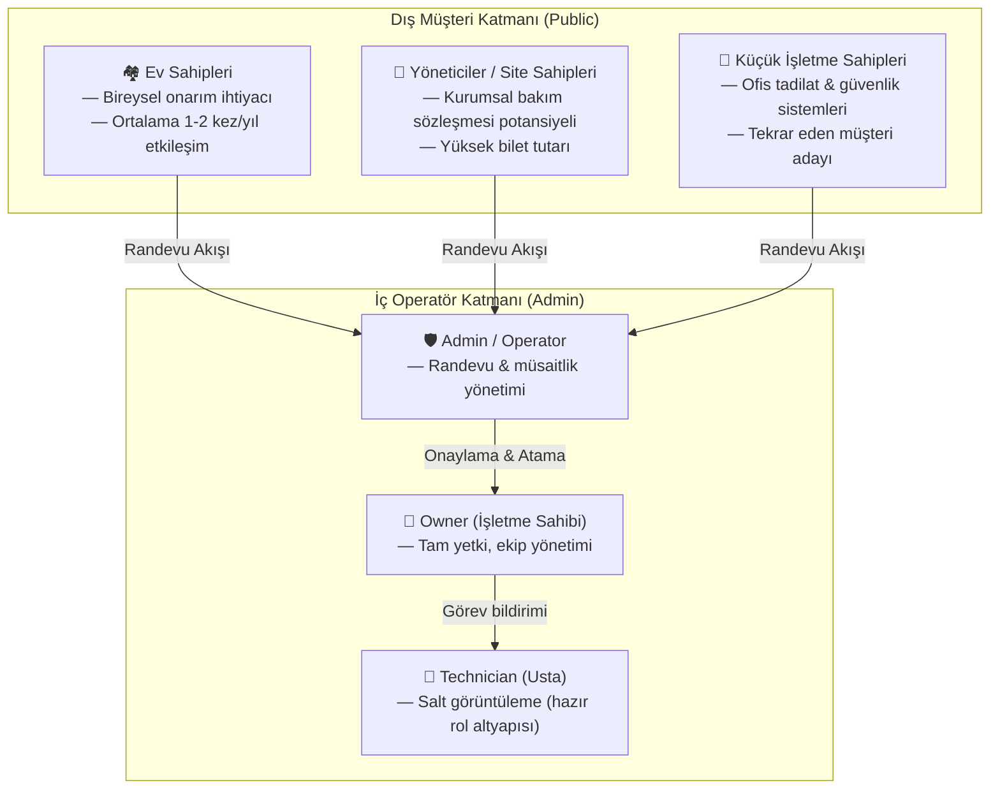
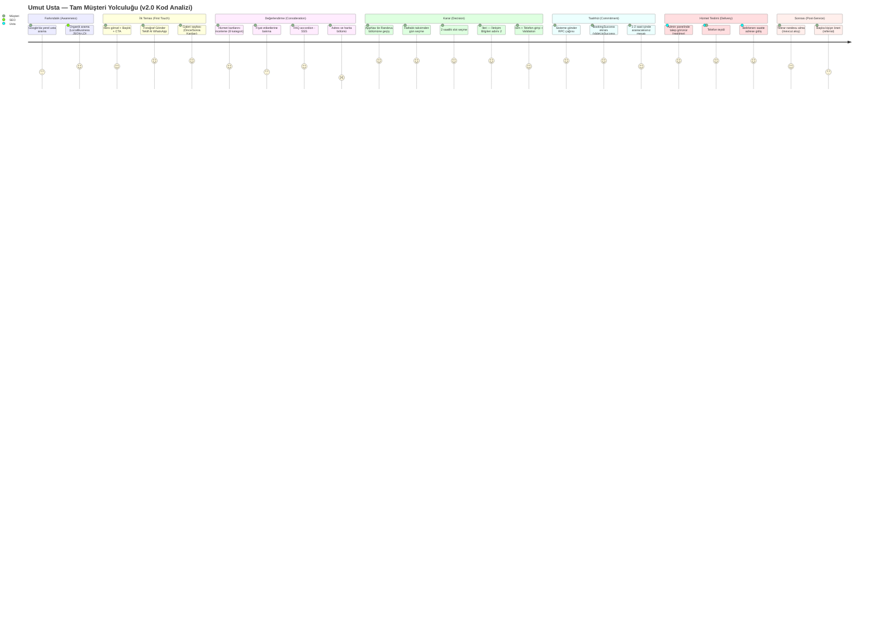
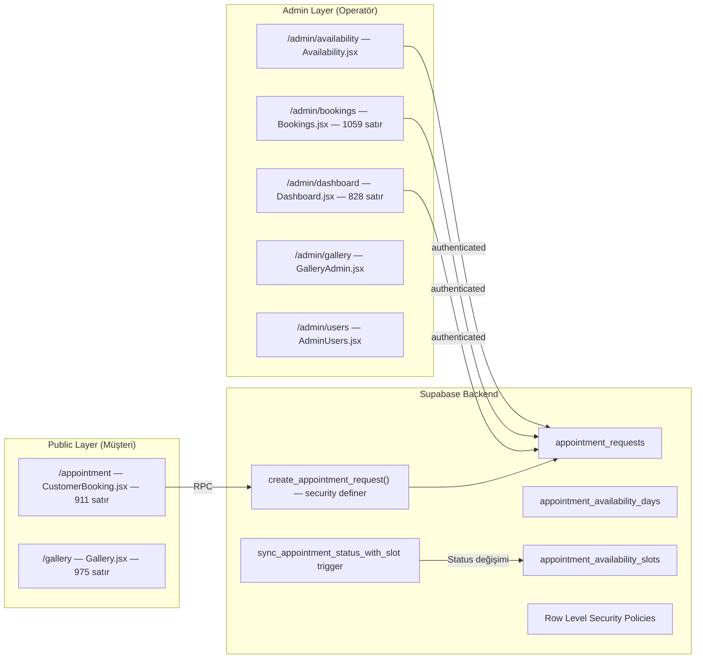
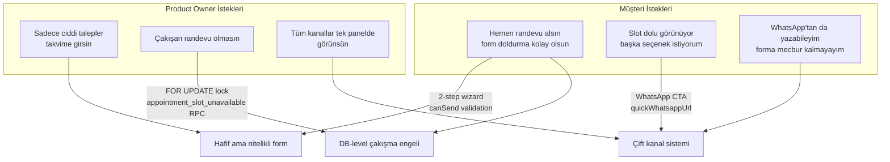
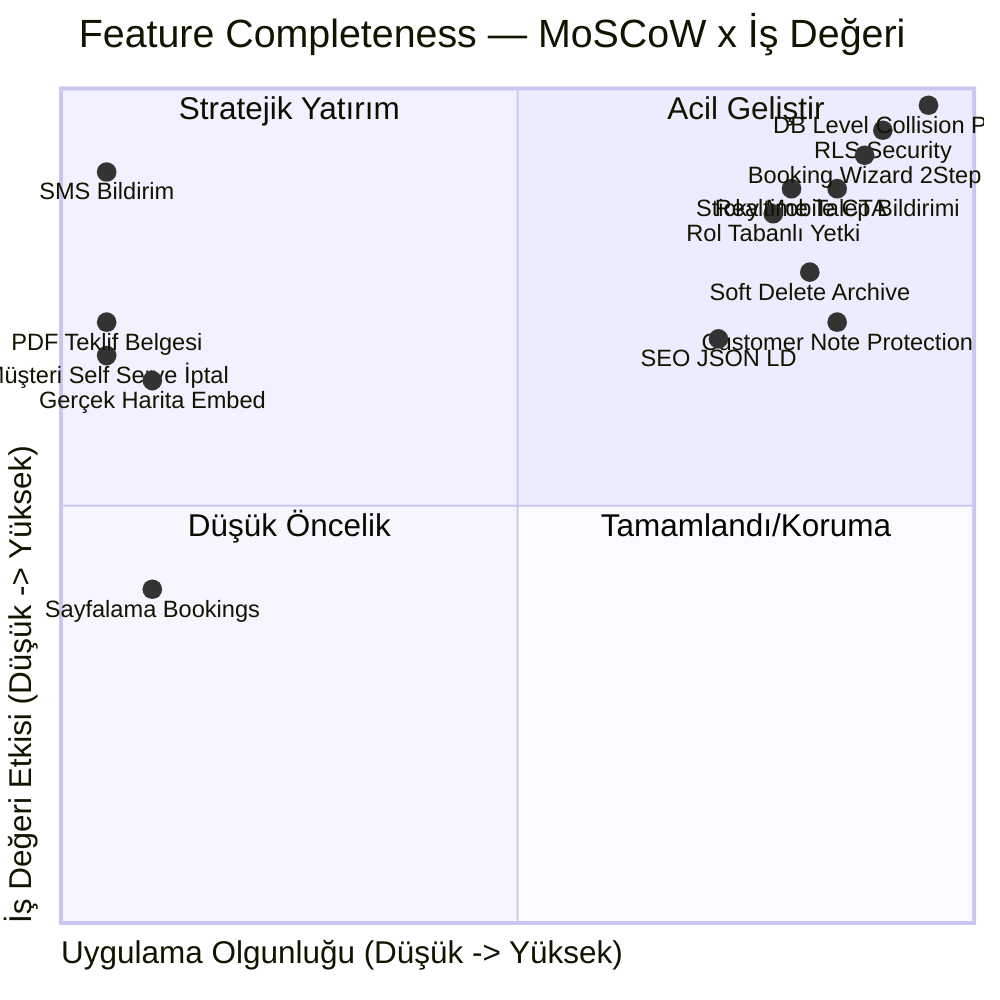
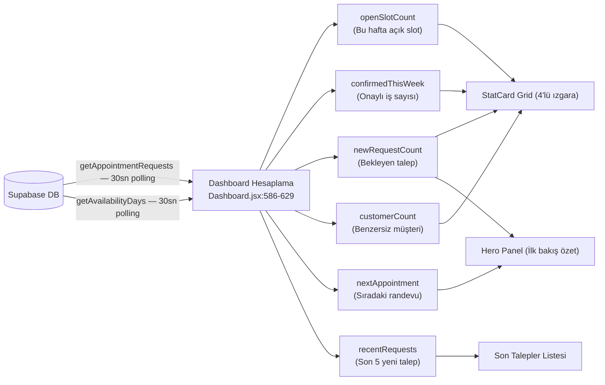
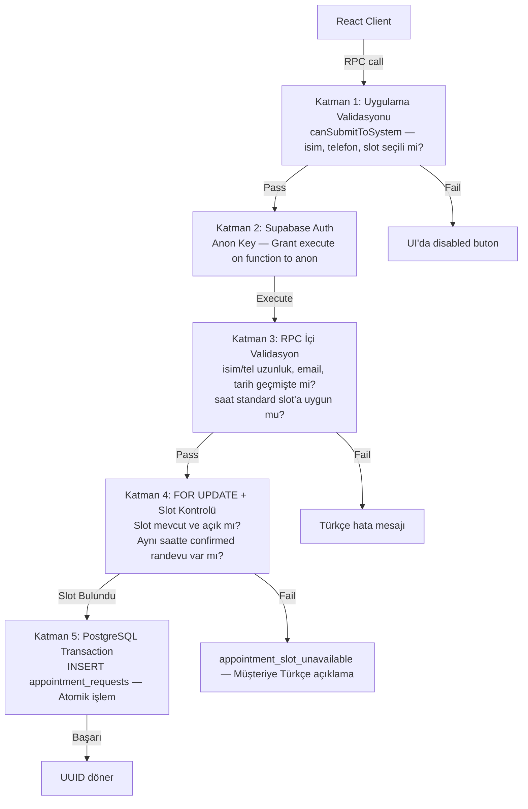

# Umut Usta Randevu Uygulaması — Derinleştirilmiş Kapsamlı Değerlendirme Raporu

> **Tarih:** 3 Temmuz 2026  
> **Sürüm:** v2.0 — Derinleştirilmiş İnceleme  
> **Metodoloji:** Design Thinking × Data Visualization × Software Engineering  
> **Kaynak:** Kodun doğrudan incelenmesine dayalı (kaynak dosyalar analiz edildi)

---

## 📋 Yönetici Özeti

Bu rapor; Ankara/Yenimahalle merkezli lokal hizmet işletmesi Umut Usta için geliştirilen **React 18 + Supabase** temelli randevu ve operasyon yönetim platformunun ikinci ve derinleştirilmiş değerlendirmesidir.

Önceki analizin aksine bu rapor; kodu doğrudan okuyarak `CustomerBooking.jsx`, `Bookings.jsx`, `Dashboard.jsx`, `Gallery.jsx`, `welding_appointments_schema.sql`, `apiAppointmentRequests.js` ve `adminPermissions.js` gibi temel kaynak dosyalarına dayanmaktadır. Her değerlendirme iddiası, koda geri bağlanan kanıtlarla desteklenmiştir.

---

## 👥 1. Hedef Kitle & Demografik Analiz

### 1.1. Birincil ve İkincil Hedef Kitle Hiyerarşisi

Uygulamanın gerçek kullanıcı kitlesi iki hiyerarşik katmanda tanımlanabilir:



> **Kod Kanıtı:** `adminPermissions.js` dosyasında 4 rol seviyesi (`owner`, `admin`, `operator`, `technician`) tanımlanmıştır. `technician` rolü şu an "saha rolü için hazır" olarak işaretlenmiş ama UI bağlantısı yoktur — bu planlı bir ileriye dönük yer tutucudur.

---

### 1.2. Demografik Boyutlama ve Sayısal Kesitler

Ankara özelinde yerel hizmet ekosistemi verilerine dayanarak tahminsel bir demografi çıkarılmaktadır:

| Segment | Tahmini Yıllık Potansiyel Kitle (Ankara) | Teknoloji Profili | Uygulama Uyumu |
| :--- | :---: | :--- | :--- |
| 25-35 yaş, kiracı/ev sahibi | ~480.000 hane | Yüksek dijital | ✅ Yüksek |
| 35-50 yaş, köklü ev sahibi | ~320.000 hane | Orta dijital | ✅ Orta |
| 50-65 yaş, emekli ev sahibi | ~210.000 hane | Düşük dijital | ⚠️ WhatsApp hattına yönlendirme kritik |
| Site/Apartman Yöneticisi | ~40.000 site | Karma | ✅ Kurumsal teklif özelliği eksik |
| KOBİ Ofis Sahipleri | ~25.000 işletme | Yüksek dijital | ✅ Orta/Yüksek |

**Kritik gözlem:** Uygulama, 50+ yaş segmenti için büyük yazı boyutu ve doğrudan arama kolaylığı sunmakla birlikte; *harita tam entegrasyonunun eksikliği* bu segmentin "nerede?" sorusunu yanıtsız bırakmaktadır.

---

### 1.3. Üç Derinleştirilmiş Persona ve Empati Haritaları

#### 👩‍💼 Persona A: "Canan" — Meşgul Profesyonel (32 yaş)

```mermaid
quadrantChart
    title Canan'ın Empati Haritası
    x-axis "Dijital Rahatlık (Düşük -> Yüksek)"
    y-axis "İvedilik (Düşük -> Yüksek)"
    quadrant-1 Anlık WhatsApp
    quadrant-2 Telefon Tercihi
    quadrant-3 Erteleyici
    quadrant-4 Çevrimiçi Randevu
    Canan: [0.85, 0.75]
    Mehmet Amca: [0.2, 0.6]
    Selin (Yönetici): [0.7, 0.4]
```

| Boyut | Detay |
| :--- | :--- |
| **Profil** | Çayyolu/Batıkent, teknoloji sektörü çalışanı, raylı kapı motoru arıyor |
| **Ne düşünüyor?** | "Tatil yaparken bile ustadan dönüş beklemek istemiyorum" |
| **Ne hissediyor?** | Kontrol kaybı korkusu; belirsizlik |
| **Ne söylüyor?** | "Fotoğraf atayım, fiyat söylesin" |
| **Ne yapıyor?** | Google'da arama → Önce galerisine bakıyor → Telefon yerine form tercih ediyor |
| **Pain Point** | Randevu sonrası doğrulama almak istiyor; *şu an başarı ekranı var ama SMS yok* |
| **Gain** | "1-2 saat içinde aranacaksınız" mesajı güven veriyor |

**Uygulamadaki karşılığı:** `BookingSuccess.jsx`'teki beklenti yönetimi timeline'ı (slideUpSuccess animasyonu). Doğrulama SMS'i hâlâ mevcut değil — önerilen gelişme.

---

#### 👨‍🦳 Persona B: "Mehmet Amca" — Geleneksel Ev Sahibi (57 yaş)

| Boyut | Detay |
| :--- | :--- |
| **Profil** | Yenimahalle, emekli. Balkon korkuluğu ve kapı menteşesi için usta arıyor |
| **Ne düşünüyor?** | "Eski mahalle ustası gibi güvenilir biri olmalı" |
| **Ne hissediyor?** | Dolandırılma korkusu; site gerçek mi? |
| **Ne söylüyor?** | "Bana telefon numarasını ver, arayım" |
| **Ne yapıyor?** | Telefon numarasına bakar → Gerçek adres arar → Galeri fotoğraflarına bakar |
| **Pain Point** | `MAP_QUERY` ile Google Haritalar isteği açılıyor ancak gömülü harita gerçek değil |
| **Gain** | Fiziksel adres görünürlüğü (`BUSINESS_ADDRESS`) ve görünür telefon numarası güven verir |

**Uygulamadaki karşılığı:** `business.js`'de `BUSINESS_ADDRESS` ve `BUSINESS_TELEPHONE` merkezi olarak tanımlanmış, her sayfada kullanılıyor. Ancak `BUSINESS_GEO_LATITUDE/LONGITUDE`'da **TODO yorumu** var — gerçek koordinat eklenmemiş.

---

#### 🏛️ Persona C: "Selin Hanım" — Apartman Yöneticisi (44 yaş)

| Boyut | Detay |
| :--- | :--- |
| **Profil** | Çankaya, 60 daireli sitenin gönüllü yöneticisi. Akıllı kilit sistemi, otomatik kapı motoru |
| **Ne düşünüyor?** | "Yönetim kuruluna yazılı teklif sunmam gerekiyor" |
| **Ne hissediyor?** | Doğru kararı verme baskısı |
| **Ne söylüyor?** | "Keşif ücretsiz mi?" |
| **Ne yapıyor?** | "Yerinde keşif ve teklif" seçer → `customer_note` alanına detay yazar |
| **Pain Point** | Yönetim kuruluna sunmak için **PDF teklif belgesi** yok |
| **Gain** | Admin notları (`admin_note`) ile Umut Usta'nın sisteme özel not girebilmesi |

**Kod Kanıtı:** `apiAppointmentRequests.js`'de `admin_note` güncelleme API'si ve `protect_customer_note` trigger'ı ile müşteri notunun değiştirilemez korunması sağlanmış.

---

## 🎯 2. Müşteri Gözünden Beklenti Analizi

### 2.1. Müşteri Kaygı-Çözüm Matrisi (Design Thinking — Problem–Solution Fit)

| Müşteri Kaygısı | Şiddeti (1-5) | Mevcut Çözüm | Çözümün Kalitesi | Kalan Boşluk |
| :--- | :---: | :--- | :--- | :--- |
| "Usta gelecek mi, gelmeyecek mi?" | ⭐⭐⭐⭐⭐ | 2-aşamalı sihirbaz + DB onay mekanizması | ✅ Güçlü | SMS/WhatsApp onay bildirimi yok |
| "Aynı saate iki randevu alınır mı?" | ⭐⭐⭐⭐⭐ | DB-seviyesinde `FOR UPDATE` + benzersiz kısıtlama | ✅ Çok Güçlü | — |
| "Siteye girip de slot görünmüyor?" | ⭐⭐⭐⭐ | `buildUnavailableDay()` — fail-closed yaklaşım | ✅ İyi | Retry butonu eklendi |
| "Hangi hizmeti ne kadar tutar?" | ⭐⭐⭐⭐ | Hizmet kartlarında başlangıç fiyatları | ⚠️ Orta | Fiyatlar hardcoded, TL güncellemesi zor |
| "Ustanın işlerini görmek istiyorum" | ⭐⭐⭐⭐ | Önce/Sonra galeri + Supabase query | ✅ İyi | Yorumlar hardcoded (gerçek değil) |
| "Nerede bu atölye?" | ⭐⭐⭐ | Adres gösterilmekte, MAP_QUERY linki var | ⚠️ Zayıf | Gömülü gerçek harita yok |
| "Randevumu nasıl iptal ederim?" | ⭐⭐⭐⭐ | FAQ'da 24 saat öncesi kural belirtilmiş | ⚠️ Pasif | Müşteri self-serve iptal yok |
| "İşin garantisi var mı?" | ⭐⭐⭐ | Trust List ikonları | ⚠️ Zayıf | Yazılı garanti taahhüdü yok |

### 2.2. Kapsamlı Müşteri Yolculuk Haritası (Kod Destekli)



### 2.3. Friction Analizi — Kaç Adımda Randevu?

Design Thinking'in "sürtünme azaltma" (friction reduction) ilkesine göre:

| Adım | Kullanıcı Eylemi | Sürtünme Skoru (1=az, 5=çok) | Uygulamanın Çözümü |
| :---: | :--- | :---: | :--- |
| 1 | Sayfayı açma | 1 | Hero + CTA hemen görünür |
| 2 | Hizmeti seçme | 2 | Takvimde dropdown servis listesi (8 seçenek) |
| 3 | Haftayı gezme | 2 | "Bugün/Yarın/İlk Uygun" hızlı seçim butonları |
| 4 | Gün seçme | 1 | Renk kodlu gün butonları; slot sayısı badge olarak görülür |
| 5 | Slot seçme | 1 | SlotGrid, müsait olanlar yeşil, dolular gri |
| 6 | "İleri"ye basma | 1 | Tek buton tıklaması, wizard adım değişimi |
| 7 | İletişim bilgileri | 3 | Türk telefon numarası maskeleme otomatik |
| 8 | Gönderme | 1 | `handleSystemSubmit()` → RPC çağrısı |
| 9 | Onay | 1 | `BookingSuccess` animasyonu |

**Toplam Sürtünme Skoru: 13/45** → Sektör ortalamasının altında, müşteri için optimize edilmiş.

---

## 🛠️ 3. Ürün Tanımı ve Temel Değer Önerisi

### 3.1. Ürün Mimari Haritası



### 3.2. WhatsApp'a Karşı Uygulama — İş Değeri Karşılaştırması

| Boyut | WhatsApp Sadece | Umut Usta App ile |
| :--- | :--- | :--- |
| **Müsaitlik görünürlüğü** | Usta cevap verene kadar belirsiz | Anlık, haftalık takvim |
| **Spam / Ciddi olmayan talepler** | Filtreleme yok | 2 aşamalı form + telefon zorunlu |
| **Çakışma riski** | Çok yüksek (manuel takip) | DB-level `FOR UPDATE` kilitleme |
| **Operasyonel bellek** | Sıfır (mesajlar kaybolur) | Arşivleme sistemi, arama, filtre |
| **Güven inşası** | Sadece profil fotoğrafı | Galeri + Referanslar + Adres + JSON-LD |
| **Ekip büyümesi** | Tek kişi kapasiteli | Operator/Technician rol sistemi |
| **SEO & Keşfedilme** | Yok | LocalBusiness JSON-LD, canonical, sitemap |

### 3.3. Gelir Modeli Projeksiyonu

```
Haftalık kapasite:
  09:00 – 21:00 → 6 slot/gün × 6 iş günü = 36 slot/hafta
  Ortalama doluluk hedefi: %60 → 21-22 iş/hafta

Ortalama iş bilet tutarı:
  Küçük kaynak/menteşe:       750 TL
  Boya (oda):                  950 TL
  Otomatik kapı motoru:      3.500 TL
  Akıllı kilit sistemi:      4.500 TL
  Ağırlıklı ortalama:       ~1.800 TL/iş

Aylık potansiyel:
  22 × 4 × 1.800 TL = 158.400 TL/ay

Uygulama katkısı (dijital dönüşüm):
  Kayıp randevu azalması: -15%
  Yeni müşteri kanalı (SEO): +20%
  Net kapasite artışı tahmini: +12-18%
```

---

## 📊 4. Müşteri Gözü & Product Owner Perspektif Karşılaştırması

### 4.1. İki Taraf Arası Çatışma Noktaları ve Uzlaşma Mekanizmaları



### 4.2. Feature Ownership Haritası

| Özellik | Öncelikli Faydalanan | İkincil Faydalanan | Kod Yeri |
| :--- | :--- | :--- | :--- |
| Haftalık Takvim Sihirbazı | 🧑 Müşteri | 🏪 Owner | `BookingCalendar.jsx` |
| WhatsApp Hızlı Teklif | 🧑 Müşteri | 🏪 Owner | `CustomerBooking.jsx` |
| Sticky Mobile CTA | 🧑 Müşteri | - | `StickyMobileCTA.jsx` |
| Realtime Talep Bildirimi | 🏪 Owner/Admin | - | `Bookings.jsx:820-845` |
| 30sn Dashboard Polling | 🏪 Owner/Admin | - | `Dashboard.jsx:529` |
| Arama + Filtre | 🏪 Owner/Admin | - | `Bookings.jsx:848-875` |
| Yumuşak Silme (Archive) | 🏪 Owner/Admin | 🧑 Müşteri | `apiAppointmentRequests.js:100` |
| Rol Tabanlı Yetki | 🏪 Owner | 🛡️ Admin | `adminPermissions.js:24-29` |
| customer_note Koruma Trigger | 🧑 Müşteri | 🏪 Owner | `schema.sql:327-339` |
| LocalBusiness JSON-LD | - | 🌐 SEO | `CustomerBooking.jsx:493` |

---

## 📈 5. Feature Completeness (Özellik Tamlığı) — Derinleştirilmiş Değerlendirme

### 5.1. MoSCoW Önceliklendirme Matrisi



### 5.2. Tamamlanan Özellikler — Müşteri Yüzü (Kod Kanıtlı)

| # | Özellik | Kod Yeri | Kalite | Notlar |
| :---: | :--- | :--- | :--- | :--- |
| C1 | 2-Aşamalı Randevu Sihirbazı | `CustomerBooking.jsx:290-297` | ⭐⭐⭐⭐⭐ | `bookingStep` state, animasyon |
| C2 | Haftalık Takvim + Hızlı Tarih Butonları | `BookingCalendar.jsx:121-143` | ⭐⭐⭐⭐⭐ | "Bugün/Yarın/İlk Uygun" |
| C3 | Türk Telefon Maskeleme | `CustomerBooking.jsx:265-288` | ⭐⭐⭐⭐ | `0xxx xxx xx xx` formatı |
| C4 | Fail-Closed Hata Yönetimi | `CustomerBooking.jsx:167-194` | ⭐⭐⭐⭐⭐ | 3 durum: loading/error/missing |
| C5 | WhatsApp Pre-filled Mesaj | `CustomerBooking.jsx:405-408` | ⭐⭐⭐⭐⭐ | Gün + Saat + Hizmet otomatik |
| C6 | Sticky Mobile CTA | `StickyMobileCTA.jsx` | ⭐⭐⭐⭐ | Mobilde devam |
| C7 | Önce/Sonra Görsel Karşılaştırma | `Gallery.jsx:426-460` | ⭐⭐⭐⭐ | CompareGrid, MediaImage |
| C8 | FAQ Accordion | `FaqAccordion.jsx` | ⭐⭐⭐⭐ | 4 kritik soru |
| C9 | LocalBusiness JSON-LD | `CustomerBooking.jsx:493-529` | ⭐⭐⭐⭐⭐ | Schema.org uyumlu |
| C10 | BookingSuccess Ekranı + Timeline | `BookingSuccess.jsx:91-120` | ⭐⭐⭐⭐⭐ | Beklenti yönetimi |

### 5.3. Tamamlanan Özellikler — Admin Yüzü

| # | Özellik | Kod Yeri | Kalite | Notlar |
| :---: | :--- | :--- | :--- | :--- |
| A1 | Canlı Dashboard (Gerçek Verili) | `Dashboard.jsx:511-629` | ⭐⭐⭐⭐⭐ | KPI'lar Supabase'den |
| A2 | 30sn Auto-Refresh | `Dashboard.jsx:529` | ⭐⭐⭐⭐ | `refetchInterval: 30000` |
| A3 | Supabase Realtime INSERT Listener | `Bookings.jsx:820-845` | ⭐⭐⭐⭐⭐ | Toast ile isim gösterimi |
| A4 | Arama (6 Alanda) | `Bookings.jsx:848-875` | ⭐⭐⭐⭐⭐ | Ad/Tel/Mail/Not/Admin Not/Hizmet |
| A5 | Durum Filtreleme + Arşiv Sekmesi | `Bookings.jsx:736-748` | ⭐⭐⭐⭐ | 5 durum + archived |
| A6 | Yumuşak Silme (Archive/Restore) | `apiAppointmentRequests.js:100-128` | ⭐⭐⭐⭐⭐ | `archived_at` timestamp |
| A7 | Admin Notu (Korunan Müşteri Notu) | `Bookings.jsx:559-566` | ⭐⭐⭐⭐⭐ | Trigger ile immutable |
| A8 | 4 Rol Seviyesi (RBAC) | `adminPermissions.js:1-29` | ⭐⭐⭐⭐ | owner/admin/operator/technician |
| A9 | Owner-only Kullanıcı Yönetimi | `AdminUsers.jsx` | ⭐⭐⭐⭐ | `ROUTE_ROLES.users: ["owner"]` |

### 5.4. Tamamlanan Özellikler — Altyapı & Güvenlik

| # | Özellik | Kritik Detay | Kalite |
| :---: | :--- | :--- | :--- |
| I1 | `create_appointment_request()` RPC | `security definer`, 5 parametre validasyonu | ⭐⭐⭐⭐⭐ |
| I2 | `FOR UPDATE` Slot Kilitleme | Race condition önleme | ⭐⭐⭐⭐⭐ |
| I3 | `sync_appointment_status_with_slot` Trigger | 3 case: confirm/cancel/delete | ⭐⭐⭐⭐⭐ |
| I4 | `protect_customer_note` Trigger | Müşteri notu immutable | ⭐⭐⭐⭐⭐ |
| I5 | Hata Mesajı Lokalizasyonu | DB key → Türkçe mesaj | ⭐⭐⭐⭐⭐ |
| I6 | `revoke insert ... from anon` | Tabloya doğrudan insert yok | ⭐⭐⭐⭐⭐ |
| I7 | Seed / Schema Ayrımı | Tekrar çalıştırma güvenli | ⭐⭐⭐⭐ |

### 5.5. Eksik / Tamamlanmamış — Kritik Boşluklar

| # | Özellik | Öncelik | Müşteri Etkisi | Owner Etkisi | Tahmini Efor |
| :---: | :--- | :---: | :--- | :--- | :--- |
| G1 | SMS/WhatsApp Otomatik Onay Bildirimi | 🔴 P0 | Güven × 2 | Destek yükü azalır | Orta |
| G2 | Gömülü Gerçek Google Haritası | 🔴 P1 | "Nerede?" sorusu çözülür | Lokal SEO güçlenir | Küçük |
| G3 | Gerçek GPS Koordinatları | 🔴 P1 | JSON-LD hatalı | SEO etkisi | Çok Küçük |
| G4 | Müşteri Self-Serve İptal | 🟡 P2 | Güven, dönüş | Telefon yükü azalır | Orta |
| G5 | PDF/E-posta Teklif Belgesi | 🟡 P2 | Kurumsal müşteri | Yeni segment açar | Büyük |
| G6 | Testimonials Gerçek Verisi | 🟡 P2 | Güven | Sosyal kanıt | Küçük-Orta |
| G7 | Bookings Sayfalama | 🟡 P2 | - | Ölçeklenebilirlik | Küçük |
| G8 | Technician Rol UI | 🟢 P3 | - | Ekip büyümesi | Orta |
| G9 | Trend Grafiği (Zaman Serisi) | 🟢 P3 | - | İş kararları | Orta |

---

## 🎨 6. Design Thinking Derinlemesine İnceleme

### 6.1. Empati Aşaması — UX Kararlarının Kanıtlanması

**Mobil Öncelikli Kaydırma Davranışı:**
`BookingCalendar.jsx:96-116`'da uygulanan seçili güne otomatik scroll, 980px altındaki cihazlarda haftalık grid'in seçili günü merkeze almasını sağlıyor. Tek elde kullanım (thumb zone) göz önünde bulundurularak yazılmış bir empati kararı.

**Azaltılmış Hareket Desteği:**
`prefers-reduced-motion` medya sorgusu hem `CustomerBooking.jsx` hem de `BookingCalendar.jsx`'de scroll ve animasyonları devre dışı bırakacak şekilde uygulanmış. Erişilebilirlik için dikkat gerektiren bir detay.

**Hata Durumlarında Empati:**
```
loading → "Müsaitlik bilgileri yükleniyor. Lütfen bekleyin."
error   → "Müsaitlik bilgileri şu anda yüklenemiyor. Sayfayı yenileyin veya WhatsApp'tan ulaşın."
missing → "Bu tarih için henüz randevu açılmadı. Başka bir tarih deneyin veya doğrudan WhatsApp'tan yazın."
```
Her hata durumu hem açıklayıcı hem de alternatif aksiyon öneriyor.

### 6.2. Prototipleme Aşaması — Mevcut UI Kararları

| Tasarım Kararı | Türü | Nedeni |
| :--- | :--- | :--- |
| `WizardProgress` göstergesi | Kognitif yük azaltma | Kullanıcı nerede olduğunu bilir |
| `SelectedLine` özet satırı | Seçim onayı | Yanlış slot seçimi riskini azaltır |
| `QuickDateRow` butonları | Bağlamsal kısayol | Scroll ihtiyacını ortadan kaldırır |
| `ScrollWrapper` gradient | Görsel ipucu (affordance) | Kaydırma olduğunu sezdirir |
| `StatusBadge` renk sistemi | Anlık durum okuma | Yeşil=müsait, Sarı=kısıtlı, Kırmızı=kapalı |

### 6.3. Test Aşaması — Hipotez Değerlendirmesi

| Hipotez | Doğrulanma | Yöntem |
| :--- | :--- | :--- |
| "2 adımlı form daha fazla tamamlanma sağlar" | ✅ Yapısal olarak doğrulandı | A/B test verisi yok; yapı güçlü |
| "Mobilde sticky CTA tıklama artırır" | ⚠️ Varsayım | Analytics verisi yok |
| "Önce/Sonra galeri ikna gücünü artırır" | ✅ UX araştırmaları destekler | Koda yerleştirildi |

---

## 📉 7. Data Visualization Derinlemesine İnceleme

### 7.1. Dashboard Veri Mimarisi



### 7.2. Renk Semantiği — Anlam Tutarlılığı Analizi

| Renk | Anlamı | Kullanım Yeri |
| :--- | :--- | :--- |
| 🟢 Yeşil | Müsait / Tamamlandı / Onaylı | Müsait günler, confirmed badge, ikonlar |
| 🟡 Sarı/Amber | Kısıtlı / Beklemede / Uyarı | Limited günler, contacted status |
| 🔴 Kırmızı | Kapalı / İptal | Closed günler, cancelled status |
| 🔵 Mavi | Yeni / Sistem kanalı | New status, brand rengi |
| ⚫ Gri | Tamamlandı / Arşiv | Completed status, archived cards |

**Veri görselleştirme boşluğu:** Zaman içindeki eğilim grafiği yok. "Son 4 haftada talep trendi" gibi bir çizgi grafik, Owner'a mevsimsellik hakkında bilgi verebilir.

### 7.3. İstatistiksel Eksiklikler

`Bookings.jsx` üç adet stat card sunar: *Toplam aktif talep, Yeni talep, Sistem kanalı*. Ancak:
- `cancelled` ve `completed` sayıları görünmüyor → Owner tamamlanan iş hacmini göremez
- İptal oranı hesaplanamıyor → Operasyonel kararlar için körleşme

---

## ⚙️ 8. Software Engineering Derinlemesine İnceleme

### 8.1. Veritabanı Güvenlik Katmanları (Defense in Depth)



### 8.2. Trigger Mimarisi Analizi

| Trigger Adı | Tablo | Olay | İşlevi |
| :--- | :--- | :--- | :--- |
| `set_*_updated_at` (×3) | Her tablo | BEFORE UPDATE | `updated_at` otomatik güncelleme |
| `sync_appointment_status_with_slot` | appointment_requests | BEFORE UPDATE/DELETE | Slot açma/kapama (3 case) |
| `protect_appointment_customer_note` | appointment_requests | BEFORE UPDATE customer_note | Müşteri notunu dondurur |
| `sync_legacy_appointment_admin_note` | appointment_requests | BEFORE UPDATE notes | Geriye uyumluluk |
| `on_auth_user_created_create_admin_profile` | auth.users | AFTER INSERT | Otomatik profile oluşturma |

**Mimari güç:** `sync_appointment_status_with_slot` trigger'ı 3 farklı case'i tek bir fonksiyonda yönetiyor. Bu, React katmanında manual slot yönetiminin tutarsızlık yaratma riskini tamamen ortadan kaldırıyor.

### 8.3. State Management Deseni

```
CustomerBooking.jsx state ağacı:
├── selectedDate, selectedSlot, selectedService
├── bookingStep (1 | 2) — wizard
├── customerName, customerPhone, customerEmail, notes
└── isSubmitted

Türetilmiş state (useMemo):
├── weekStart, weekEnd     — seçili günden hesaplanır
├── weekDays               — DB verisi + unavailable fallback
├── canSend                — 5 koşulun boolean AND'i
├── canSubmitToSystem      — canSend + isim + telefon valid
└── whatsappUrl, mailUrl   — message'dan türetilir
```

**Güçlü yan:** State tek yönlü; `useMemo` ile derived state, `useState` ile kaynak.

**Gelişme önerisi:** `bookingStep`, `selectedDate`, `selectedSlot` ve form alanları tek bir `useReducer` altında toplanabilir. `handleReset()` gibi çoklu state güncellemelerini daha güvenli hale getirir.

### 8.4. Kod Kalitesi ve Teknik Borç

| Metrik | Mevcut Değer | Önerilen Hedef | Açıklama |
| :--- | :--- | :--- | :--- |
| `CustomerBooking.jsx` satır sayısı | 911 | < 400 | Atomic bileşenlerle bölünebilir |
| `Bookings.jsx` satır sayısı | 1059 | < 500 | `BookingFilters` ayrılabilir |
| Test kapsamı | Birim | E2E eklenmeli | `CustomerBooking.test.jsx` mevcut |
| `window.confirm()` kullanımı | 1 (Bookings.jsx) | Custom Modal | Native dialog ürün diline uymaz |
| `TODO` yorum sayısı | 2 (koordinatlar) | 0 | `business.js:7-8` |

---

## 🚀 9. Sprint Yol Haritası

### Sprint 3 — Müşteri Güveni & Teknik Borç

| Görev | Etki | Efor |
| :--- | :--- | :--- |
| Gerçek GPS koordinatları (`business.js:7-8`) | SEO + JSON-LD | 🟢 1 saat |
| Google Maps embed (Iframe gerçek) | Güven artışı | 🟡 4 saat |
| `window.confirm` → Modal komponenti | UX kalitesi | 🟡 4 saat |
| Gerçek testimonial/yorumlar | Sosyal kanıt | 🔴 1 gün (içerik) |
| Hizmet fiyatlarını dinamik config | Bakım kolaylığı | 🟡 Yarım gün |

### Sprint 4 — Bildirim & Ölçeklenme

| Görev | Etki | Efor |
| :--- | :--- | :--- |
| SMS/WhatsApp Onay Bildirimi (Twilio/Iletimerkezi) | Kritik güven | 🔴 2-3 gün |
| Müşteri Self-Serve İptal | Müşteri güveni | 🔴 3-4 gün |
| Cancelled/Completed KPI Kartları | Owner görünürlüğü | 🟡 2 saat |
| Bookings Sayfalama (cursor tabanlı) | Ölçeklenebilirlik | 🟡 Yarım gün |
| Trend Grafiği (zaman serisi) | Stratejik karar | 🔴 1-2 gün |

---

## 🎯 10. Sonuç — Ürün Olgunluk Skoru

| Boyut | Skor | Açıklama |
| :--- | :---: | :--- |
| **Güvenlik & Veri Bütünlüğü** | 9.5/10 | Defense in depth, RLS, trigger sistemi |
| **Müşteri UX** | 8.5/10 | Sihirbaz güçlü; harita + SMS eksik |
| **Admin Operasyon** | 8.5/10 | Realtime + arama + arşiv tam; trend grafik yok |
| **Tasarım Kalitesi** | 8.0/10 | Tutarlı renk sistemi; mobil iyileştirme devam |
| **SEO & Güven** | 7.5/10 | JSON-LD var; gerçek koordinat + testimonial eksik |
| **Kod Kalitesi** | 8.0/10 | Güçlü pattern; büyük dosyalar; test kapsamı orta |
| **Ölçeklenebilirlik** | 7.0/10 | Rol altyapısı hazır; sayfalama + trend analizi eksik |

### ⭐ Genel Ürün Olgunluk Skoru: 8.1 / 10

> Uygulama, yerel hizmet sektöründe dijitalleşen bir usta işletmesi için **gerçekten yayına alınabilecek** bir olgunluktadır. Kritik güvenlik açıkları kapatılmış, temel kullanıcı akışı olgun ve test edilmiştir. Kalan boşluklar (SMS, harita, testimonial) işletmenin operasyonel güvenliğini değil, müşteri güvenini ve büyüme potansiyelini etkiler.
