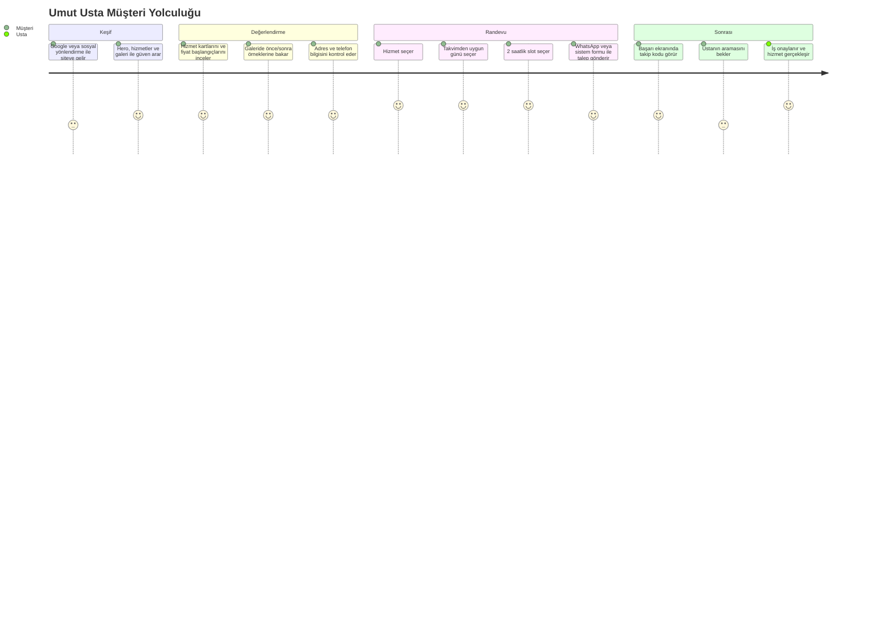

# Umut Usta Randevu Uygulaması Kapsamlı Değerlendirme Raporu

**Proje adı:** The Welding Expert App  
**Ürün adı:** Umut Usta Randevu Uygulaması  
**İnceleme tarihi:** 10 Temmuz 2026  
**İnceleme kapsamı:** Müşteri gözü, Product Owner değerlendirmesi, hedef kitle ve demografi, beklenti analizi, ürün tanımı, temel değer önerisi, feature completeness, Design Thinking, data visualization ve software engineering temelli analiz.

## 1. Yönetici Özeti

Umut Usta Randevu Uygulaması, yerel usta/hizmet işletmesi için yalnızca "randevu formu" sunan basit bir web sayfası değil; müşteri tarafında güven, hız ve görünür müsaitlik, işletme tarafında ise talep, takvim, ekip ve operasyon yönetimi sağlayan uçtan uca bir randevu platformudur.

Ürünün mevcut olgunluk seviyesi yüksektir. Kod incelemesinde şu kritik ürün kabiliyetleri doğrulanmıştır:

- Müşteri tarafında `/appointment` ekranı, hizmet seçimi, haftalık takvim, 2 saatlik slot seçimi, WhatsApp yönlendirmesi ve sistem üzerinden talep oluşturma akışı sunuyor.
- Admin tarafında `/admin/dashboard`, `/admin/bookings`, `/admin/availability`, `/admin/services`, `/admin/gallery`, `/admin/users` rotalarıyla operasyon paneli oluşturulmuş.
- Supabase tarafında public insert yerine `create_appointment_request` RPC fonksiyonu kullanılıyor. Bu, randevu veri bütünlüğü açısından doğru bir mühendislik kararı.
- Slot uygunluğu, geçmiş tarih, standart dışı saat, kapalı gün ve onaylı randevu çakışması veritabanı seviyesinde kontrol ediliyor.
- Dashboard tarafında KPI kartları, 8 haftalık talep trendi, hizmet dağılımı grafiği, dönüşüm hunisi ve 30 saniyelik yenileme davranışı bulunuyor.
- Product Owner için arşivleme, durum filtreleri, arama, rol bazlı yetki ve ekip yönetimi gibi temel operasyon özellikleri mevcut.

Genel değerlendirme: Ürün, MVP sınırını aşmış ve operasyonel kullanılabilirlik seviyesine gelmiş durumda. Kalan ana iyileştirme alanları müşteri güvenini artıracak otomatik bildirimler, self-servis iptal/değişiklik, gerçek müşteri yorumları, daha güçlü teklif/keşif akışı ve veri görselleştirmede karar destek metriklerinin derinleştirilmesidir.

## 2. Ürün Tanımı ve Temel Değer Önerisi

### 2.1 Ürün Tanımı

Umut Usta Randevu Uygulaması; Ankara merkezli bakım, onarım, kaynak, montaj, boya, bahçe ve metal işleri hizmetleri için müşterilerin uygun gün ve saat seçerek talep bırakmasını, işletme ekibinin de bu talepleri tek panelden yönetmesini sağlayan React, Vite ve Supabase tabanlı bir web uygulamasıdır.

Ürün iki ana kullanıcı katmanına hizmet eder:

| Katman | Kullanıcı | Temel ihtiyaç |
| --- | --- | --- |
| Public müşteri katmanı | Ev sahipleri, kiracılar, apartman/site yöneticileri, küçük işletmeler | Güvenilir usta bulmak, müsait saat görmek, hızlı teklif veya randevu almak |
| Admin operasyon katmanı | İşletme sahibi, admin, operatör, teknisyen | Talepleri takip etmek, slotları yönetmek, işi onaylamak, ekip ve içerik yönetmek |

### 2.2 Temel Değer Önerisi

**Müşteri için:** "Ustaya ulaşmak için beklemek yerine, hizmeti seç, müsait zamanı gör, WhatsApp veya sistem üzerinden hızlıca talep bırak."

**İşletme için:** "Dağınık telefon ve WhatsApp konuşmalarını tek bir operasyon paneline taşı; çakışan randevu riskini azalt, takvimi görünür yönet, gelen talebi ölç."

**Teknik değer:** "Randevu kurallarını yalnızca arayüzde değil, Supabase RPC ve PostgreSQL trigger katmanında da güvenceye al."

## 3. Hedef Kitle ve Demografik Analiz

### 3.1 Birincil Hedef Kitle

1. Ev sahipleri ve kiracılar  
   Balkon korkuluğu, kapı, menteşe, boya, montaj veya küçük onarım işleri için hızlı ve güvenilir hizmet arayan bireysel kullanıcılar.

2. Apartman ve site yöneticileri  
   Kapı motoru, korkuluk, güvenlik, ortak alan bakım ve tadilat işleri için daha yüksek bütçeli, daha planlı ve çoğu zaman teklif gerektiren işler açan kullanıcılar.

3. Küçük işletme sahipleri  
   Ofis, dükkan, depo veya atölye için periyodik bakım, montaj, kilit, kaynak ve iyileştirme ihtiyacı olan kullanıcılar.

### 3.2 Demografik ve Davranışsal Segmentler

| Segment | Dijital alışkanlık | Beklenti | Üründeki karşılık | Risk |
| --- | --- | --- | --- | --- |
| 25-35 yaş profesyoneller | Yüksek | Hızlı form, WhatsApp, net zaman aralığı | 2 adımlı wizard, WhatsApp CTA, slot takvimi | Otomatik bildirim yoksa güven kaybı |
| 35-50 yaş aile/ev sahibi | Orta-yüksek | Güvenilir usta, fiyat fikri, gerçek iş örnekleri | Hizmet kartları, galeri, adres, FAQ | Gerçek yorum ve garanti kanıtı sınırlı |
| 50+ kullanıcılar | Orta-düşük | Telefon, adres, basit yönlendirme | Görünür telefon, Google Maps embed, WhatsApp | Form akışı bazı kullanıcılar için fazla dijital kalabilir |
| Site/apartman yöneticisi | Orta | Yazılı teklif, keşif, planlama | Ücretsiz keşif randevusu, not alanı | PDF teklif ve kurumsal teklif süreci eksik |
| Küçük işletme | Yüksek | Hızlı servis, tekrar eden iş ilişkisi | Randevu ve hizmet seçimi | Müşteri hesabı veya tekrar eden bakım özelliği yok |

### 3.3 Persona Analizi

**Persona A: Canan, 32, çalışan profesyonel**  
Canan'ın problemi zaman kaybıdır. Telefonda usta beklemek istemez, uygun saatleri görmek ve seçimini hemen yapmak ister. Uygulamadaki hizmet seçimi, haftalık takvim, 2 saatlik slotlar ve WhatsApp mesaj hazırlama akışı bu persona için güçlüdür. Eksik taraf, talep sonrası otomatik SMS veya WhatsApp onay bildirimi olmamasıdır.

**Persona B: Mehmet, 58, geleneksel ev sahibi**  
Mehmet güven arar. Ustanın gerçek kişi olduğuna, adresin gerçek olduğuna, telefonun ulaşılabilir olduğuna ve daha önce yaptığı işlerin kaliteli olduğuna bakar. Uygulamadaki adres, telefon, galeri ve FAQ yardımcıdır. Fakat gerçek müşteri yorumları, garanti metni ve daha görünür "hemen ara" davranışı bu persona için güçlendirilmelidir.

**Persona C: Selin, 44, apartman yöneticisi**  
Selin işin sadece yapılmasını değil, yönetim kuruluna anlatılabilir bir teklif ve plan çıkmasını ister. Not alanı ve ücretsiz keşif seçeneği iyi bir başlangıçtır. Ancak PDF teklif, iş kalemi bazlı keşif formu ve teklif durum takibi eksiktir.

## 4. Müşteri Gözünden Beklenti Analizi

### 4.1 Müşteri Kaygısı ve Ürün Yanıtı

| Müşteri beklentisi | Önem | Mevcut ürün yanıtı | Değerlendirme |
| --- | ---: | --- | --- |
| "Usta gerçekten gelecek mi?" | Çok yüksek | Talep başarı ekranı, takip kodu, 1-2 saat içinde aranma beklentisi | Güçlü, fakat otomatik onay bildirimi eksik |
| "Hangi saatler müsait?" | Çok yüksek | Haftalık takvim, gün/slot durumu, kapalı gün bilgisi | Güçlü |
| "Randevum çakışır mı?" | Çok yüksek | RPC ve trigger ile slot uygunluğu kontrolü | Teknik olarak güçlü |
| "Fotoğraf gönderip hızlı fiyat alabilir miyim?" | Yüksek | WhatsApp CTA ve hazır mesaj | Güçlü |
| "Bu usta güvenilir mi?" | Yüksek | Galeri, adres, telefon, hizmet açıklamaları | Orta-güçlü, gerçek yorum ve garanti metni eklenmeli |
| "Fiyat ne kadar olur?" | Yüksek | Başlangıç fiyatları ve fiyatlandırma açıklamaları | Orta, fiyat güncelliği ve keşif mantığı netleştirilmeli |
| "İptal veya değişiklik nasıl olacak?" | Orta-yüksek | FAQ'da telefon/WhatsApp üzerinden yönlendirme | Zayıf, self-servis değişiklik yok |
| "Konumu nerede?" | Orta | Adres ve Google Maps iframe | İyi |

### 4.2 Müşteri Yolculuğu

Müşteri deneyiminde en güçlü karar, formun mecburi tek kanal olmaması ve WhatsApp'ın birincil alternatif olarak konumlanmasıdır. Yerel hizmet sektöründe WhatsApp, müşteri güveni ve hız algısı açısından kritik bir davranış kalıbıdır.

## 5. Product Owner Değerlendirmesi

### 5.1 Product Owner İçin İş Hedefleri

Product Owner açısından ürünün hedefi yalnızca randevu almak değil, işletmenin günlük operasyon yükünü azaltmak ve ölçülebilir bir satış/iş kabul hattı oluşturmaktır.

Öncelikli iş hedefleri:

- Gelen talepleri kaybetmemek.
- Aynı saate çakışan iş onayı vermemek.
- Yeni, iletişime geçilen, onaylanan, iptal edilen ve tamamlanan işleri görünür tutmak.
- Takvimi hızlıca açıp kapatmak.
- Hizmet ve fiyat bilgisini kod değişmeden yönetmek.
- Galeri ve referanslarla müşteri güvenini artırmak.
- Ekip büyüdüğünde yetki seviyelerini ayırmak.

### 5.2 Müşteri ve Product Owner Çatışma Noktaları

| Konu | Müşteri ister | Product Owner ister | Ürün kararı |
| --- | --- | --- | --- |
| Form uzunluğu | En az alan | Ciddi ve ulaşılabilir talep | Ad ve telefon zorunlu, e-posta opsiyonel |
| Kanal seçimi | WhatsApp kolaylığı | Sistemde izlenebilir kayıt | WhatsApp birincil, sistem formu ikincil |
| Slot seçimi | Her zaman müsaitlik | Çakışmasız operasyon | DB seviyesinde slot doğrulama |
| İptal/değişiklik | Self-servis kolaylığı | Kontrol ve planlama | Şimdilik telefon/WhatsApp, ileride self-servis önerilir |
| Fiyat | Net fiyat | Keşif gerektiren değişken fiyat | Başlangıç fiyatı ve keşif dili |

### 5.3 Product Owner İçin Kritik Metrikler

Üründe ölçülmesi gereken metrikler:

- Wizard açılış sayısı
- Hizmet seçimi dağılımı
- Takvim görüntüleme ve slot seçme oranı
- Sistem formu gönderim oranı
- WhatsApp tıklama oranı
- Yeni talep sayısı
- Onaylanan iş sayısı
- İptal oranı
- Ortalama ilk dönüş süresi
- Tamamlanan iş sayısı
- En yoğun gün ve saat aralıkları
- Hizmet türüne göre dönüşüm ve gelir tahmini

Mevcut dashboard bu metriklerin önemli bir bölümüne temel sağlar. Ancak gelir, dönüşüm oranı ve kanal bazlı verimlilik metrikleri daha açık hale getirilmelidir.

## 6. Feature Completeness Değerlendirmesi

### 6.1 Müşteri Tarafı

| Özellik | Durum | Kalite | Not |
| --- | --- | ---: | --- |
| Public randevu sayfası | Tamamlandı | 9/10 | Akış net, mobil odaklı |
| Hizmet seçimi | Tamamlandı | 8/10 | Dinamik servis config desteği var |
| Haftalık takvim | Tamamlandı | 9/10 | Hızlı tarih, hafta geçişi, slot seçimi güçlü |
| Fail-closed müsaitlik davranışı | Tamamlandı | 9/10 | Hata durumunda slot seçimi kapanıyor |
| WhatsApp hazır mesaj | Tamamlandı | 9/10 | Yerel hizmet davranışına uygun |
| Sistem üzerinden talep | Tamamlandı | 8/10 | RPC ile güvenli |
| Başarı ekranı ve takip kodu | Tamamlandı | 8/10 | Beklenti yönetimi iyi |
| Harita ve adres | Tamamlandı | 7/10 | Embed var, lokal SEO için güçlüleştirilebilir |
| Galeri önizleme | Tamamlandı | 8/10 | Güven inşasına katkı sağlar |
| Müşteri self-servis iptal | Eksik | 0/10 | Orta vadede önemli |
| Otomatik SMS/WhatsApp onay | Eksik | 0/10 | Güven ve operasyon için yüksek değer |

### 6.2 Admin ve Operasyon Tarafı

| Özellik | Durum | Kalite | Not |
| --- | --- | ---: | --- |
| Protected admin route | Tamamlandı | 9/10 | `ProtectedRoute` ve rol kontrolleri mevcut |
| Dashboard KPI'ları | Tamamlandı | 8/10 | Açık slot, yeni talep, onay, iptal, tamamlanan iş var |
| 8 haftalık trend grafiği | Tamamlandı | 8/10 | Recharts ile işleniyor |
| Hizmet dağılımı grafiği | Tamamlandı | 7/10 | Basit ama karar destek sağlar |
| Dönüşüm hunisi | Tamamlandı | 7/10 | Analytics event temeli var |
| Randevu talep listesi | Tamamlandı | 8/10 | Arama, statü filtresi, arşiv sekmesi var |
| Sayfalama | Tamamlandı | 7/10 | 20 kayıt/page ve count kullanımı mevcut |
| Realtime talep güncellemesi | Tamamlandı | 8/10 | INSERT/UPDATE dinleniyor |
| Müsaitlik yönetimi | Tamamlandı | 8/10 | Gün ve slot bazlı kontrol |
| Servis/fiyat config yönetimi | Tamamlandı | 8/10 | Product Owner için değerli |
| Kullanıcı ve rol yönetimi | Tamamlandı | 7/10 | Owner/admin/operator/technician modeli var |
| Teknisyen iş atama ekranı | Eksik | 0/10 | Rol altyapısı var, iş akışı yok |

### 6.3 Teknik Altyapı ve Güvenlik

| Özellik | Durum | Kalite | Not |
| --- | --- | ---: | --- |
| Supabase Auth | Tamamlandı | 8/10 | Admin paneli için yeterli |
| RLS politikaları | Tamamlandı | 8/10 | Public/admin ayrımı var |
| Public insert yerine RPC | Tamamlandı | 9/10 | Doğru güvenlik kararı |
| Slot çakışma kontrolü | Tamamlandı | 9/10 | `FOR UPDATE` ve confirmed kontrolü var |
| Status-slot trigger sync | Tamamlandı | 8/10 | Onay/iptal/arşiv akışını yönetiyor |
| Müşteri notu koruması | Tamamlandı | 8/10 | `customer_note` immutable trigger mevcut |
| Seed ve schema ayrımı | Tamamlandı | 8/10 | Tekrar çalıştırma riskini azaltır |
| Otomatik testler | Kısmi | 5/10 | Unit testler var, E2E ve DB entegrasyon testleri güçlenmeli |
| Observability | Eksik/kısmi | 4/10 | Hata izleme ve production monitoring net değil |

## 7. Design Thinking Temelli İnceleme

### 7.1 Empathize: Kullanıcıyı Anlama

Uygulama, yerel hizmet müşterisinin temel psikolojisini doğru yakalıyor: hızlı ulaşmak, güvenmek, örnek iş görmek, fiyat hakkında fikir almak ve belirsizliği azaltmak.

Güçlü empati kararları:

- WhatsApp'ın merkezi rolde olması.
- Formu iki aşamalı tutarak bilişsel yükü azaltması.
- Seçilen tarih, saat ve hizmeti talep özeti olarak tekrar göstermesi.
- Hata durumunda kullanıcıyı kilitlemeyip WhatsApp'a yönlendirmesi.
- Başarı ekranında "ne olacak?" beklentisini anlatması.

### 7.2 Define: Problem Tanımı

Ana problem şudur: Yerel hizmet işletmelerinde randevu alma süreci çoğu zaman dağınık, sözlü, ölçülemez ve çakışmaya açıktır.

Uygulamanın çözmeye çalıştığı alt problemler:

- Müşteri müsait zamanı göremiyor.
- Usta/işletme gelen talebi kaçırabiliyor.
- Telefon ve WhatsApp konuşmaları operasyon belleğine dönüşmüyor.
- İş yoğunluğu ve kanal performansı ölçülemiyor.
- Güven kanıtı sınırlı kalıyor.

### 7.3 Ideate: Çözüm Mantığı

Ürün, tek bir "randevu al" formu yerine çok kanallı bir model seçmiş:

- Görsel güven: hero, galeri, önce/sonra örnekler.
- Bilgi güveni: hizmet kartları, fiyat başlangıçları, FAQ.
- Zaman güveni: takvim ve slot.
- İletişim güveni: WhatsApp, telefon, sistem kaydı.
- Operasyon güveni: admin dashboard ve slot yönetimi.

Bu kombinasyon yerel hizmet ürünü için doğru bir problem-solution fit oluşturuyor.

### 7.4 Prototype ve Test

Kod yapısı, ürünün prototipten operasyonel ürüne evrildiğini gösteriyor. Büyük müşteri sayfası bileşenlere ayrılmış; `BookingCalendar`, `BookingForm`, `BookingSuccess`, `ServiceSelection`, `StickyMobileCTA` gibi parçalar kullanıcı akışını modüler hale getiriyor.

Test tarafında ise ürün içgörüsü şudur: Birim testlerin varlığı olumlu, fakat müşteri akışı için Playwright smoke testleri, Supabase RPC için entegrasyon testleri ve responsive görsel regresyon testleri eklenmeden ürün kalitesi tam güvenceye alınmış sayılmaz.

## 8. Data Visualization Değerlendirmesi

### 8.1 Mevcut Görselleştirme Katmanı

Dashboard tarafında şu görselleştirme kararları mevcut:

- Açık randevu aralığı
- Onaylanan iş / 7 gün
- Yeni talep
- Ortalama yanıt süresi
- İptal edilen talep
- Tamamlanan iş
- Haftalık onaylı iş hedefi progress bar
- Önümüzdeki 7 gün müsaitlik görünümü
- Son 8 haftanın talep trendi
- Hizmet dağılımı pasta grafiği
- Dönüşüm hunisi

Bu yapı Product Owner için operasyonel farkındalık sağlar. Özellikle "kaç iş var?" sorusundan "işler hangi hizmetlerde yoğunlaşıyor ve son haftalarda ne yönde gidiyor?" sorusuna geçiş yapılmış.

### 8.2 Görselleştirme Kalitesi

| Boyut | Değerlendirme |
| --- | --- |
| KPI okunabilirliği | Güçlü. Kartlar net ve operasyon diliyle yazılmış. |
| Zaman serisi | İyi. 8 haftalık trend küçük işletme için yeterli başlangıç. |
| Hizmet dağılımı | Orta. Pasta grafik hızlı fikir verir, ancak yüksek kategori sayısında zor okunur. |
| Hedef takibi | İyi. Haftalık hedef barı Product Owner davranışı oluşturur. |
| Funnel analizi | İyi başlangıç. Kanal bazlı dönüşümle genişletilmeli. |
| Veri doğruluğu | Orta-güçlü. Bazı metrikler created_at ve status üzerinden türetildiği için iş anlamı net dokümante edilmeli. |

### 8.3 Önerilen Ek Görselleştirmeler

| Görsel | Neden gerekli? | Öncelik |
| --- | --- | --- |
| Kanal dönüşüm karşılaştırması: WhatsApp vs sistem formu | Hangi kanal daha çok iş getiriyor anlaşılır | P1 |
| Hizmet türüne göre onay oranı | Hangi hizmetler gerçekten işe dönüşüyor görülür | P1 |
| Gün/saat yoğunluk heatmap'i | Takvim planlaması iyileşir | P1 |
| İptal nedenleri dağılımı | Operasyonel kalite artırılır | P2 |
| Ortalama ilk dönüş süresi trendi | Hizmet seviyesi takip edilir | P2 |
| Tahmini gelir paneli | Product Owner karar desteği artar | P2 |

## 9. Software Engineering Değerlendirmesi

### 9.1 Mimari Güçlü Yanlar

- React Router ile public ve admin rotaları ayrılmış.
- Admin rotaları `ProtectedRoute` ile korunuyor.
- React Query veri çekme, cache ve polling davranışlarını yönetiyor.
- Supabase RPC ile public randevu oluşturma güvenli hale getirilmiş.
- RLS ve DB trigger katmanı, UI dışı isteklerde de veri bütünlüğü sağlıyor.
- `customer_note` ve `admin_note` ayrımı veri sahipliği açısından doğru.
- Arşivleme, kalıcı silmeye göre işletme hafızasını koruyor.
- Service config yönetimi, Product Owner'ın içerik/fiyat düzenlemesini koddan bağımsızlaştırıyor.

### 9.2 Teknik Riskler

| Risk | Etki | Öneri |
| --- | --- | --- |
| Büyük sayfa dosyaları ve styled-component yoğunluğu | Bakım maliyeti artar | Feature bazlı component ve hook ayrımı sürdürülmeli |
| Production hata izleme belirsiz | Canlı sorunlar geç fark edilir | Sentry veya benzeri hata izleme eklenmeli |
| E2E test eksikliği | Kritik müşteri akışı regresyon alabilir | Playwright ile randevu smoke testi eklenmeli |
| DB entegrasyon testleri sınırlı | RPC/trigger davranışı kırılabilir | Supabase local veya SQL test akışı kurulmalı |
| Bildirim sistemi yok | Müşteri güveni ve dönüş hızı azalır | WhatsApp/SMS provider entegrasyonu planlanmalı |
| Teknisyen rolü iş akışına bağlanmamış | Ekip ölçeklenmesi sınırlı | İş atama ve teknisyen görünümü eklenmeli |

### 9.3 Güvenlik ve Veri Bütünlüğü

En kritik teknik kazanım, randevu oluşturma ve slot uygunluğu kararının sadece React tarafında bırakılmamış olmasıdır. RPC fonksiyonu:

- İsim, telefon, hizmet uzunluğu kontrolü yapıyor.
- E-posta ve not uzunluğunu sınırlandırıyor.
- Geçmiş tarihleri reddediyor.
- 09:00-19:00 başlangıçlı, 2 saatlik standart slot mantığını doğruluyor.
- Görünür ve kapalı olmayan günleri kontrol ediyor.
- Slotun açık olup olmadığını `FOR UPDATE` ile kilitleyerek okuyor.
- Aynı tarih/saatte onaylı randevu varsa talebi reddediyor.

Bu yaklaşım, küçük işletme ürünü için oldukça olgun bir software engineering seviyesidir.

## 10. Genel Ürün Olgunluk Skoru

| Boyut | Skor | Kısa gerekçe |
| --- | ---: | --- |
| Müşteri UX | 8.5/10 | Akış hızlı, WhatsApp iyi konumlanmış, başarı ekranı güçlü |
| Product Owner değeri | 8.5/10 | Dashboard, arama, arşiv, rol ve servis yönetimi güçlü |
| Feature completeness | 8.0/10 | Çekirdek ürün tamam, bildirim ve self-servis eksik |
| Data visualization | 7.5/10 | KPI ve trend var, gelir ve kanal analizi derinleşmeli |
| Software engineering | 8.5/10 | RPC, RLS, trigger ve route protection iyi kurulmuş |
| Güven ve SEO | 7.5/10 | JSON-LD, adres, galeri var; gerçek yorum/garanti eksik |
| Ölçeklenebilirlik | 7.0/10 | Rol altyapısı var; teknisyen iş akışı ve teklif modülü eksik |

**Genel skor: 8.0 / 10**

Bu skor, ürünün canlı kullanım için ciddi bir temel sunduğunu; fakat büyüme, güven ve operasyonel otomasyon tarafında hâlâ geliştirilecek değerli alanlar olduğunu gösterir.

## 11. Öncelikli Geliştirme Yol Haritası

### Sprint 1: Müşteri Güveni ve Bildirim

| İş | Etki | Efor |
| --- | --- | --- |
| Sistem talebi sonrası otomatik WhatsApp/SMS onay bildirimi | Çok yüksek | Orta |
| Müşteriye randevu takip bağlantısı | Yüksek | Orta |
| Self-servis iptal/değişiklik talebi | Yüksek | Orta |
| Gerçek müşteri yorumları ve garanti metni | Yüksek | Küçük-orta |

### Sprint 2: Product Owner Karar Desteği

| İş | Etki | Efor |
| --- | --- | --- |
| Kanal bazlı dönüşüm grafiği | Yüksek | Orta |
| Hizmet türüne göre onay oranı | Yüksek | Küçük |
| Gün/saat yoğunluk heatmap'i | Orta-yüksek | Orta |
| Tahmini gelir ve tamamlanan iş raporu | Yüksek | Orta |

### Sprint 3: Operasyon ve Ölçeklenme

| İş | Etki | Efor |
| --- | --- | --- |
| Teknisyen rolü için iş atama ve günlük iş listesi | Yüksek | Orta-büyük |
| PDF teklif/keşif belgesi | Yüksek | Orta-büyük |
| Admin aksiyon geçmişi | Orta-yüksek | Orta |
| İptal nedeni ve müşteri geri bildirimi | Orta | Küçük-orta |

### Sprint 4: Teknik Kalite

| İş | Etki | Efor |
| --- | --- | --- |
| Playwright müşteri randevu smoke testi | Yüksek | Küçük |
| RPC ve trigger entegrasyon testleri | Yüksek | Orta |
| Production error monitoring | Yüksek | Küçük |
| Bundle analizi ve route bazlı optimizasyon | Orta | Orta |

## 12. Sonuç

Umut Usta Randevu Uygulaması, yerel hizmet sektörünün gerçek ihtiyaçlarına temas eden, müşteri tarafında düşük sürtünmeli ve işletme tarafında ölçülebilir bir ürün deneyimi sunuyor. Tasarım kararları Design Thinking açısından doğru problem alanına oturuyor: güven, hız, görünür müsaitlik ve operasyonel düzen.

Product Owner açısından en değerli kazanım, randevu talebinin artık dağınık konuşmalardan çıkıp yönetilebilir veriye dönüşmesidir. Software engineering açısından en güçlü karar ise randevu güvenliğinin arayüzde değil, veritabanı fonksiyonu ve trigger katmanında da korunmasıdır.

Bir sonraki büyük sıçrama, ürünün "talep alma ve yönetme" seviyesinden "müşteri iletişimini otomatikleştiren ve iş kararlarını veriye dayandıran operasyon platformu" seviyesine taşınmasıdır. Bunun için ilk yatırım alanı otomatik bildirim, self-servis takip ve daha derin dashboard metrikleri olmalıdır.
