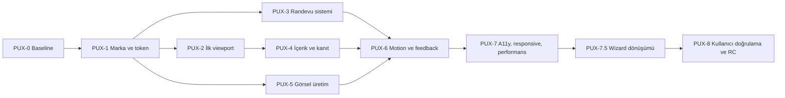

# Umut Usta Premium UX/UI Uygulanabilir Sprint Planı

**Proje:** `the-welding-expert-app`  
**Tarih:** 19 Temmuz 2026  
**Sürüm:** 1.0  
**Program kodu:** `PUX` - Premium Customer UX  
**Kapsam:** Müşteri giriş sayfası, randevu akışı, müşteri galeri bağlantıları, logo, renk, tipografi, görsel ve hareket dili  
**Kapsam dışı:** Admin dashboard görsel dönüşümü, yeni iş özelliği, production deployment, Git commit/push

**Program durumu:** PUX-0, PUX-1, PUX-2, PUX-3, PUX-4 ve PUX-5 teknik uygulaması tamamlandı. [PUX-0 Yerel Kapanış Raporu](./PUX_0_Yerel_Kapanis_Raporu_2026-07-19.md), [PUX-1 Yerel Kapanış Raporu](./PUX_1_Yerel_Kapanis_Raporu_2026-07-19.md), [PUX-2 Yerel Kapanış Raporu](./PUX_2_Yerel_Kapanis_Raporu_2026-07-19.md), [PUX-3 Yerel Kapanış Raporu](./PUX_3_Yerel_Kapanis_Raporu_2026-07-19.md), [PUX-4 Yerel Kapanış Raporu](./PUX_4_Yerel_Kapanis_Raporu_2026-07-19.md), [PUX-5 Yerel Kapanış Raporu](./PUX_5_Yerel_Kapanis_Raporu_2026-07-19.md)  
**PUX-5 öncesi kontrol:** Wizard sınıflandırma, adım navigasyonu ve genişlik düzeltmeleri tamamlandı. [PUX-5 Öncesi Wizard Düzeltme Raporu](./PUX_5_Oncesi_Wizard_Duzeltme_Raporu_2026-07-19.md)  
**PUX-0 - PUX-4 güvence denetimi:** Sprint kriterleri kod, görsel kanıt, güvenlik ve performans kapılarıyla yeniden doğrulandı. [Koordineli Güvence Denetim Raporu](./PUX_0_4_Koordineli_Guvence_Denetim_Raporu_2026-07-19.md)  
**PUX-5 içerik kapısı:** Gerçek fotoğraf/provenans kabulü açık dış bağımlılıktır. [Medya Envanteri ve Çekim Standardı](./PUX_5_Medya_Envanteri_ve_Cekim_Standardi_2026-07-19.md)  
**PUX-6 durumu:** Teknik uygulama ve otomatik kalite kapıları tamamlandı. [PUX-6 Yerel Kapanış Raporu](./PUX_6_Yerel_Kapanis_Raporu_2026-07-19.md)  
**PUX-7 durumu:** Teknik uygulama ve otomatik kalite kapıları tamamlandı. [PUX-7 Yerel Kapanış Raporu](./PUX_7_Yerel_Kapanis_Raporu_2026-07-19.md)  
**PUX-7.5 durumu:** Randevu wizard premium dönüşümü uygulandı ve yerel kalite kapılarıyla kapatıldı. [PUX-7.5 Yerel Kapanış Raporu](./PUX_7_5_Yerel_Kapanis_Raporu_2026-07-19.md)  

**PUX-8 durumu:** Teknik kullanıcı doğrulama paketi ve yerel release-candidate kapısı tamamlandı. Gerçek katılımcı saha oturumları henüz uygulanmadığından nihai kullanıcı doğrulaması ölçüm bekliyor. [PUX-8 Yerel RC Raporu](./PUX_8_Yerel_RC_ve_Kullanici_Dogrulama_Raporu_2026-07-19.md)  
**PUX-8.1 durumu:** Zaman seçimi, araştırma ve uzman denetimi doğrultusunda uygunluk odaklı gün-saat karar yüzeyi olarak yeniden tasarlandı; otomatik kalite kapıları geçti. [PUX-8.1 Zaman Seçimi Yeniden Tasarım Raporu](./PUX_8_1_Zaman_Secimi_Yeniden_Tasarim_Raporu_2026-07-19.md)  
**Sıradaki karar kapısı:** 5-8 gerçek katılımcıyla PUX-8 protokolünü uygulamak ve saha GO/NO-GO kararını vermek.

## 1. Amaç

Bu plan, aşağıdaki iki araştırma belgesini mevcut yerel uygulamanın gerçek durumu ile birleştirir:

- [Bilişsel Yük Odaklı UX/UI Araştırma Raporu](./Umut_Usta_Bilissel_Yuk_UX_UI_Arastirma_Raporu_2026-07-19.md)
- [Premium Tasarım Dili Benchmark Raporu](./Umut_Usta_Premium_Tasarim_Dili_Benchmark_Raporu_2026-07-19.md)

Hedef yalnızca arayüzü daha güzel göstermek değildir. Hedef, müşterinin randevu veya fotoğrafla danışma görevini daha az karar maliyetiyle tamamladığı; Umut Usta'nın gerçek işçilik, düzen ve güven sinyallerinin premium fakat ulaşılabilir bir dilde sunulduğu bütünlüklü bir müşteri deneyimi oluşturmaktır.

Ana tasarım yönü:

> **Quiet Craft / Sessiz Zanaat:** Avrupa tasarım disiplini + Amerikan hizmet açıklığı + yerel usta samimiyeti.

## 2. Yeniden denetim yöntemi

19 Temmuz 2026 tarihinde yerel `http://127.0.0.1:5293/appointment` sayfası şu açılardan incelendi:

1. `390x844` mobil ilk viewport.
2. `1440x900` masaüstü ilk viewport.
3. Açık ve koyu tema.
4. Hero, sticky CTA, trust bar ve ilk randevu adımı.
5. Sayfanın semantik DOM sırası ve görünür metinleri.
6. React/styled-components bileşen sınırları.
7. Mevcut analytics taxonomy, unit/E2E ve visual regression kapsamı.
8. Logo, favicon, hero ve optimize görsel asset'leri.

Bu denetim kullanıcı araştırmasının yerine geçmez. Sprintlerin sonunda gerçek görev testi gereklidir.

## 3. Mevcut durum özeti

### 3.1 Korunması gereken güçlü temeller

| Alan | Mevcut güçlü yön | Karar |
| --- | --- | --- |
| Sayfa sırası | Hero -> trust -> wizard -> iş kanıtı -> hizmet -> süreç -> konum -> SSS | Ana görev sırası korunur, alt bölümler sıkıştırılır |
| Randevu modeli | 3 adım: Hizmet, Zaman Tercihi, İletişim | Korunur |
| Hizmet seçimi | Önce ihtiyaç grubu, sonra ilgili hizmet | Korunur ve görsel olarak rafine edilir |
| Varsayılan seçim | Kullanıcı seçmeden hizmet atanmıyor | Korunur |
| Mobil sticky | Wizard görünürken gizleniyor | Korunur; hero görünürken de gizlenecek |
| Analytics | CTA, wizard, service, slot, form ve başarı olayları mevcut | Yeni şema yerine mevcut taxonomy kullanılır |
| E2E | Mobil booking, klavye, reduced motion ve visual baseline var | Genişletilir |
| Performans | Responsive image bileşenleri ve optimize asset altyapısı var | Yeni görsellere uygulanır |

### 3.2 Yüksek öncelikli bulgular

#### A. İlk viewport'ta tekrar eden marka

- Navigasyonda `Umut Usta` işareti, isim ve açıklama var.
- Hero içinde ikinci logo, ikinci isim ve `Randevu ve hizmet talebi` açıklaması var.
- Mobilde iki marka bloğu dikey alanı tüketiyor.
- Koyu temada navigasyon içindeki mevcut SVG işareti arka planla yeterli ayrışmıyor.

**Sonuç:** Marka hatırlanırlığı artmıyor; ilk görevin görünürlüğü azalıyor.

#### B. Aynı iki kararın dört buton olarak görünmesi

- Hero: `Talep Oluştur` + `Fotoğrafla Danış`.
- Mobil sticky: aynı iki eylem aynı viewport'ta tekrar ediyor.
- Kullanıcı dört buton görüyor fakat yalnız iki farklı karar bulunuyor.

**Sonuç:** Görsel yoğunluk, yanlış “daha fazla seçenek” algısı ve ekran kaplama.

#### C. Güven bilgisinin üst üste tekrarı

- Hero trust listesi: yerinde değerlendirme, zaman tercihi, ekip teyidi.
- Hero badge: Ankara'da yerinde servis.
- Trust bar: konum, saat, telefon/WhatsApp, yayınlanmış iş.

**Sonuç:** Doğru bilgiler rekabet eden rozet ve satırlara dönüşüyor.

#### D. Renk ve vurgu parçalanması

- İncelenen üç temel stil dosyasında `63` farklı `--color-*` token adı ve `59` benzersiz hex değer gözlendi.
- Bakır CTA, WhatsApp yeşili, açık tema için mavi/sarı toggle, koyu tema için mor/mavi toggle ve sıcak konum pill'i aynı viewport'ta yarışıyor.
- `ThemeToggle.jsx` içinde token dışı renkler ve `1.5s` geçiş kullanılıyor.

**Sonuç:** Quiet Craft yerine farklı ürünlerin birleşimi gibi görünen bir renk dili.

#### E. Hero görseli kaliteyi taşımıyor

- Mevcut atölye/kaynak görseli konu açısından uygun.
- Açık temadaki yoğun beyaz overlay görüntüyü silikleştiriyor.
- Mobilde görsel, logo kutusu, metin ve rozet için arka plan görevinde; gerçek işçilik detayı okunmuyor.
- Metin kontrastı korunurken fotoğrafın kanıt değeri düşüyor.

**Sonuç:** Görsel mevcut ama premium işçilik sinyali sınırlı.

#### F. Hizmet kataloğu ikinci bir karar alanına dönüşüyor

- Wizard'da hizmet seçildikten sonra sayfada 4+4 büyük hizmet kartı bulunuyor.
- Kartlarda ihtiyaç, kapsam, fiyat ve planlama disclosure'ı birlikte sunuluyor.
- Kartların tıklanmaması doğru; ancak görsel ve metinsel ağırlıkları yeni bir seçim yüzeyi izlenimi yaratıyor.

**Sonuç:** Bilgi amaçlı bölüm, görevi tamamlamış kullanıcı için gereğinden ağır.

#### G. İş kanıtı güçlü fakat hikaye standardı eksik

- Gerçek galeri verisi ve konum/kategori bilgisi var.
- Açıklamalar uzun, kart yükseklikleri ve görsel kalitesi değişken olabilir.
- Önce/sonra, kullanılan teknik ve net sonuç düzenli bir metadata sistemi değil.

**Sonuç:** Gerçek kanıt var; premium editoryal çerçeve eksik.

#### H. Koyu tema marka sisteminden kopuk

- Koyu tema lacivert/slate ailesinde.
- Quiet Craft ana yönü obsidyen, bone ve bakır üzerine kurulu.
- Logo koyu navigasyonda kayboluyor; toggle parlak mavi/mor/sarı bir odak oluşturuyor.

**Sonuç:** Tema özelliği deneyim kalitesini artırmak yerine marka bütünlüğünü zayıflatıyor.

## 4. Sayfa bazında hedef durum

| Yüzey | Mevcut durum | Hedef durum | Sprint |
| --- | --- | --- | --- |
| Navigasyon | Logo + alt açıklama + 4 link + CTA + görünür tema segmenti | Compact logo, en fazla 3-4 link, tek `Randevu Al`, tema ayarı menü/utility katmanında | PUX-2 |
| Hero marka | İkinci logo ve isim | Kaldırılır; tek marka navigasyonda | PUX-2 |
| Hero başlık | Uzun ve “talep” odaklı | Kısa, müşteri görevi odaklı | PUX-2 |
| Hero CTA | İki dolu renk | Bir bakır primary, bir sakin secondary | PUX-2 |
| Hero güven | 3 madde + badge + trust bar | Tek kısa hizmet satırı + 3 kanıtlık proof strip | PUX-2 |
| Mobil sticky | İki eşit dolu buton, hero ile eşzamanlı | Hero çıktıktan sonra bir primary + kompakt WhatsApp utility | PUX-2 |
| Wizard shell | Çok katmanlı kart/progress | Sakin bölüm, tek task panel, net step state | PUX-3 |
| Hizmet grupları | 5 eşit seçenek | 4 ana ihtiyaç + ayrı `Emin değilim` kaçış yolu | PUX-3 |
| Tarih/saat | İşlevsel progressive disclosure | Aynı mantık, yeni token ve durum dili | PUX-3 |
| İletişim formu | Ana ve optional alanlar ayrılmış | Korunur; hata/başarı/loading premium geri bildirimle yenilenir | PUX-3/6 |
| İş örnekleri | 3 büyük kart, uzun açıklama | 2-3 kanıt kartı; problem/uygulama/sonuç standardı | PUX-4/5 |
| Hizmetler | 4+4 büyük bilgi kartı | 4 kompakt kategori satırı veya grid; ayrıntı disclosure | PUX-4 |
| Süreç | 4 metin kartı | 3-4 kısa adım, daha az tekrar | PUX-4 |
| Konum | Bilgi kartları + harita | Kompakt iletişim/hizmet alanı; harita isteğe bağlı yüklenir | PUX-4/7 |
| SSS | Doğru fakat uzun sayfa sonunda | En kritik 3 soru + `Tümünü göster` | PUX-4 |
| Footer | Marka ve iletişim tekrarları | Sade kapanış; iletişim, yasal ve takip bağlantısı | PUX-4 |
| Motion | Dağınık süreler; tema 1.5 s | 140/200/320 ms token sistemi | PUX-6 |
| Logo | PNG master ile SVG karakteri farklı | 5 varyantlı Forged U asset sistemi | PUX-1 |

## 5. Ürün ve tasarım kararları

### 5.1 Hero önerilen içerik hiyerarşisi

1. H1: `Ankara'da ev, ofis ve metal işleri için randevu alın`
2. Destek: `Hizmeti ve size uyan zamanı seçin; uygunluğu telefon veya WhatsApp ile teyit edelim.`
3. Primary: `Randevu Al`
4. Secondary: `Fotoğrafla Danış`
5. Utility: `Yenimahalle merkezli, Ankara'da yerinde hizmet`

Metin prototip testinde doğrulanmadan kesin production copy sayılmaz.

### 5.2 CTA hiyerarşisi

- `Randevu Al`: bakır dolu primary.
- `Fotoğrafla Danış`: obsidyen outline veya sakin text+icon secondary.
- Telefon: metin bağlantısı; hero'da üçüncü buton değil.
- Galeri: kanıt bölümüne doğal geçiş.
- WhatsApp yeşili yalnız ikon/kanal tanıma düzeyinde; büyük marka yüzeyi değil.

### 5.3 Tema kararı

Müşteri yüzeyi için iki kabul edilebilir yol vardır. Bu planda önerilen yol A'dır.

| Yol | Karar | Gerekçe |
| --- | --- | --- |
| A - Önerilen | Açık ve koyu tema desteklenir; toggle ana navigasyondan utility menüsüne taşınır, her iki tema Quiet Craft token'larıyla yeniden kurulur | Özellik korunur, dikkat maliyeti düşer |
| B | Müşteri yüzeyi light-first olur; dark mode geçici olarak gizlenir | Daha hızlı ve düşük riskli, ancak mevcut kullanıcı tercihi yüzeyi daralır |

Tema geçişi `1.5s` yerine `200-320ms`; reduced-motion'da anlık olmalıdır.

### 5.4 Bilgi mimarisi

Önerilen sıra:

1. Navigasyon.
2. Hero.
3. Tek proof strip.
4. Randevu wizard.
5. Tamamlanan işler.
6. Hizmet kapsamı.
7. Nasıl çalışır.
8. Kompakt konum + SSS.
9. Footer.

Mevcut sıra büyük ölçüde doğrudur; değişiklik bölüm ağırlıklarında ve tekrarların azaltılmasındadır.

## 6. Sprint bağımlılık haritası

PUX-3 ve PUX-5, PUX-1 tamamlandıktan sonra kısmen paralel ilerleyebilir. Tek geliştirici akışında numara sırasıyla yürütülmesi daha az bağlam değiştirir.

## 7. Ortak Definition of Done

Her sprint aşağıdaki koşullar sağlanmadan tamamlanmış sayılmaz:

1. İstenen davranış ve görsel hedef uygulanmış olmalı.
2. İlgili unit/component testleri güncellenmeli.
3. `npm run lint` başarılı olmalı.
4. `npm run test:run` başarılı olmalı.
5. Etkilenen ana akışlarda Playwright testi başarılı olmalı.
6. 390x844, 768x1024 ve 1440x900 görsel kontrol yapılmalı.
7. 320 px ve `%200` eşdeğeri dar viewport'ta yatay taşma olmamalı.
8. Klavye focus sırası ve görünür focus doğrulanmalı.
9. Reduced motion davranışı doğrulanmalı.
10. Analytics event adı/semantiği yanlış dönüşüm iddiası üretmemeli.
11. Sprint kapanış raporu yerel `docs/` altında oluşturulmalı.
12. Git push veya canlı yayın yapılmamalı.

## 8. PUX-0 - Baseline, karar kaydı ve koruma ağı

**Amaç:** Görsel dönüşüm başlamadan önce mevcut davranışı, ölçümü ve geri dönüş sınırlarını sabitlemek.

**Tahmini büyüklük:** Küçük-Orta, 1-2 çalışma günü.

### İş paketleri

#### PUX-0.1 Görsel baseline

- 390x844 açık/koyu ilk viewport.
- 768x1024 tablet.
- 1440x900 masaüstü.
- Wizard adım 1, adım 2, adım 3 ve success state.
- Tracking/self-servis sayfası açık/koyu temel görünüm.

#### PUX-0.2 Tekrar envanteri

- Logo, CTA, konum, saat, telefon, teyit ve galeri bağlantılarının görünür tekrar sayısı.
- Her tekrar için `koru`, `birleştir`, `taşı`, `kaldır` kararı.

#### PUX-0.3 Token envanteri

- 63 renk token'ı ve 59 hex değerini role göre sınıflandır.
- Alias, semantic ve component-specific token ayrımı.
- Radius, shadow ve motion envanteri.

#### PUX-0.4 Test baseline genişletme

- Hero + trust + wizard first viewport screenshot testleri.
- Light/dark logo görünürlük assertion'ı.
- Hero görünürken sticky'nin görünmemesi için önce kırmızı test hazırlanır.

### Etkilenecek dosyalar

- `e2e/visual-regression.spec.js`
- `e2e/accessibility.spec.js`
- `e2e/booking-flow.spec.js`
- Yeni görsel snapshot dosyaları
- `docs/PUX_0_*`

### Kabul kriterleri

- Tüm ana müşteri durumlarının baseline'ı kayıtlıdır.
- Mevcut davranış testleri yeşildir.
- Görsel değişimlerin hangi baseline'ı bilinçli değiştirdiği izlenebilir.
- Hiçbir üretim bileşeni henüz görsel olarak değiştirilmez.

### Risk ve geri dönüş

- Risk: Dinamik galeri görselleri flaky snapshot üretir.
- Önlem: API mock ve sabit fixture; yalnız stabil bölge screenshot'ı.
- Geri dönüş: Snapshot kapsamını component seviyesine daralt.

## 9. PUX-1 - Marka asset sistemi ve Quiet Craft temeli

**Durum:** Tamamlandı ve yerel kalite kapılarından geçti. Uygulama ve doğrulama ayrıntıları için [PUX-1 Yerel Kapanış Raporu](./PUX_1_Yerel_Kapanis_Raporu_2026-07-19.md).

**Amaç:** Sonraki tüm sprintlerin kullanacağı tek logo, renk, tipografi, radius, shadow ve motion sözlüğünü kurmak.

**Tahmini büyüklük:** Orta-Büyük, 3-5 çalışma günü.

### İş paketleri

#### PUX-1.1 Forged U vektör sistemi

- Master PNG ile mevcut SVG arasındaki optik farkı gider.
- Kaynak dikişini 2-3 zarif mikro detaya indir.
- U formunun iki kol, alt eğri ve iç boşluk dengesini düzelt.
- Primary horizontal, compact horizontal, mark-only, monochrome ve textured varyant üret.
- SVG içinde `<text>` veya sistem fontu bırakma.

#### PUX-1.2 Boyut ve zemin matrisi

- 16, 24, 32, 48, 96 ve 128 px.
- Bone, white, obsidian ve gerçek fotoğraf.
- Monochrome baskı.
- Favicon ve Apple touch.

#### PUX-1.3 Token sadeleştirme

Yeni çekirdek:

- `ink-950 #181A18`
- `ink-850 #292B29`
- `steel-700 #555953`
- `steel-600 #676B65`
- `bone-100 #F7F6F2`
- `paper-0 #FFFFFF`
- `line-200 #DDDCD5`
- `copper-700 #8F4021`
- `copper-500 #C56A37`
- Semantik success, warning, danger ve WhatsApp.

Mevcut isimler bir anda silinmez. Önce semantic alias'lara bağlanır, component'ler taşındıkça kullanım azaltılır.

#### PUX-1.4 Tipografi, radius ve shadow

- Plus Jakarta Sans korunur.
- H1 700; compact panel heading 650/700; body 400/500.
- Radius yalnız `4`, `8` ve gerektiğinde modal için `12 px`.
- Shadow yalnız nav/sticky/modal; kartlarda border ve zemin.
- Letter spacing `0`; logotype hariç negatif veya geniş tracking yok.

#### PUX-1.5 Tema parity

- Dark palet slate yerine obsidian/graphite karakterine taşınır.
- Logo her iki temada okunur.
- Theme toggle hardcoded renkleri token'a taşınır.
- Geçiş 200-320ms; reduced motion `0ms`.

### Etkilenecek dosyalar

- `public/umut-usta-logo.svg`
- `public/umut-usta-logo-horizontal.svg`
- `public/umut-usta-favicon.svg`
- PNG/WebP favicon ve touch asset'leri
- `src/ui/BrandLogo.jsx`
- `src/styles/GlobalStyles.js`
- `src/ui/ThemeToggle.jsx`
- Gerekirse `src/ui/Logo.jsx`
- Yeni `src/styles/tokens.js` veya mevcut GlobalStyles token bölümü

### Testler

- Logo asset dosyalarının varlığı ve erişilebilir `img` davranışı.
- Light/dark visual snapshots.
- `colorContrast` utility ile ana token çiftleri.
- Reduced motion theme transition testi.
- 16-48 px favicon görsel kontrolü.

### Kabul kriterleri

- Navigasyon logosu açık ve koyu temada ayırt edilir.
- UI SVG, master Forged U silüetini taşır.
- Yeni bileşenler doğrudan hex kullanmaz.
- Birincil metin, muted metin, CTA ve focus kontrastı WCAG AA'dır.
- Theme toggle marka dışı mavi/mor/sarı odak üretmez.

### Risk ve geri dönüş

- Risk: Logo mikro detayı küçük boyutta kirli görünür.
- Önlem: Favicon için seam-free sade varyant.
- Geri dönüş: Eski asset dosyaları sprint baseline klasöründe saklanır; runtime referansı tek değişkenle geri alınabilir.

## 10. PUX-2 - Navigasyon, hero ve dikkat mimarisi

**Durum:** Teknik uygulama ve otomatik kalite kapıları tamamlandı. Yüzde 85 başarı hedefli katılımcı 5 saniye testi PUX-8 doğrulamasında ölçülecek. Ayrıntılar için [PUX-2 Yerel Kapanış Raporu](./PUX_2_Yerel_Kapanis_Raporu_2026-07-19.md).

**Amaç:** İlk viewport'u tek marka, tek ana görev ve tek güven katmanına indirmek.

**Tahmini büyüklük:** Orta, 3-4 çalışma günü.

### İş paketleri

#### PUX-2.1 Navigasyon

- Compact horizontal Forged U + Umut Usta.
- Mobilde uzun alt açıklamayı kaldır veya menü içine taşı.
- Linkleri `Hizmetler`, `İşler`, `İletişim` seviyesine indir.
- `Randevu Al` tek dolu ana CTA.
- Tema ayarını utility/menu içine taşı.
- Nav yüksekliğini mobilde sabit ve kompakt tut.

#### PUX-2.2 Hero de-duplication

- Hero içindeki ikinci logo/isim bloğunu kaldır.
- H1'i kısalt ve “talep oluştur” yerine müşteri görevine bağla.
- Açıklamayı tek teyit cümlesine indir.
- Üçlü trust listesi ve ayrı konum badge'ini kaldır/birleştir.
- Telefon ve galeri linklerini hero'nun ana eylem kümesinden çıkar.

#### PUX-2.3 CTA sistemi

- Primary `Randevu Al`.
- Secondary `Fotoğrafla Danış` outline/text.
- WhatsApp yeşili yalnız ikon veya ince semantik ayrıntı.
- Butonların mobilde eşit ve stabil yüksekliği; uzun metin taşması yok.

#### PUX-2.4 Proof strip

Trust bar 4 hücreden 3 kanıta indirilir:

1. `Yenimahalle merkezli, Ankara'da yerinde hizmet`.
2. `09:00-21:00 planlama`.
3. `9 gerçek iş örneği` veya veri yoksa `İş örneklerini inceleyin`.

Telefon numarası burada kart değildir; iletişim utility'sidir.

#### PUX-2.5 Mobil sticky davranışı

- Hero CTA görünürken sticky render edilmez.
- Hero çıktıktan sonra ve wizard görünmeden önce açılır.
- Bir geniş `Randevu Al` + sabit ölçülü WhatsApp icon button.
- Klavye ve safe-area uyumu.

### Etkilenecek dosyalar

- `src/pages/CustomerBooking.jsx`
- `src/pages/CustomerBooking.styles.js`
- `src/ui/AppNav.jsx`
- `src/ui/ThemeToggle.jsx`
- `src/features/booking/components/StickyMobileCTA.jsx`
- `src/pages/CustomerBooking.test.jsx`
- İlgili E2E testleri

### Analytics

Mevcut olaylar korunur:

- `navigation_cta_clicked`
- `hero_cta_clicked`
- `public_channel_clicked`
- `booking_wizard_started`
- `booking_whatsapp_clicked`

Sadece `placement` değerleri yeni yüzeylerle eşleştirilir. Yeni Supabase migration gerekmez.

### Kabul kriterleri

- İlk viewport'ta logo bir kez görünür.
- İlk viewport'ta aynı CTA seti tekrar etmez.
- Tek dolu marka CTA vardır.
- 5 saniye testinde kullanıcıların en az `%85`i randevu başlangıcını doğru işaretler.
- Mobil sticky hero ve wizard ile çakışmaz.
- H1 320-390 px genişlikte düzensiz tek kelime satırı üretmez.
- Açık/koyu ilk viewport premium yönle tutarlıdır.

### Risk ve geri dönüş

- Risk: Trust azaltımı güven algısını düşürür.
- Önlem: Bilgi kaldırılmak yerine doğru alt bölüme taşınır; proof strip gerçek kanıtı korur.
- Geri dönüş: Üçlü proof strip içinde en güçlü dördüncü kanıt kontrollü A/B hipotezi olarak geri eklenebilir.

## 11. PUX-3 - Premium ve düşük bilişsel yüklü randevu sistemi

**Durum:** Teknik uygulama ve otomatik kalite kapıları tamamlandı. Ayrıntılar için [PUX-3 Yerel Kapanış Raporu](./PUX_3_Yerel_Kapanis_Raporu_2026-07-19.md).

**Amaç:** Mevcut doğru 3 adımlı mantığı Quiet Craft bileşen sistemiyle yeniden sunmak.

**Tahmini büyüklük:** Büyük, 4-6 çalışma günü.

### İş paketleri

#### PUX-3.1 Wizard shell ve ilerleme

- Wizard'ı iç içe kart görünümünden çıkar; tek görev yüzeyi.
- Step status metni screen-reader için korunur.
- Görsel progress daha sakin: numara/check + kısa label.
- Desktop ve mobilde stabil ölçü; adım geçişinde layout jump yok.

#### PUX-3.2 Hizmet grubu seçimi

- 4 ana ihtiyaç grubu 2x2 veya tek kolon stabil grid.
- `Emin değilim` ana grid ile eş ağırlıklı beşinci kart değil; ayrı güvenli kaçış bağlantısı/satırı.
- Seçili durum: copper border, soft surface, check icon.
- İkon dekor değil kategori taramasını hızlandırır.
- Bir grup seçilince ilgili 1-3 hizmet görünür; geri dönüş açık.

#### PUX-3.3 Hizmet seçimi

- Radio semantics korunur.
- Başlık + tek kapsam cümlesi.
- Fiyat veya detay bu karar için zorunlu değilse disclosure içinde.
- Seçimden sonra ana `Zaman tercihini seç` aktif olur; aktiflik sadece renge bağlı değildir.

#### PUX-3.4 Tarih ve saat

- Hızlı tarihler önce.
- Tam takvim disclosure.
- Slot durumları: available, selected, unavailable, loading, conflict.
- Saat kartları sabit ölçülü ve 44 px minimum hedef.
- Seçilen hizmet/tarih özeti kısa ve düzenlenebilir.

#### PUX-3.5 İletişim formu

- Ad/telefon ana yüzeyde.
- E-posta/not optional disclosure korunur.
- Inline hata alan ölçüsünü önceden ayırır; layout shift yok.
- Submit sırasında buton genişliği değişmez.
- Gizlilik ve teyit açıklaması tek yerde.

#### PUX-3.6 Başarı ve self-servis geçişi

- `Talebiniz kaydedildi` ana sonuç.
- `Ekip teyidi bekleniyor` durum etiketi.
- `Talebi takip et` ana sonraki adım.
- WhatsApp tekrar gönderimi ikincil kanal.
- Aynı teyit mesajı üç yerde tekrarlanmaz.

### Etkilenecek dosyalar

- `src/features/booking/components/ServiceSelection.jsx`
- `src/features/booking/components/BookingCalendar.jsx`
- `src/features/booking/components/BookingForm.jsx`
- `src/features/booking/components/BookingSuccess.jsx`
- `src/features/booking/components/booking.styles.js`
- `src/pages/CustomerBooking.jsx`
- `src/pages/CustomerBooking.styles.js`
- Bileşen unit testleri ve E2E booking flow

### Kabul kriterleri

- Mevcut 3 adımlı iş mantığı ve API kontratı değişmez.
- Varsayılan hizmet/tarih/saat seçimi yoktur.
- Her adımda tek ana ileri eylem vardır.
- Optional alanlar ana karar akışını uzatmaz.
- Validation, conflict, loading, empty ve success durumları görsel olarak tamamdır.
- Klavye ve screen-reader semantics korunur.
- Mobil tamamlama akışı mevcut E2E testini geçer.

### Risk ve geri dönüş

- Risk: Görsel refactor booking state davranışını etkiler.
- Önlem: Sunum ve state değişiklikleri ayrı commit mantığında, fakat commit yapılmadan yerel patch gruplarıyla ilerletilir; mevcut unit/E2E sözleşmesi korunur.
- Geri dönüş: Her alt adım bağımsız component sınırında geri alınabilir.

## 12. PUX-4 - İçerik yoğunluğu, iş kanıtı ve alt sayfa mimarisi

**Durum:** Teknik uygulama ve otomatik kalite kapıları tamamlandı. Ayrıntılar için [PUX-4 Yerel Kapanış Raporu](./PUX_4_Yerel_Kapanis_Raporu_2026-07-19.md).

**Amaç:** Wizard sonrasındaki içeriği ikinci bir karar maratonu olmaktan çıkarıp kanıt ve gerektiğinde ayrıntı sunan sakin bir yapıya dönüştürmek.

**Tahmini büyüklük:** Orta-Büyük, 4-5 çalışma günü.

### İş paketleri

#### PUX-4.1 İş örnekleri

- 3 kanıt kartı; mobilde tek kolon, yatay taşan carousel yok.
- Kart standardı: iş türü, ilçe, problem, yapılan işlem, sonuç.
- Açıklama maksimum 2-3 satır; tam vaka galeri sayfasında.
- Ok metni yerine icon + `Tüm işleri gör`.

#### PUX-4.2 Hizmet kataloğu

- 8 büyük kart yerine 4 ihtiyaç kategorisi.
- Her kategoride kısa kapsam ve `Neler etkiler?` disclosure.
- Fiyat başlangıcı kullanılacaksa tarih/güncellik ve kapsam uyarısı tutarlı olmalı.
- Bölüm tıklanınca wizard'a otomatik scroll etmez.
- “Seçiminizi randevu adımında yaparsınız” açıklaması kısa ve tek yerde.

#### PUX-4.3 Süreç

- 4 adım korunabilir; metinler tek cümleye indirilir.
- `Talep -> Teyit -> Uygulama -> Teslim` görsel zinciri.
- Teyit mesajı hero ve formdan kopyalanmaz.

#### PUX-4.4 Konum ve iletişim

- Konum, hizmet bölgesi ve saat tek kompakt blok.
- E-posta aktif değilse “yakında” satırı gösterilmez; kullanıcıya işlem sunmayan bilgi kaldırılır.
- Harita üçüncü taraf yükünü azaltmak için kullanıcı isteğiyle veya viewport yaklaşınca yüklenir.
- Telefon/WhatsApp tekrarları utility seviyesinde.

#### PUX-4.5 SSS ve footer

- En kritik 3 soru başlangıçta; diğerleri disclosure.
- Footer marka açıklaması kısalır.
- `Randevu`, `Takip`, `İletişim/Gizlilik` bağlantıları.
- Aynı telefon, adres, saat ve teyit metni gereksiz tekrar edilmez.

### Etkilenecek dosyalar

- `src/pages/CustomerBooking.jsx`
- `src/pages/CustomerBooking.styles.js`
- `src/pages/Gallery.jsx` ve styles yalnız kart standardı gerekiyorsa
- `src/features/gallery/*`
- `src/config/business.js`
- `src/pages/CustomerBooking.test.jsx`

### Kabul kriterleri

- Wizard sonrası bölüm sayısı değil, görünür karar sayısı azalır.
- Hizmet kartları tıklama/otomatik scroll davranışı taşımaz.
- İş örneği kartları problem/uygulama/sonuç mantığını gösterir.
- İşlevsiz e-posta satırı görünmez.
- Aynı iletişim bilgisi bir viewport içinde tekrarlanmaz.
- Alt bölümlerde iç içe kart bulunmaz.

## 13. PUX-5 - Fotoğraf sanat yönetimi ve medya sistemi

**Amaç:** Görselleri dekor olmaktan çıkarıp gerçek işçilik ve güven kanıtı haline getirmek.

**Tahmini büyüklük:** Orta; asset üretimine göre 3-5 çalışma günü. Çekim süresi ayrıdır.

### İş paketleri

#### PUX-5.1 Asset audit

- Mevcut hero ve galeri görsellerini çözünürlük, kadraj, PPE, temizlik, gerçeklik ve before/after eşleşmesiyle puanla.
- Kullanılabilir, yeniden kırpılacak ve değiştirilecek olarak sınıflandır.

#### PUX-5.2 Hero art direction

- Gerçek Umut Usta/atölye veya gerçek iş sahnesi.
- Masaüstü metni için negatif alan.
- Mobil `4:5` güvenli kırpım.
- Metal ve işçilik detayı overlay altında kaybolmamalı.
- Açık/koyu tema için ayrı görsel değil, kontrollü overlay token'ı.

#### PUX-5.3 İş kanıtı çekim standardı

- Before/after aynı açı.
- Kaynak dikişi makrosu.
- Bitmiş birleşim ve mekan bütünü.
- Alet düzeni, alan koruma ve temizlik.
- Alt metin ve metadata standardı.

#### PUX-5.4 Pipeline

- AVIF/WebP/JPEG fallback.
- Responsive srcset ve doğru `sizes`.
- Hero preload yalnız gerçekten LCP ise.
- Width/height veya aspect-ratio ile CLS önleme.
- Galeri lazy-load ve blur/skeleton ölçü eşleşmesi.

### Etkilenecek dosyalar

- `public/images/*`
- `public/images/optimized/*`
- `scripts/optimize-images.mjs`
- `src/ui/ResponsiveImage.jsx`
- `src/ui/ProgressiveImage.jsx`
- `src/utils/responsiveImages.js`
- `src/pages/CustomerBooking.jsx`

### Kabul kriterleri

- Hero hem mobil hem desktop kırpımda işi açık gösterir.
- Stock veya yapay kaynak görseli kullanılmaz.
- Görsel nedeniyle yatay taşma veya CLS oluşmaz.
- LCP bütçesi mevcut baseline'dan kötüleşmez.
- Before/after çiftleri aynı açı ve bağlamı korur.

### Dış bağımlılık

Gerçek fotoğraf çekimi hazır değilse PUX-2 mevcut görselle tamamlanabilir; PUX-5 yeni medya geldiğinde yalnız asset katmanını değiştirir. UI sprintleri fotoğraf bekleyerek bloke edilmez.

## 14. PUX-6 - Motion, loading ve geri bildirim dili

**Durum:** Teknik uygulama ve otomatik kalite kapıları tamamlandı. Ayrıntılar için [PUX-6 Yerel Kapanış Raporu](./PUX_6_Yerel_Kapanis_Raporu_2026-07-19.md).

**Amaç:** Premium hissi sakin, kısa ve anlamlı durum geçişleriyle desteklemek.

**Tahmini büyüklük:** Orta, 3-4 çalışma günü.

### İş paketleri

#### PUX-6.1 Motion token'ları

- `fast 140ms`
- `base 200ms`
- `slow 320ms`
- Standart ease-out.
- `prefers-reduced-motion` tam desteği.

#### PUX-6.2 Etkileşim durumları

- Button press, hover ve focus.
- Service selected ve step completed.
- Accordion/disclosure.
- Form validation ve submit.
- Success state.

#### PUX-6.3 Adım geçişleri

- Opacity + `4-8 px` transform.
- Container yüksekliği sıçramasını azalt.
- Yeni adım başlığına kontrollü focus.
- Otomatik scroll sadece görev devamlılığı için.

#### PUX-6.4 Loading

- Route fallback logo gösterisi değil sade durum ekranı.
- Skeleton gerçek kart/input ölçüsünü korur.
- Submit spinner buton metnini ve genişliğini bozmaz.
- Görsel blur-up bir kez ve kısa çalışır.

### Etkilenecek dosyalar

- `src/styles/GlobalStyles.js`
- `src/pages/CustomerBooking.styles.js`
- `src/features/booking/components/booking.styles.js`
- `src/ui/LoadingSkeleton.jsx`
- `src/ui/RouteFallback.jsx`
- `src/ui/Spinner.jsx`
- `src/hooks/useScrollReveal.js`

### Kabul kriterleri

- Sürekli pulse, bounce, parallax veya logo parlaması yoktur.
- Hiçbir zorunlu etkileşim 320ms'den uzun bekletilmez.
- Reduced motion altında görev akışı tamdır.
- Loading ve validation layout shift üretmez.
- Scroll reveal ana görev kontrollerini saklamaz.

## 15. PUX-7 - Responsive, erişilebilirlik ve performans sertleştirme

**Durum:** Teknik uygulama ve otomatik kalite kapıları tamamlandı. Ayrıntılar için [PUX-7 Yerel Kapanış Raporu](./PUX_7_Yerel_Kapanis_Raporu_2026-07-19.md).

**Amaç:** Görsel dönüşümü gerçek cihaz, yardımcı teknoloji ve performans koşullarında güvenceye almak.

**Tahmini büyüklük:** Orta-Büyük, 3-5 çalışma günü.

### İş paketleri

#### PUX-7.1 Responsive matris

- 320x568
- 360x800
- 390x844
- 768x1024
- 1024x768
- 1366x768
- 1440x900
- 1920x1080

#### PUX-7.2 Erişilebilirlik

- WCAG AA kontrast.
- 44 px hedef tercihi; WCAG 2.2 minimum altında kontrol yok.
- Visible focus ve mantıklı tab sırası.
- Radio/group, progress, accordion ve live-region semantics.
- `%200` zoom/eşdeğer viewport.
- Dark/light forced contrast kontrolü.

#### PUX-7.3 Mobil klavye ve sticky

- iOS/Android sanal klavye senaryosu.
- Submit, hata ve optional disclosure görünürlüğü.
- Safe-area inset.
- Sticky'nin wizard ve footer ile çakışmaması.

#### PUX-7.4 Performans

- `npm run build`
- `npm run perf:budget`
- Lighthouse yerel karşılaştırma.
- LCP hero, CLS görseller ve INP yoğun etkileşimler.
- Harita üçüncü taraf yükü.

#### PUX-7.5 Visual regression

- Light/dark first viewport.
- Wizard adım 1/2/3.
- Error/success.
- Tracking invalid/valid state.
- Mobil sticky açık/kapalı durumu.

### Kabul kriterleri

- Yatay taşma `0`.
- Kontrol/metin çakışması `0`.
- Klavye ile booking tamamlama mümkün.
- Reduced motion testi başarılı.
- Ana kontrast çiftleri AA.
- Performans bütçesi baseline'dan kötüleşmez veya bilinçli sapma raporlanır.
- Console'da runtime/accessibility kaynaklı hata yok.

## 16. PUX-8 - Kullanıcı doğrulaması ve yerel release candidate

**Amaç:** Tasarımın yalnız estetik olarak değil görev, güven ve premium algı açısından hedefe ulaştığını doğrulamak.

**Tahmini büyüklük:** Orta, 2-4 çalışma günü; katılımcı bulunma süresi hariç.

### Katılımcı profili

- Ankara'da ev/ofis bakım işi yaptırmış veya yaptırma ihtimali olan 5-8 kişi.
- En az 3 mobil ağırlıklı kullanıcı.
- Farklı dijital yeterlilik düzeyleri.
- Mümkünse 45+ yaş grubundan katılımcı.

### Görevler

1. Kaynak ve metal işi için randevu başlat.
2. Uygun hizmetten emin olmadan randevu başlat.
3. Fotoğraf göndererek ön değerlendirme iste.
4. İş örneklerinden benzer bir çalışma bul.
5. Daha önce oluşturulan talebi değiştirme/iptal yolunu bul.

### Ölçümler

- İlk doğru tıklama.
- Görev başarısı.
- Görev süresi.
- Geri dönüş ve yanlış seçim.
- Yardım isteme sayısı.
- 1-7 güven, açıklık, premium, samimiyet ve kontrol algısı.

### Analytics doğrulaması

- `hero_cta_clicked -> booking_wizard_started`
- Hizmet grup seçimi -> hizmet seçimi.
- Step completion 1/2/3.
- Validation failure.
- Submission success/failure.
- WhatsApp başlangıcı talep/satış olarak sayılmaz.

### Yerel release candidate kapısı

- Tüm otomatik testler yeşil.
- P0/P1 erişilebilirlik hatası yok.
- Açık kalan P2/P3 bulgular risk listesinde.
- Kullanıcı görev başarısı en az `%90` hedefinde.
- İlk doğru tıklama en az `%85`.
- Premium algı yükselirken görev açıklığı ve yerel samimiyet düşmemiş.
- Kullanıcının açık onayı olmadan push/deployment yapılmaz.

## 17. Sprintler arası test matrisi

| Test | P0 | P1 | P2 | P3 | P4 | P5 | P6 | P7 | P8 |
| --- | --- | --- | --- | --- | --- | --- | --- | --- | --- |
| Unit/component | ✓ | ✓ | ✓ | ✓ | ✓ | ✓ | ✓ | ✓ | ✓ |
| Booking E2E | Baseline | Smoke | Smoke | Tam | Tam | Tam | Tam | Tam | Tam |
| Accessibility E2E | Baseline | Token | Nav/hero | Wizard | Content | Alt/media | Motion | Tam | Tam |
| Visual regression | Baseline | Logo/theme | First viewport | 3 adım | Sections | Media | States | Matris | RC |
| Performance | Baseline | CSS | LCP smoke | INP smoke | DOM | Images | Animation | Tam | RC |
| Kullanıcı testi | - | - | 5 sn pilot | Task pilot | Content pilot | Image preference | Motion comfort | - | Tam |

## 18. Teknik riskler ve önlemler

| Risk | Olasılık | Etki | Önlem |
| --- | ---: | ---: | --- |
| Büyük CSS refactor dark/admin yüzeyini etkiler | Orta | Yüksek | Semantic alias, müşteri scope'u ve visual test |
| Logo SVG küçük boyutta bozulur | Orta | Orta | Mark-only sade varyant ve boyut matrisi |
| Hero görseli LCP'yi kötüleştirir | Orta | Yüksek | Responsive format, preload kararı, perf budget |
| CTA tekrarını kaldırmak dönüşümü düşürür | Düşük-Orta | Yüksek | Sticky görünürlük mantığı + analytics karşılaştırma |
| İçerik azaltımı güveni düşürür | Orta | Orta | Bilgiyi silmek yerine doğru katmana taşıma, kullanıcı testi |
| Wizard styling state davranışını kırar | Orta | Yüksek | API/state sözleşmesini değiştirmeme, E2E kapısı |
| Galeri dinamik veriyle screenshot flaky olur | Yüksek | Düşük | Mock fixture ve component snapshot |
| Dark mode yarım kalır | Orta | Orta | PUX-1 parity kapısı; hazır değilse toggle utility içinde gizlenir |

## 19. Veritabanı ve altyapı etkisi

Bu tasarım programı için başlangıçta **Supabase SQL migration gerekmemektedir**.

Gerekçeler:

- Randevu API sözleşmesi değişmiyor.
- Mevcut analytics olayları ilk viewport ve booking hunisini ölçmeye yeterli.
- Galeri veri modeli korunuyor.
- Self-servis takip sözleşmesi korunuyor.

Yeni olay eklemek gerekirse önce `src/analytics/events.js` whitelist'i, event sanitization ve generic `analytics_events` kabul davranışı incelenir. Yalnız veritabanı constraint'i yeni adı engelliyorsa ayrı migration hazırlanır; kullanıcı çalıştırmadan hiçbir uzak veritabanına uygulanmaz.

## 20. Önerilen uygulama sırası ve kilometre taşları

### Kilometre Taşı 1 - Marka temeli

PUX-0 + PUX-1 tamamlandığında:

- Ölçülebilir baseline vardır.
- Forged U logo sistemi hazırdır.
- Quiet Craft token'ları iki temada çalışır.

### Kilometre Taşı 2 - Ana müşteri görevi

PUX-2 + PUX-3 tamamlandığında:

- İlk viewport tek göreve yönlendirir.
- Booking deneyimi yeni marka diliyle uçtan uca çalışır.
- CTA ve trust tekrarları kaldırılmıştır.

### Kilometre Taşı 3 - Kanıt ve premium derinlik

PUX-4 + PUX-5 tamamlandığında:

- Alt sayfa içerikleri daha düşük bilişsel yük taşır.
- Gerçek işçilik premium kanıt olarak görünür.

### Kilometre Taşı 4 - Kalite ve doğrulama

PUX-6 + PUX-7 + PUX-8 tamamlandığında:

- Motion, loading, responsive, accessibility ve performans kapıları geçilmiştir.
- Kullanıcı doğrulaması yapılmıştır.
- Yerel release candidate hazırdır.

## 21. İlk uygulama için önerilen başlangıç

Geliştirmeye geçildiğinde doğrudan hero CSS'inden başlamak yerine **PUX-0** uygulanmalıdır. PUX-0 üretim görünümünü değiştirmez; yeni tasarımın güvenli ilerlemesi için baseline ve kırmızı testleri kurar. Ardından PUX-1 marka/tasarım token temeli gelir.

Bu sıra şu hatayı önler: navigasyonu yeni palete taşırken wizard'ın eski palette kalması, koyu temada logonun kaybolması veya görsel regression'ların hangi sprintte oluştuğunun anlaşılamaması.

---

**Yerel çalışma notu:** Bu belge yalnız inceleme ve uygulanabilir sprint planıdır. Bu aşamada müşteri uygulama kodu değiştirilmemiş, Git commit/push yapılmamış ve canlı siteye herhangi bir değişiklik aktarılmamıştır.
